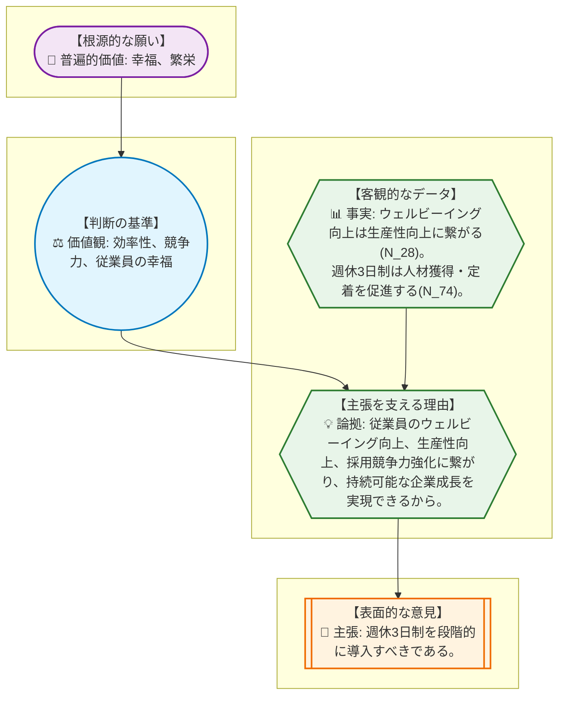
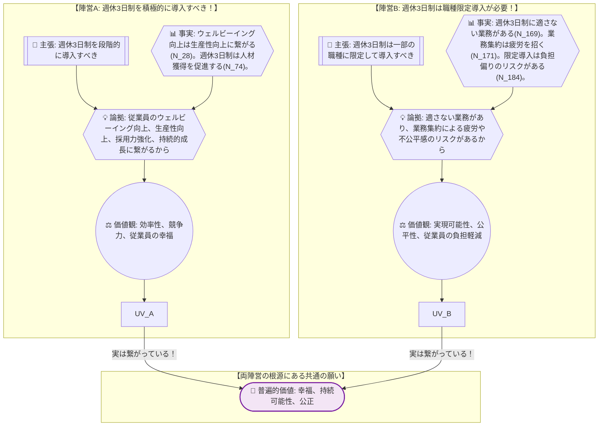
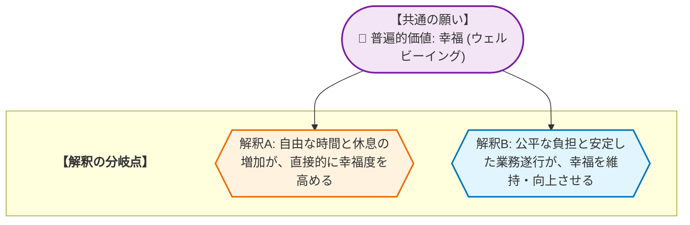

# 🧐 論理構造解析ワークシート：週休3日制の段階的導入 を解き明かす
> **【学習者の皆さんへ】**
> このレポートは、AIが論理の組み立て方を提示した「思考のサンプル」です。AIが示した「事実」や「理由」が本当に正しいか、他に抜けている視点はないか、自分なりに疑い、検証してみてください。このレポートの内容を批判的に検討し、自分の言葉で議論を深めること自体が、最高のリテラシー教育となります。

やっほー、みんな！論理的思考のインストラクターの先輩だよ。
今日は、みんなが普段の学校生活や部活動で「なんでこうなんだろう？」「本当はどうしたいんだろう？」ってモヤモヤする時に役立つ、とっておきの思考法を教えちゃうね。

## 1. AREの「逆推論」を理解する
> **【この章の要約】表面的な意見の奥にある「普遍的な願い」まで遡るプロセスを学びます。**

みんな、誰かが何かを主張する時って、その言葉の裏に「本当はこうしたい！」っていう願いが隠れてることが多いんだ。例えば、部活のミーティングで「練習メニューを週に1回は自由にしたい！」って意見が出たとするよね。これ、ただ「サボりたい」って言ってるわけじゃないかもしれない。

その意見の奥にある本当の願いを見つけるテクニックを「逆推論」って言うんだ。表面的な「主張（Claim）」から、それを支える「論拠（Reason）」、さらにその根拠となる「事実（Evidence）」、そしてその事実をどう捉えるかの「価値観（Value）」、最終的には誰もが共感できる「普遍的価値（Universal Value）」まで、まるで意見の層を一枚一枚剥がしていくみたいに遡っていくんだ。

今日のテーマは【週休3日制の段階的導入】。ちょっと難しそうに聞こえるけど、これもみんなの学校生活に置き換えて考えてみよう。

例えば、ある会社で「週休3日制を段階的に導入すべきだ！」っていう主張（C）が出たとしよう。これは、みんなの学校で「文化祭の準備期間、もっと休みを増やしてほしい！」っていう主張と同じようなものだよね。

じゃあ、この主張の奥にはどんな願いが隠れているんだろう？一緒に逆推論の旅に出てみよう！

---
**【主張（Claim）】**
「現代の競争が激化する労働市場において、企業は、従業員のウェルビーイング向上、採用競争力強化、従業員満足度向上、生産性向上、長時間労働の是正によるブランド価値向上といった多角的な目的を達成し、持続可能な企業成長を実現するために、週休3日制を段階的に導入すべきである。」（N_7）

これを、みんなの学校生活に置き換えてみよう。
**C（主張）**：「文化祭の準備期間、もっと休みを増やしてほしい！」

**W（論拠）**：なんでそう思うの？
「だって、みんなが元気になって、準備の効率が上がるし、来年の新入生も『この学校楽しそう！』って思ってくれるから！」
（元の主張では「従業員のウェルビーイング向上、生産性向上、採用競争力強化に繋がるから」）

**F（事実）**：本当にそう言えるの？何か根拠はある？
「実際、去年はみんな疲れてて、アイデアも出なかったし、準備も遅れたよね。他校はもっと休みがあって、楽しそうに準備してるって聞いたよ。」
（元の主張では、N_28「従業員のウェルビーイング向上は、集中力と創造性を高め、生産性を向上させるという事実。」やN_74「週休3日制は、魅力的な労働条件として優秀な人材の獲得・定着を促進し、企業の競争力を強化するという事実。」といったデータが根拠になるね。）

**V（価値観）**：その事実をどう捉えて、何を大切にしたいの？
「みんなで協力して、最高の文化祭を作りたい！」「他の学校にも負けない、魅力的な学校にしたい！」「何より、みんなが楽しく学校生活を送れるのが一番！」
（元の主張では、「効率性」「競争力」「幸福」といった価値観が隠れているんだ。）

**UV（普遍的価値）**：じゃあ、最終的にどんな世界になったら嬉しい？
「みんなが充実した学校生活を送ること」「学校が発展していくこと」
（元の主張では、「幸福」や「繁栄」といった、誰もが「そうだよね！」って頷けるような根源的な願いにたどり着くんだ。）

どうかな？表面的な意見の裏に、こんなにたくさんの思いが詰まっているって分かると、相手の意見も深く理解できる気がしない？

## 2. 複数の主張から「共通の価値」を見つける
> **【この章の要約】一見違う2つの意見が、実は「同じ願い」を持っていることを解剖します。**

さて、週休3日制の導入について、いろんな意見があるのは想像できるよね。まるで水と油のように見える意見でも、実は「同じ山の頂上を目指す別々の登山隊」みたいなものなんだ。目指す方向は同じなのに、どのルートを通るかで意見が分かれているだけ、ってこと。

今日のテーマ「週休3日制の段階的導入」でも、大きく分けて2つの陣営があるみたいだ。

*   **陣営A：積極的に導入すべき！**
    *   「週休3日制を導入して、従業員も会社も社会も、みんなでハッピーになろうよ！」（N_7, N_56, N_234）
*   **陣営B：導入には慎重に、工夫が必要だ！**
    *   「週休3日制はいいけど、全部の仕事に合うわけじゃないし、不公平にならないように気をつけないとね。」（N_117, N_166）

一見すると、陣営Aは「どんどん進めよう！」、陣営Bは「ちょっと待って！」って言ってるように見えるよね。でも、この二つの意見の奥底には、実は共通の「普遍的な願い」が隠れているんだ。

彼らが共通して願っているのは、例えばこんなことじゃないかな？

1.  **💎 幸福（ウェルビーイング）**：
    *   陣営Aは「休みが増えれば、みんな元気になって幸せになる！」って考えている。
    *   陣営Bは「一部の人だけが疲弊したり、不公平になったりしたら、みんな幸せになれないよ」って心配している。
    *   どちらも、最終的には「みんなが心身ともに健康で、充実した生活を送れること」を願っているんだ。学校で言えば、「生徒みんなが楽しく学校生活を送れること」だね。

2.  **💎 持続可能性（繁栄）**：
    *   陣営Aは「週休3日制で会社がもっと強くなって、長く発展していける！」って期待している。
    *   陣営Bは「無理な導入をして会社が傾いたり、社会が混乱したりしたら、長くは続かないよ」って危惧している。
    *   どちらも、「会社や社会が、これからもずっと良い状態で続いていくこと」を大切にしているんだ。学校で言えば、「学校がずっと魅力的な場所であり続けること」だね。

3.  **💎 公正（公平性）**：
    *   陣営Aは「多様な働き方を認めることで、みんなに平等なチャンスを与えたい！」って考えている。
    *   陣営Bは「週休3日制を導入するなら、評価が不公平になったり、一部の人に負担が偏ったりしないようにしないと」って訴えている。
    *   どちらも、「誰もが納得できる、公平で平等な環境」を求めているんだ。学校で言えば、「クラスの中で、誰かだけが損したり、無理したりしないようにしたい」っていう気持ちだね。

ほらね？意見は違っても、その根っこにある願いは同じなんだ。この共通の願いを見つけることができれば、対立する意見同士でも、どうすればみんなが納得できる解決策を見つけられるか、話し合いのヒントになるはずだよ。

## 3. 議論が噛み合わない「隠れた論拠(Warrant)」を発見する
> **【この章の要約】事実を「問題だ」と判断する背景にある、隠れた前提を探ります。**

みんな、探偵になった気分で考えてみてほしいんだ。ある事件現場で「このナイフが凶器だ！」という主張（C）があったとするよね。そして、その根拠として「ナイフから被害者の血液が検出された」という事実（F）が示された。

でも、これだけだと「なぜそのナイフが凶器だと断定できるの？」という疑問が残るよね。もしかしたら、被害者が自分でナイフに触れただけかもしれないし、別の誰かが使った後かもしれない。

ここで探偵が探すのが、事実と主張を結びつける「隠れた前提」、つまり「論拠（Warrant）」なんだ。この場合、「ナイフから検出された血液は、犯行時に付着したものに違いない」とか、「このナイフは犯人しか触れる機会がなかった」といった、無意識のうちに信じられている前提が隠れているんだ。この隠れた前提が崩れると、主張も成り立たなくなってしまう。

週休3日制の議論でも同じだよ。ある事実から「だからこうすべきだ！」という主張が飛び出すとき、その間に「当たり前だ」とされている隠れた前提が必ず存在するんだ。この隠れた前提が、実は人によって違っていたり、そもそも間違っていたりすると、議論はいつまで経っても噛み合わない「平行線」になってしまうんだ。

例えば、こんなケースを考えてみよう。

**F（事実）**：「ある調査によると、週休3日制を導入した企業では、従業員のストレスレベルが平均15%低下したという報告があります。」
**C（主張）**：「したがって、週休3日制は従業員の心身の健康を改善する効果があると言えます。」

この事実から主張へ飛躍する間に、どんな「隠れた論拠」が潜んでいると思う？

---

**【ワーク】隠れた論拠を探せ！**

以下の「事実」と「主張」の間に隠れている「論拠（Warrant）」を考えてみよう。

**F（事実）**：
「週休3日制を導入した企業では、従業員一人あたりの平均残業時間が月10時間減少したというデータがある。」

**C（主張）**：
「だから、週休3日制は従業員のワークライフバランスを向上させる効果があると言える。」

この事実から主張へ飛躍するために、どんな「隠れた前提」が必要だろう？

▼ 考え方のヒントと解答例

**【ヒント】**
*   「残業時間が減る」ことと「ワークライフバランスが向上する」ことの間には、どんな関係があると考えているだろう？
*   残業時間が減れば、必ずワークライフバランスが向上すると言えるだろうか？他に影響する要素はないかな？
*   この主張をする人は、何を「良いこと」だと考えているだろう？

**【解答例】**
*   **隠れた論拠**: 「残業時間の減少は、従業員が仕事以外の活動に使える時間を増やし、それが直接的にワークライフバランスの向上に繋がる。」
    *   この論拠は、「仕事以外の時間が充実すれば、自動的にワークライフバランスが良くなる」という前提に立っているんだ。でも、もし残業が減った分、仕事の密度が上がって疲労が増したり、給与が減って生活が苦しくなったりしたら、必ずしもワークライフバランスが向上するとは言えないよね。このように、隠れた論拠を見つけることで、議論の弱点や、別の視点が見えてくるんだ。

## 4. データが示す「対立の震源地」を特定する
> **【この章の要約】議論が平行線になる本当の理由（価値観の衝突）を特定します。**

みんな、前章で「週休3日制の段階的導入」について、二つの陣営があることを見たよね。

*   **陣営A**：「積極的に導入すべき！」
*   **陣営B**：「導入には慎重に、工夫が必要だ！」

これら二つの陣営は、実は「みんなが幸せに、会社も社会も発展していくこと」という共通の願い（普遍的価値）を持っているんだ。まるで、同じ山の頂上を目指している登山隊みたいにね。

でも、なぜ意見が対立してしまうんだろう？それは、その共通の願いを「どうすれば実現できるか」という解釈のルートが、根本的に異なっているからなんだ。これが、議論が平行線になる「対立の震源地」なんだよ。

例えば、「幸福」という共通の願いがあったとしよう。

*   **陣営Aの解釈**：幸福は「自由な時間と休息の増加」によって直接的に達成される。週休3日制は、この自由な時間を増やす最善の方法だ！
*   **陣営Bの解釈**：幸福は「安定した業務遂行と公平な負担」によって守られるべきものだ。週休3日制が業務の集中や不公平感を生み出せば、かえって幸福を損なうリスクがある。

このように、同じ「幸福」という願いを持っていても、それを実現するための「道筋」や「優先すべきこと」に対する解釈が違うから、意見がぶつかってしまうんだ。

この「解釈の分岐点」を理解することが、対立を乗り越える第一歩になるんだよ。

## 5. 価値を統合して「第三の解決策」をデザインする
> **【この章の要約】AかBかの妥協ではなく、両方の価値を満たす新しい仕組みを考えます。**

さて、週休3日制の議論で、陣営Aは「従業員の幸福や生産性向上」を重視し、陣営Bは「業務の実現可能性や公平性、負担軽減」を重視していることが分かったよね。どちらの意見も、大切な価値観に基づいている。

ここで大切なのは、どちらか一方の意見を押し通す「勝つか負けるか」の議論ではなく、両方の価値観を「アウフヘーベン（止揚）」する、つまり、どちらも犠牲にせず、より高いレベルで統合する「第三の解決策」を考えることなんだ。

**【第三の解決策の一例】**
「**選択的週休3日制と、それに伴う業務再設計・スキルアップ支援のセット導入**」

これは、具体的にこんな仕組みだよ。

1.  **従業員の選択権**: 週休3日制を希望する従業員は、個人の裁量で選択できるようにする。これにより、陣営Aが重視する「多様な働き方と個人の幸福」を尊重する。
2.  **業務の再設計と効率化**: 週休3日制を選択した場合は、チームや部署全体で業務内容を見直し、不要な会議の削減、ルーティン業務の自動化ツール導入、タスクの優先順位付けなどを徹底する。これにより、陣営Bが懸念する「業務の集中や生産性低下」を防ぐ。
3.  **スキルアップ支援**: 会社は、効率的な働き方を実現するための研修（例：タイムマネジメント、デジタルツールの活用、コミュニケーションスキル向上など）を積極的に提供する。これにより、従業員のスキルアップを促し、生産性維持・向上をサポートする。
4.  **成果主義への評価制度見直し**: 労働時間ではなく、個々の成果や貢献度を重視する評価制度に移行する。これにより、週休3日制を選択した従業員とそうでない従業員との間の「不公平感」を解消し、陣営Bが重視する「公平性」を担保する。

この解決策は、単に「休みを増やす」だけでなく、「どうすれば休みを増やしても、みんながハッピーで、会社も困らないか」という両方の視点を取り入れているんだ。

---

**【自己開示としての検証課題】**

もし、みんなの学校で「部活動の練習日を、週に1回、自由に休める日を選べる制度」を導入するとしたら、どんな工夫が必要だと思う？

*   休む人がいる日の練習メニューはどうする？
*   休んだ人の分を誰かがカバーするなら、その人にはどんなメリットがあるべき？
*   みんなが不公平だと感じないように、どんなルールを作ればいいかな？

このアイデアを、友達や先生と話し合ってみて、もっと良い「第三の解決策」を考えてみよう！

## 🎓 学習リフレクション

やっほー、みんな！今日の「思考の冒険」はどうだったかな？

表面的な意見の裏に隠された「普遍的な願い」を探したり、事実と主張を結びつける「隠れた論拠」を暴いたり、そして対立する価値観を統合する「第三の解決策」をデザインしたりと、まるで頭の中でパズルを解くような時間だったね。

AREの思考法は、一見複雑に見える問題も、一つ一つの要素に分解して、その繋がりをじっくりと見つめ直すことで、より深く理解し、より良い解決策を見つける手助けをしてくれるんだ。

この思考法は、今日の週休3日制のような社会問題だけでなく、友達との意見の食い違い、家族との話し合い、部活動の目標設定、ニュースで見る様々な出来事など、みんなの日常のあらゆるコミュニケーションで活かせるはずだよ。

さあ、今日の学びを胸に、明日からどんな場面でこのAREの思考法を活かして、新しい発見やより良い関係を築いていきたいと思う？