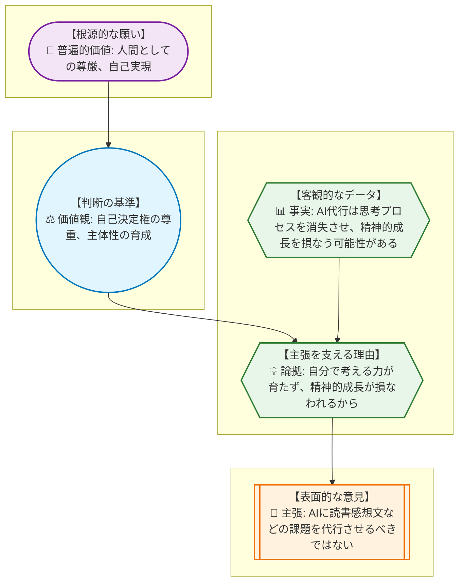
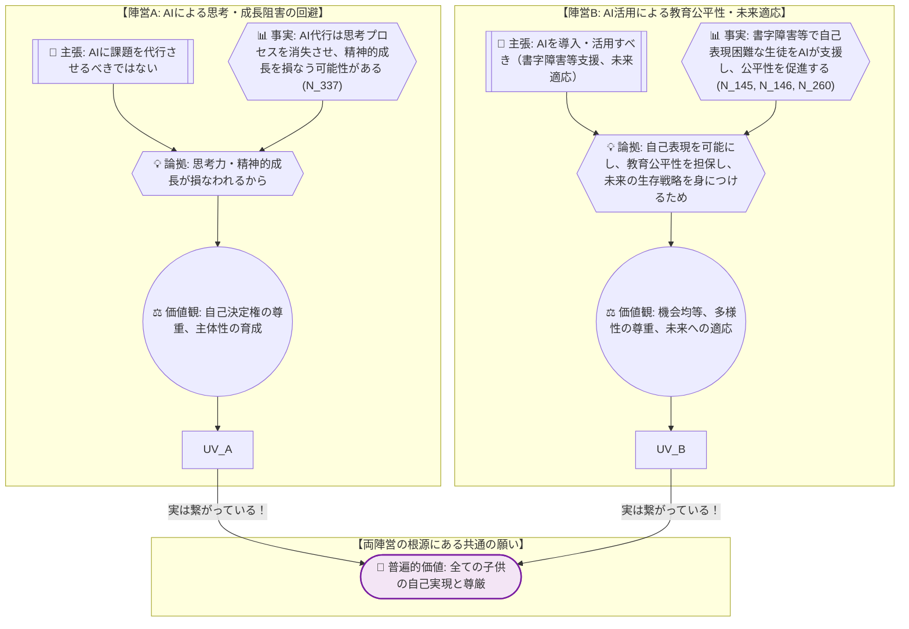
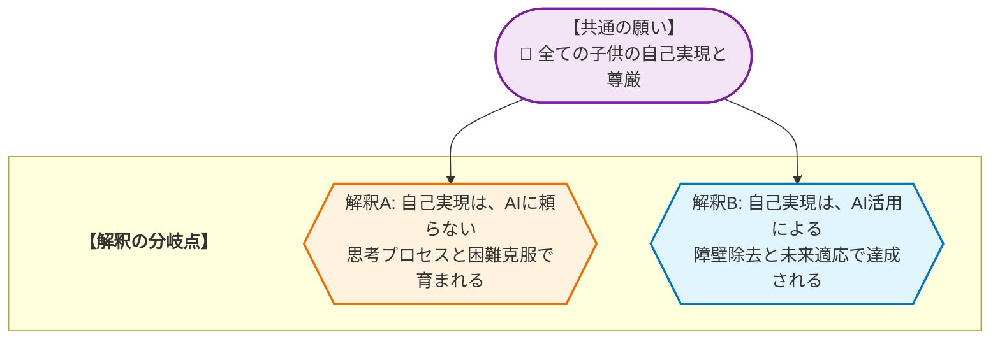

# 🧐 論理構造解析ワークシート：生成AIの小中学校導入論点 を解き明かす
> **【学習者の皆さんへ】**
> このレポートは、AIが論理の組み立て方を提示した「思考のサンプル」です。AIが示した「事実」や「理由」が本当に正しいか、他に抜けている視点はないか、自分なりに疑い、検証してみてください。このレポートの内容を批判的に検討し、自分の言葉で議論を深めること自体が、最高のリテラシー教育となります。

---

やあ、みんな！元気にしてるか？
今日は、ちょっと難しいけど、みんなの未来に直結する「生成AIの小中学校導入論点」について、一緒に考えてみよう。
「AIが学校に来るって、どういうこと？」って、ワクワクする人もいれば、ちょっと不安に思う人もいるかもしれないね。

でも、どんな意見も、その奥には「こうなってほしい！」っていう、みんなの本当の願いが隠れてるんだ。
まるで、学校の文化祭で「もっと盛り上げたい！」って意見が飛び交うけど、その根っこには「みんなで最高の思い出を作りたい」っていう共通の願いがあるのと同じだよ。

このレポートでは、そんな意見の奥にある本当の願いを見つける「逆推論」っていう探偵テクニックを伝授するよ。
さあ、一緒に論理の迷宮を探検してみよう！

## 1. AREの「逆推論」を理解する
> **【この章の要約】表面的な意見の奥にある「普遍的な願い」まで遡るプロセスを学びます。**

みんなが普段、友達と意見を言い合ったり、先生に質問したりするとき、実は「主張（Claim）」をしてるんだ。
でも、その主張が「なんでそう思うの？」って聞かれたときに、ちゃんと答えられるかな？
その「なんで？」を深く掘り下げていくのが「逆推論」だ。

今回のテーマは【生成AIの小中学校導入論点】だね。
例えば、こんな意見があったとしよう。

---
**📢 主張 (Claim):** 「教育現場において、子供の思考プロセスと精神的成長を損なわないために、AIに読書感想文などの課題を代行させるべきではない。」（CLAIMS: N_16）

---

これ、どういうことか、みんなの学校生活に置き換えて考えてみよう。
想像してみて。体育祭の応援団で、君たちが「今年はこんな振り付けにしたい！」ってアイデアを出し合ってるところ。
もし、AIが「はい、これが最高の振り付けです！」って全部作ってきちゃったらどうなると思う？

この主張の奥にある「本当の願い」を、一緒に探ってみよう。

1.  **📢 主張 (Claim - C):** 「AIに読書感想文などの課題を代行させるべきではない。」
    *   これは、AIが宿題を代わりにやってしまうことに対して「それはダメだ！」って言ってる意見だね。
    *   **比喩:** 応援団の振り付けを、AIが全部作ってきて、君たちはただそれを覚えるだけ、っていう状況だ。

2.  **💡 論拠 (Warrant - W):** 「なぜ、AIに代行させるべきではないの？」
    *   その理由は、「自分で考える力が育たず、精神的成長が損なわれるから」だ。
    *   **比喩:** AIが振り付けを全部作っちゃったら、君たちが「どうやったらもっとかっこよく見えるかな？」「みんなが盛り上がるにはどうしたらいいかな？」って、頭をひねって考える機会がなくなっちゃうよね。友達と「ここ、もっとこうしようぜ！」って話し合う時間も減る。そうすると、自分たちで何かを「創り出す力」が育たないってことだ。

3.  **📊 事実 (Fact - F):** 「その論拠は、どんなデータや情報に基づいているの？」
    *   「AIに課題を代行させ、その出力プロセスがブラックボックスである場合、子供の思考プロセスが消失し、精神的成長が損なわれる可能性があるという事実。」（FACTS: N_51, N_144）
    *   実際に、専門家も「AIに全部やらせちゃうと、自分で考える機会が減って、成長が止まっちゃうかも」って警鐘を鳴らしているんだ。
    *   **比喩:** 実際に、過去の応援団で、誰かに言われた通りにやったチームと、自分たちでゼロから考えたチームとでは、本番の熱量や、終わった後の達成感が全然違った、みたいな話を聞いたことがあるかもしれない。自分で考えた方が、やっぱり「自分のもの」になるんだ。

4.  **⚖️ 価値観 (Value - V):** 「その事実や論拠の背景には、何を大切にしたいという思いがあるの？」
    *   それは、「自己決定権の尊重」や「主体性の育成」という価値観だ。
    *   「子供が自らの意思で思考し、判断するプロセスを尊重することが、批判的思考力や問題解決能力の基盤となるという事実。」（FACTS: N_240）
    *   「自己決定権の重視が学習者の主体性を育むという事実。」（FACTS: N_198）
    *   つまり、「自分で考えて、自分で決めること」って、すごく大事だよねってこと。それが、君たちの「主体性」を育むんだ。
    *   **比喩:** 応援団の振り付けも、自分たちで考えて、自分たちで決めたからこそ、本番で最高のパフォーマンスができるんだ。誰かに言われた通りじゃなくて、自分たちの「こうしたい！」を形にするのが楽しいんだ。

5.  **💎 普遍的価値 (Universal Value - UV):** 「最終的に、どんな根源的な願いにたどり着くの？」
    *   それは、「人間としての尊厳」や「自己実現」という普遍的な願いだ。
    *   「自己決定権の尊重が個人の尊厳を保障するという事実。」（FACTS: N_277）
    *   「自己実現の重視が、個人の内発的な動機や能力の発揮を促し、それによって個人の尊厳を支える力学という事実。」（FACTS: N_323）
    *   最終的には、「自分らしく生きて、自分の可能性を最大限に引き出すこと」をみんなが願っているんだ。
    *   **比喩:** 応援団の活動を通して、君たちが「自分たちでやり遂げた！」って自信を持って、最高の自分になれること。それが、みんなが応援団に期待している、一番大切なことなんだ。

どうかな？一つの意見の裏に、こんなに深い願いが隠れているんだ。
この「逆推論」のプロセスを図にすると、こんな感じになるよ。

---

## 2. 複数の主張から「共通の価値」を見つける
> **【この章の要約】一見違う2つの意見が、実は「同じ願い」を持っていることを解剖します。**

さて、AIの学校導入については、いろんな意見があるよね。
まるで、体育祭の準備で「応援団は派手なパフォーマンスで盛り上げよう！」って言うチームと、「いや、裏方の準備を完璧にして、みんなが安心して楽しめるようにしよう！」って言うチームみたいに、一見すると水と油のように見えるかもしれない。

でも、実はどちらのチームも「体育祭を最高のイベントにしたい！」っていう、同じ山の頂上を目指す別々の登山隊なんだ。

生成AIの導入についても、大きく分けて二つの陣営がある。

*   **陣営A：AI導入に慎重な「思考・成長保護派」**
    *   「AIに課題を代行させるべきではない。子供の思考プロセスと精神的成長を損なわないため。」（CLAIMS: N_16）
    *   彼らは、AIが子供たちの「自分で考える力」や「心の成長」を奪ってしまうことを心配しているんだ。
    *   **比喩:** 応援団の振り付けをAIに任せたら、自分たちでアイデアを出し合ったり、試行錯誤したりする「成長の機会」が失われることを心配する先輩たち、って感じかな。

*   **陣営B：AI導入に積極的な「教育公平性・未来適応派」**
    *   「既存の教育システムで出力に苦しむ子供たちに対して、教育現場は、書字障害や学習障害、不登校などの子供の自己表現を可能にし、教育の公平性を担保するために、AIを導入・活用すべきである。」（CLAIMS: N_17）
    *   「AIとの協働が社会の標準装備となる未来において、学校は、子供たちが激変する未来の生存戦略を身につけ、教育の不作為を避けるために、AIの正しい扱い方を教えるべきである。」（CLAIMS: N_19）
    *   彼らは、AIが「書くのが苦手な子」や「学校に行きづらい子」の助けになったり、将来AIと一緒に働く社会でみんなが活躍できるように、今のうちからAIの使い方を教えるべきだと考えているんだ。
    *   **比喩:** 体育祭で、足が速い子も、絵を描くのが得意な子も、みんながそれぞれの形で活躍できるように、新しい道具（AI）を導入して、みんなが最高のパフォーマンスを出せるようにしよう！って考える先生たち、って感じだね。

この二つの陣営、意見は真逆に見えるけど、実はどちらも「全ての子供たちが、自分らしく輝き、それぞれの可能性を最大限に引き出して生きていけること」という、共通の願いを持っているんだ。

具体的に見ていこう。

1.  **💎 普遍的価値: 人間としての尊厳**
    *   **陣営A**は、AIが思考プロセスを代行することで、子供が「自らの頭で考え、悩み、表現する」という人間としての根幹が揺らぐことを懸念している。（FACTS: N_337）これは、子供一人ひとりの「人間としての尊厳」を守りたいという願いに繋がる。
    *   **陣営B**は、書字障害や学習障害を持つ生徒が、AIの支援によって自己表現できるようになることで、彼らの「人間としての尊厳」が守られ、自信を持って学校生活を送れるようになることを願っている。（FACTS: N_260）

2.  **💎 普遍的価値: 自己実現**
    *   **陣営A**は、AIに頼りすぎると、子供が自分で困難を乗り越え、達成感を味わう機会が失われ、結果として「自分の可能性を最大限に引き出す（自己実現）」機会が奪われることを心配している。
    *   **陣営B**は、AIが個別最適化された学習機会を提供したり（FACTS: N_142, N_271）、AIとの協働スキルを身につけることで（FACTS: N_317）、子供たちが将来の社会で「自分らしく活躍し、自己実現する」ための道が開かれることを期待している。（FACTS: N_208）

つまり、どちらの陣営も、子供たちが「自分らしく、幸せに生きていける未来」を心から願っているんだ。
そのためのアプローチが違うだけで、目指すゴールは同じなんだね。

この共通の願いを図にすると、こんな感じになるよ。

---

どうだったかな？
一見すると対立しているように見える意見も、その奥を深く掘り下げていくと、みんなが共有している「根源的な願い」が見えてくるんだ。
この「逆推論」のスキルは、学校での議論はもちろん、将来社会に出てからも、いろんな場面で役立つはずだ。

このレポートの内容を鵜呑みにするんじゃなくて、「本当にそうかな？」「他にどんな意見があるだろう？」って、自分なりに考えてみてほしい。
それが、君たちの「論理的思考力」を鍛える一番の近道だからね！
じゃあ、またな！

## 3. 議論が噛み合わない「隠れた論拠(Warrant)」を発見する
> **【この章の要約】事実を「問題だ」と判断する背景にある、隠れた前提を探ります。**

さて、意見が対立するとき、私たちはしばしば「事実」と「主張」ばかりに目を奪われがちだ。でも、その間に、まるで探偵が事件現場で見落としがちな「隠れた手がかり」のように、重要なものが潜んでいることがある。それが「隠れた論拠（Warrant）」だ。

探偵が、ある容疑者の「アリバイ（事実）」と「無罪の主張（主張）」を聞いたとき、そのアリバイが本当に無罪を証明するのか、それとも何か別の前提が隠されているのかを疑うように、私たちも議論の裏にある「隠れた論拠」を探る必要があるんだ。

例えば、「生成AIの小中学校導入論点」で、こんな意見があったとしよう。

---
**📊 事実 (Fact):** 「生成AIは、与えられたプロンプトに基づいて、人間が書いたような自然な文章を瞬時に生成できる。」

**📢 主張 (Claim):** 「だから、小中学校の国語の授業で、生徒にAIを使って作文やレポートを書かせるべきではない。」
---

この「事実」から「主張」への飛躍、何か引っかからないかな？
AIが文章を生成できることと、それを授業で使わせるべきではない、という結論の間には、どんな「隠れた前提」があるんだろう？

探偵になったつもりで、この「隠れた論拠」を探してみよう。

---
**【ワーク】隠れた論拠を探せ！**

上記の「事実」と「主張」の間にある「隠れた論拠」を考えてみよう。

▼ 考え方のヒントと解答例

**【ヒント】**
*   「なぜ、AIが文章を生成できることが、授業で使わせるべきではない理由になるのか？」と考えてみよう。
*   「もしAIを使わせたら、何が失われると心配しているのだろう？」という視点も有効だ。
*   この主張をしている人が、教育において何を最も大切にしているかを想像してみよう。

**【解答例】**
*   **隠れた論拠**: 「作文やレポートの作成プロセスそのものが、生徒の思考力、表現力、創造性を育む重要な学習機会であり、AIによる代行はその機会を奪うため、教育的価値が損なわれる。」

どうだったかな？
この隠れた論拠は、「教育の目的は、単に『正しい答え』や『完成した文章』を作り出すことではなく、その過程で生徒が自ら考え、試行錯誤し、成長することにある」という、教育に対する深い信念に基づいているんだ。
この隠れた論拠が見えてくると、なぜこの主張がなされているのか、その背景にある価値観がより明確になるよね。

## 4. データが示す「対立の震源地」を特定する
> **【この章の要約】議論が平行線になる本当の理由（価値観の衝突）を特定します。**

前章までで、私たちは意見の奥にある「普遍的な願い」を見つけ、さらに「隠れた論拠」を発見する探偵スキルを身につけた。
しかし、それでも議論が平行線になることがある。それは、両者が同じ「共通の願い」を持っているにもかかわらず、その願いを「どう実現するか」という解釈やアプローチが根本的に異なるからだ。まるで、同じ山の頂上を目指しているのに、片方は「険しいが最短ルート」を選び、もう片方は「安全だが遠回りなルート」を選ぼうとしているようなものだね。

「生成AIの小中学校導入論点」における共通の願いは、「全ての子供の自己実現と尊厳」だった。
しかし、この共通の願いから、二つの異なる解釈が生まれる。

*   **陣営A（思考・成長保護派）の解釈**: 「自己実現と尊厳」は、AIに頼らず、自らの頭で考え、困難を乗り越える「プロセス」を通して育まれる。AIによる安易な代行は、この成長プロセスを阻害し、結果的に子供の自己実現の機会を奪う。
*   **陣営B（教育公平性・未来適応派）の解釈**: 「自己実現と尊厳」は、AIというツールを適切に活用することで、学習の障壁を取り除き、個々の能力を最大限に引き出し、未来社会で活躍できる力を身につけることで達成される。AIは、そのための強力な「手段」となる。

このように、同じ「子供たちの幸せな未来」という願いを共有しながらも、その実現方法に対する「教育観」や「人間観」の違いが、議論の「対立の震源地」となるんだ。

## 5. 価値を統合して「第三の解決策」をデザインする
> **【この章の要約】AかBかの妥協ではなく、両方の価値を満たす新しい仕組みを考えます。**

対立の震源地が「どう実現するか」という解釈の違いにあると分かれば、次は「どちらか一方を選ぶ」という妥協ではなく、両方の価値を「アウフヘーベン（止揚）」する、つまり、それぞれの良いところを活かしつつ、より高次元で統合する「第三の解決策」を考えることができる。

「生成AIの小中学校導入論点」において、陣営Aは「思考力・精神的成長の保護」を、陣営Bは「教育の公平性・未来への適応」を重視していたね。この二つの価値をどちらも犠牲にしないアイデアを考えてみよう。

**【第三の解決策の一例】「AI協働型クリエイティブ・ラーニング・ラボ」の導入**

これは、AIを単なる「答えを出す道具」としてではなく、「思考を深めるためのパートナー」として位置づける新しい学習環境の提案だ。

1.  **AIの役割の明確化と段階的導入**:
    *   **初期段階（アイデア出し、情報収集の補助）**: AIは、生徒がアイデアを広げたり、関連情報を効率的に集めたりするための「壁打ち相手」や「アシスタント」として活用する。例えば、読書感想文のテーマ決めや、レポートの構成案作成の際に、AIに様々な視点やキーワードを提案させる。
    *   **中間段階（表現の多様化、苦手克服）**: 書字障害などで表現に困難を抱える生徒に対しては、AIが音声入力の文字化や、表現のバリエーションを提示するツールとして機能する。これにより、自己表現の障壁を取り除き、教育の公平性を担保する。
    *   **最終段階（批判的思考、倫理的判断）**: AIが生成した文章やアイデアを鵜呑みにせず、生徒自身が「本当にこれで良いのか？」「もっと良い表現はないか？」と批判的に検討し、自分の言葉で再構築するプロセスを必須とする。AIの出力の限界や倫理的な問題についても議論する時間を設ける。

2.  **教員の役割の再定義**:
    *   教員は、AIの「使い方」を教えるだけでなく、「AIとどう協働するか」「AIの限界をどう見極めるか」「AIが生成した情報をどう批判的に評価するか」といった、より高度なリテラシーを指導する「AI協働学習のファシリテーター」となる。
    *   生徒がAIに頼りすぎないよう、思考のプロセスを重視した評価基準を導入し、AIを活用した部分と、生徒自身の思考・創造による部分を明確に区別する。

この「AI協働型クリエイティブ・ラーニング・ラボ」では、AIが思考プロセスを完全に代行するのではなく、生徒の思考を「拡張」し、苦手な部分を「サポート」することで、全員がより創造的で深い学びに取り組めるようになる。同時に、未来社会で必須となるAIとの協働スキルや批判的思考力も育むことができる。

**【自己開示としての検証課題】（中学3年生向け）**

中学3年生の皆さん、この「AI協働型クリエイティブ・ラーニング・ラボ」のアイデアが、本当に君たちの学びを豊かにするのか、一緒に考えてみよう。

もし君たちの学校にこのラボが導入されたら、どんな課題に取り組んでみたい？そして、その課題でAIを「思考のパートナー」として使うとしたら、具体的にどんな場面で、どのようにAIを活用してみたいかな？

逆に、「ここはAIに任せちゃいけない」と思うのはどんな時？そして、その理由は何だろう？

このアイデアをより良くするために、君たち自身の視点から「こんなルールがあったらもっと良い」「こんな機能があったらもっと安心して使える」といった意見を、ぜひ考えてみてほしい。君たちのリアルな声が、未来の教育をデザインする上で最も大切なデータになるんだ。

## 🎓 学習リフレクション

今日の「思考の冒険」、どうだったかな？
一見すると複雑で、対立しているように見える意見も、その奥にある「隠れた論拠」や「共通の願い」を丁寧に探っていくと、意外な発見があったんじゃないかな。まるで、バラバラに見えるパズルのピースが、実は一つの大きな絵の一部だったと気づくような感覚だね。

このAREの思考法は、学校でのグループワークや友達との話し合いはもちろん、将来、社会に出てから様々な問題に直面したときにも、きっと君たちの強力な武器になるはずだ。

さあ、君たちの日常のコミュニケーションの中で、意見が食い違ったとき、今日の「逆推論」や「隠れた論拠の発見」のスキルを、どう活かしてみたいと思う？

---
**【本レポートの生成について（Disclaimer）】**
本レポートは、提供されたデータを基に、AREが新しい視点と学びを提供するために自動生成したものです。