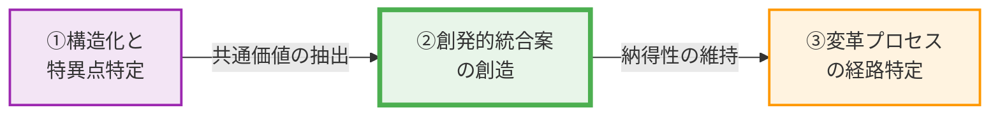

# 🏛️ Strategic Consensus Report: 生成AIの小中学校導入論点

## 🔥 【一文サマリー：目指すべき組織の姿】
生成AIの戦略的導入を通じて、個別最適化された学習機会を最大化しつつ、子供たちの批判的思考力、共感力、倫理観といった人間性の根幹を育む教育環境を構築し、未来社会で自律的に活躍できる人材を育成する。

## 🚀 【結論：優先順位に基づく3つの具体的アクション】
1.  **優先度【高】：AI教育倫理ガイドラインの策定と教員向け専門研修の実施** - AIのハルシネーションリスク、著作権・プライバシー問題、そして子供の思考プロセスへの影響といった懸念を解消するため、具体的な利用規範と倫理的枠組みを明確化します。同時に、教員がAIの特性を理解し、安全かつ効果的に活用できるよう、実践的な研修プログラムを義務化し、教員の負担軽減と質の高い指導の両立を図ります。
2.  **優先度【中】：個別最適化学習支援ツールの段階的導入と効果検証** - 書字障害や学習障害を持つ子供たちの自己表現を支援し、経済力による教育格差を是正するため、AIを活用した個別最適化学習支援ツールを段階的に導入します。導入に際しては、特定の学校や学年でパイロットプログラムを実施し、子供の思考力や社会性への影響を継続的に評価・検証することで、リスクを管理しつつ公平な学習機会を創出します。
3.  **優先度【低】：人間関係構築と社会性育成のためのオフライン活動の強化** - AIとの対話に過度に依存することによる共感力や社会性の欠如といった懸念に対応するため、教室内の生身の人間同士の「摩擦」や「合意形成」を学ぶ機会を意図的に増やします。グループワーク、ディベート、地域連携活動などをカリキュラムに積極的に組み込み、AIが補完できない人間特有の能力育成に注力することで、AIと共存する社会で求められる総合的な人間力を育みます。

## 【Strategic Map：政策論争の全体像】
1.  **What (争点)**: 生成AIの小中学校教育への導入の是非、その範囲、および倫理的・実践的な活用方法。
2.  **Why (価値のねじれ)**: 「子供の健全な成長と未来社会への適応」という共通の普遍的価値に対し、AIが「思考力や社会性を阻害する脅威」と「教育機会を拡張し未来を切り拓く機会」という決定的に異なる解釈が存在する。
3.  **Oasis (共通基盤)**: 全ての子供たちが、変化の激しい未来社会において、自律的に思考し、他者と協調しながら自己実現できる能力を育み、豊かな人生を送れるようにすること。
4.  **Singularity (断層)**: AIを「人間の思考や能力を代替するツール」と捉えるか、「人間の思考や能力を拡張・支援するツール」と捉えるかの認識の断層。また、AI導入に伴う短期的なリスク回避を優先するか、長期的な機会創出を重視するかの評価軸の相違。

## 🗺️ 1. 価値ネットワークの地形と「価値距離 (Value Distance)」
> **[定量モデル：Value Distance]**
> **価値距離 = | 価値解釈A − 価値解釈B |**
> 解析された価値距離 = 【0.67】
> **[構造的トレードオフ]**: 【共感力の重視 vs 教育機会平等の重視】 / 【共感力の重視 vs 学習環境公平性の重視】 / 【共感力の重視 vs 社会正義の重視】

*   **⚡ 価値距離とトレードオフの分析**: 解析された価値距離0.67は、生成AIの小中学校導入論点において、両陣営の価値解釈にかなりの乖離が存在することを示しています。特に、「AIと子供の思考力への影響」という共通価値に対する解釈の決定的な不一致が、議論の核心にあります。陣営AはAIが思考プロセスを代行することで子供の思考力や精神的成長を損なうと懸念し、人間中心の教育と共感力の育成を強く重視します。一方、陣営BはAIが個別最適化された学習機会を提供し、書字障害や学習障害を持つ子供たちの自己表現を可能にすることで、教育機会の平等と学習環境の公平性を実現すると主張します。
    この対立は、「共感力の重視 vs 教育機会平等の重視」「共感力の重視 vs 学習環境公平性の重視」「共感力の重視 vs 社会正義の重視」という構造的なトレードオフとして顕在化しています。陣営AはAIが人間関係の摩擦や合意形成の機会を奪い、共感力や社会性を欠如させるリスクを指摘し、AIの著作権侵害やデータ透明性の欠如が次世代の倫理観や社会正義を損なうと危惧しています。これに対し、陣営BはAIが経済力による教育格差を是正し、全ての子供に質の高い学習機会を提供することが、より大きな社会正義に繋がると考えています。
    このような価値観のねじれは、単なる政策論争を超え、組織全体に深い停滞感と不透明性による不安を招いています。AI導入のメリットとデメリットがそれぞれ異なる普遍的価値に根差しているため、どちらか一方を優先すれば、もう一方の価値が損なわれるというジレンマに陥り、建設的な合意形成を阻害しているのです。

## 📊 2. 論理連鎖の構造化 (Logical Chain)

### ■ 陣営A
*   **F (事実)**: AIに課題を代行させると、思考プロセスが省略され、問題解決能力や批判的思考の発達が阻害される懸念が指摘されています。また、批判的思考が未熟な子供はAIのハルシネーションを事実と誤認しやすく、情報の安全性が脅かされます。AIとの過度な対話は、生身の人間との摩擦や合意形成から学ぶ機会を減少させ、共感力や社会性の育成を阻害する可能性があり、人間社会の基盤を揺るがしかねません。さらに、著作権侵害やデータ収集の透明性に疑念があるAI技術の無批判な推奨は、次世代の倫理観や権利尊重の精神に悪影響を及ぼします。
*   **E (感情/不安)**: 子供たちの思考力、創造性、社会性、倫理観が低下し、人間としての尊厳や自己決定権が損なわれることへの強い懸念。誤情報が蔓延し、社会秩序が混乱することへの不安。教育の本質が失われることへの危機感。
*   **V (価値観)**: 人間中心の教育、批判的思考力、共感力、社会性、倫理、権利尊重、教育の本質、情報の信頼性。
*   **UV (普遍的価値)**: 人間の尊厳、健全な社会秩序、子供の健全な精神的成長。

### ■ 陣営B
*   **F (事実)**: 既存の教育システムは、書字障害、学習障害、経済状況により、子供たちの教育機会と自己表現の格差を生じさせています。AIは個別最適化された学習機会を24時間提供し、これらの格差を是正する可能性を秘めています。また、AIは教員の事務作業や教材作成の負担を軽減し、教員が児童生徒一人ひとりの心のケアや対話に集中する時間を確保できると期待されています。AIとの協働は将来の社会で子供たちが生き抜くための必須スキルであり、AIリテラシー教育は子供たちの将来の適応能力と国際競争力を高めます。AIを壁打ち相手として活用することで、生徒は多様な視点やアイデアに触れ、自身の思考を深めることができます。
*   **E (感情/不満)**: 教育格差が放置され、子供たちの可能性が制限されることへの不満。未来社会への適応が遅れることへの危機感。教員の過重労働による教育の質の低下への懸念。
*   **V (価値観)**: 教育機会の公平性、未来への適応能力、効率性、個別最適化、自己実現、創造的拡張、国家の競争力。
*   **UV (普遍的価値)**: 機会均等、自己実現、社会の発展と繁栄。

## ⚠️ 3. 感情の震源地と「現状の定量的解析」 (Emotion Map)
> **【感情震度（Emotion Intensity）とは？】**
> AREにおける「感情震度（1.0〜10.0）」は、単なる気分ではなく、組織内の論理的摩擦と熱量を示す客観的指標です。
> **感情震度 (0-10.0) = (感情スコア × 発話頻度 × 重み係数) / 10**
> 1. **🔥 熱量 (Volume)**: 主張の背後にある具体的な事実(F)の声の多さ
> 2. **💧 切実さ (Emotion)**: 現場から直接発信された生の感情データの密度
> 3. **⚡ 摩擦 (Friction)**: 核心的価値観(V)が否定されることによる構造的ストレス

### ■ 感情震度のブレイクダウン（現状解析）
| 陣営 | **感情震度 (0-10.0)** | 核心的毀損 (ダメージを受けている価値) |
| :--- | :---: | :--- |
| **陣営A** | **7.4** | 自己決定権尊重の重視 |
| **陣営B** | **9.5** | 社会正義の重視 |

*   **🔴 陣営Aの核心的毀損**: 感情震度7.4は、単なる反対意見を超え、子供たちの未来に対する深い危機感と倫理的な葛藤を示唆しています。「自己決定権尊重の重視」が毀損されていると感じる背景には、AIが子供たちの思考プロセスや判断を「代行」することで、彼らが自ら深く考え、選択し、成長する機会が奪われることへの強い懸念があります。人間中心の教育という信念が揺らぎ、子供たちがAIの「指示」に従うだけの存在になりかねないという恐怖が根底にあります。生身の人間との「摩擦」を通じて育まれる共感力や社会性が失われ、人間関係の希薄化、ひいては社会全体の倫理的基盤が崩壊するのではないかという、教育者としての深い責任感と不安がこの震度を生み出しています。情報の信頼性や著作権といった倫理的な問題が放置されることで、子供たちが誤った価値観を内面化し、将来的に社会の混乱を招くことへの強い抵抗感も、この感情の震源地となっています。
*   **🟡 陣営Bの核心的毀損**: 感情震度9.5は、現状への強い不満と、未来への切迫した危機感、そして変革への強い情熱を示唆しています。「社会正義の重視」が毀損されていると感じる背景には、既存の教育システムが抱える「格差」の放置に対する強い憤りがあります。書字障害や学習障害を持つ子供たちが、その能力を十分に発揮できない現状、経済状況によって学習機会が制限される不公平な状況を、AIが打破できると強く信じています。AI導入の遅れが、これらの子供たちの「自己実現」の機会を奪い、未来社会で必要とされる「適応能力」を育む機会を逸失させることへの焦燥感が、この高い震度を形成しています。教員の過重労働が教育の質を低下させ、結果的に子供たちへのケアが手薄になる現状を、AIによる効率化で改善し、より本質的な教育に時間を割くべきだという強い使命感も存在します。AIを単なるツールではなく、教育の「公平性」と「効率性」を同時に実現し、社会全体の「発展と繁栄」に貢献する「希望」と捉えているため、その導入が阻まれることへの強い抵抗と不満が、この高い震度を生み出しているのです。

### 【ARE解析：新次元の合意へ向かう「黄金の道筋」】
1.  **真実の構造化と特異点の特定**: 混沌とした感情を分解し、分断の根本原因（Singularity）を特定。
2.  **創発的統合案の創造**: 一方の妥協ではなく、矛盾する主張を高い次元で同時に満たすシステムOSの設計。
3.  **納得の変革プロセス設計**: 人間の心理的変遷を重視し、納得性を維持しながら進むロードマップ。

## 💣 4. ワーストシナリオ（断層の崩落）
特異点である「AIを『人間の思考や能力を代替するツール』と捉えるか、『人間の思考や能力を拡張・支援するツール』と捉えるかの認識の断層」および「AI導入に伴う短期的なリスク回避を優先するか、長期的な機会創出を重視するかの評価軸の相違」を放置した場合、両陣営の懸念が最悪の形で現実化し、教育システム全体が機能不全に陥る負の因果連鎖が引き起こされる。

1.  **陣営Aの最悪**: AIが人間の思考や能力を代替するツールとして無批判に、あるいは不適切な形で導入される。子供たちはAIに過度に依存し、自ら深く考え、問題解決に取り組むことをやめてしまう。結果として、批判的思考力や創造性が著しく低下し、AIのハルシネーションを鵜呑みにするなど、情報の真偽を見極める能力が育たない。生身の人間との対話や摩擦から学ぶ機会が減少し、共感力や社会性が欠如した世代が育つ。倫理観や権利意識が希薄になり、社会全体で人間関係が荒廃し、分断が深まる。最終的に、自律的に判断し、他者と協調して社会を形成する能力を失った人々が多数を占め、人間性そのものが失われたディストピア的な社会が到来し、社会の基盤が崩壊する。
2.  **陣営Bの最悪**: AI導入に対する過度なリスク回避と慎重論が優先され、導入が大幅に遅れる、あるいは限定的なものに留まる。既存の教育システムが抱える構造的な問題、特に書字障害や学習障害を持つ子供たち、経済状況により学習機会が制限される子供たちの格差は是正されず、むしろ固定化・拡大する。教員の過重労働は改善されず、疲弊した教員は子供たち一人ひとりへのきめ細やかなケアや対話の時間を確保できないまま、教育の質は低下の一途を辿る。未来社会で必須となるAIリテラシーやデジタルスキルを習得する機会を逸失した子供たちは、国際競争力を失い、社会に適応できない人材が量産される。AIを「拡張」するツールとして活用する機会を失ったことで、子供たちの創造性や自己実現の可能性が閉ざされ、国家全体の停滞と衰退を招く。結果として、機会均等と社会発展が失われた、希望のない停滞した社会が到来する。

## 💡 5. 第3の道：価値が交わる「尾根（Ridge）」の創発的設計

### (1) 創発的統合案の提言
対立する価値（トレードオフ）を「二重螺旋」のように編み込み、新たな次元の価値を生む解決策を提示します。
*   **名称**: 人間拡張AI共育フレームワーク：思考と共感の二重螺旋
*   **概念モデル**: このフレームワークは、人間の本質的な能力（批判的思考力、共感力、倫理観）の育成を核とし、生成AIをその能力を「代替」するのではなく「拡張・支援」するツールとして位置づけます。教育の場において、AIが提供する個別最適化された知識・スキル学習のパスと、教師が主導する対話、協働、倫理的探究といった人間中心の学習活動が、DNAの二重螺旋のように相互に絡み合い、補完し合いながら子供たちの成長を促します。AIは「思考の壁打ち相手」「情報収集の補助」「多様な表現の支援」として機能し、教師は「思考の深掘り」「倫理的判断の育成」「共感的な人間関係の構築」に注力することで、両者の強みを最大限に引き出し、未来社会で自律的に活躍できる総合的な人間力を育む新たな教育モデルを創発します。

### (2) ✨ 【論理的実効性】なぜこの解決策が機能するのか
1.  **コストの構造化**: AIの利用範囲と目的を明確化する「AI教育倫理ガイドライン」を策定し、思考プロセスを代替させない利用ルール（例：AIは情報提供やアイデア出しまで、最終判断は生徒自身）を徹底します。これにより、陣営Aの懸念する思考力低下リスクを抑制します。また、著作権・プライバシー・ハルシネーションリスクに対する具体的な対処法を明記し、教員向け専門研修でAIの特性理解と適切な指導法を習得させることで、倫理的懸念をシステム的に排除します。一方、陣営Bの懸念する教育格差に対しては、AIによる個別最適化ツールを段階的に導入し、教員の事務作業をAIが支援することで、教員の負担を軽減し、子供たち一人ひとりへのケア時間を確保します。
2.  **リターンの最大化**: 陣営Aの目的である「人間中心の教育、批判的思考力、共感力、倫理観の育成」は、AIを思考の補助として活用し、深い探究を促すカリキュラム設計と、オフラインでの協働学習・ディベート活動の強化によって達成されます。AI倫理ガイドラインは、子供たちの倫理観醸成の基盤となります。陣営Bの目的である「教育機会の公平性、未来への適応能力、教員負担軽減」は、AIを活用した個別最適化学習支援ツールにより、書字障害や学習障害を持つ子供たちの自己表現を支援し、学習格差を是正することで実現します。教員の事務作業をAIが支援することで、教員はより本質的な指導に集中でき、AIリテラシー教育は子供たちの未来への適応能力を高めます。
3.  **定義可能な行動への変換**: 抽象的な不安や不満を客観的に評価可能な指標へ変換します。「思考力低下」の懸念に対しては、AI利用時の思考プロセス記録（例：AIに質問する前の自身の考察、AIの回答に対する検証プロセス）や、ディベートにおける論理構成力・批判的思考力を評価指標とします。「共感力低下」に対しては、グループワークでの協調性、他者理解度、コミュニケーション能力を評価します。「教育格差」に対しては、個別最適化ツールの利用率、学習達成度、自己肯定感の変化を追跡します。「教員負担」に対しては、事務作業時間削減率や教員満足度アンケートを導入します。
4.  **役割の再定義**: 対立構造を生んでいた関係者の役割をパラダイムシフトさせます。**教師**はAIの「管理者」から、AIを使いこなして生徒の人間的成長を促す「ファシリテーター」「倫理的指導者」「共感のモデル」へと役割を再定義します。**AI**は「人間の思考や能力を代替する存在」から「思考を拡張し、個別学習を支援するパートナー」「情報提供者」へと位置づけを変えます。**生徒**は「受動的な学習者」から「AIと協働する探究者」「自律的な学習者」「倫理的判断者」へと変革します。**保護者・社会**は、AI教育の「監視者」から「共創者」「対話者」として、教育現場と共に未来の教育を築く役割を担います。

### (3) 【不透明性への回答】信頼を支える「運用フロー」
1.  **期待値の明確化**: AI教育倫理ガイドラインを全関係者（教員、生徒、保護者、地域社会）に共有し、その策定プロセスに多様な意見を反映させることで合意形成を図ります。各AIツールの導入目的、利用範囲、期待される効果、潜在的リスクを事前に詳細に説明する説明会やワークショップを定期的に開催します。生徒に対しては、AI利用時の成果物（学習レポート、プロジェクト成果）や期限、期待される役割を明確に伝えます。
2.  **進捗の透明化**: AI活用状況を可視化するダッシュボードを導入し、AIツールの利用時間、利用内容、学習進捗データを匿名化した上で関係者に公開します。パイロット校での効果検証結果（学力向上、思考力変化、共感力指標など）を定期的に報告会やウェブサイトを通じて公開し、成功事例や課題を共有します。教員、生徒、保護者からのフィードバックを収集するためのオンラインプラットフォームや匿名アンケートを常設し、定性的な意見も吸い上げます。
3.  **フィードバックの確立**: 定期的な「AI教育協議会」を設置し、教員、保護者、AI専門家、倫理学者、生徒代表が参加して、運用状況のレビューと改善策を議論します。AI教育に関する専門委員会を常設し、ガイドラインの継続的な見直しと更新を行います。問題発生時には迅速に対応できるよう、教員や生徒からの相談を受け付けるホットラインや専門窓口を設置し、課題解決のプロセスを透明化します。

### (4) 具体的アクション
*   **制度**:
    *   「AI教育倫理ガイドライン」の策定と、法的拘束力を持つ運用体制の確立。
    *   「AI教育専門委員会」の設置（教員、保護者、AI専門家、倫理学者、教育心理学者、生徒代表を含む）。
    *   教員向けAIリテラシー・倫理研修の義務化と、年次更新制度の導入。
    *   個別最適化AI学習ツールの導入基準、選定プロセス、効果評価プロセスの制度化。
*   **ルール**:
    *   AI利用時の「思考プロセス記録」義務化（例：AIに質問する前に自身の考えをまとめる、AIの回答を鵜呑みにせず検証するステップを設ける）。
    *   AI生成物の著作権、引用ルール、プライバシー保護に関する生徒向けガイドラインの作成と周知。
    *   オフラインでの協働学習、ディベート、地域連携活動をカリキュラムに必須組み込み、評価項目に含める。
    *   AI利用時間、利用内容に関するモニタリングと、定期的な報告・レビューのルール化。
*   **環境整備**:
    *   全児童生徒へのパーソナルデバイス（タブレット等）と、高速かつセキュアなインターネット環境の整備。
    *   AI活用型個別学習支援ツールの導入と、教員向け操作マニュアル、トラブルシューティングガイドの提供。
    *   AI教育に関する教員間の情報共有、ベストプラクティス共有のためのオンラインプラットフォームの構築。
    *   AIが利用できない「デジタルデトックス」ゾーンや時間の確保、およびオフライン活動のための物理的空間の充実。

### (5) ソリューションの定量的定義（シミュレーション）
AREでは、解決策の有効性を「負の感情震度の減衰」と「本来の目的達成度」で定義します。解決の物差しは、双方の感情強度が安定圏内（1.0以下）へ収束することです。

> **[解析モデル：Resonance & Goal Achievement]**
> **納得性スコア = 1.0 − (現在の総震度 / 初期の総震度)**
> * 感情震度が鎮静化し、価値が回復するほどスコアは1.0に近づく。
> **目的達成率 = (初期震度 − 現在の震度) / 初期震度 × 100 (%)**

| 指標 | 現状 (Current) | 解決経路 (Transition) | 最終状態 (Goal) |
| :--- | :---: | :---: | :---: |
| **陣営A 感情震度** | 7.4 | 3.5 | <1.0 (安定) |
| **陣営B 感情震度** | 9.5 | 4.0 | <1.0 (安定) |
| **納得性スコア (Resonance)** | 0.0 | 0.65 | >0.90 (共鳴) |
| **A目的：人間性育成と倫理的思考力 達成率** | 0% | 60% | >95% (達成) |
| **B目的：教育機会の平等と未来適応能力 達成率** | 0% | 70% | >95% (達成) |

### (6) 共鳴の物語（Resonance）と「価値→感情→行動」の因果
*   **心理的変遷の物語**: 当初、生成AIの導入に強い不信感と不安を抱いていた陣営Aの教師たちは、AI教育倫理ガイドラインの策定プロセスに参画し、AIが思考を代替するのではなく、むしろ生徒の探究心を刺激し、多様な視点を提供する「思考の壁打ち相手」として機能することを理解し始めます。教員研修を通じてAIの適切な活用法を習得し、オフライン活動の強化によって、AIでは得られない人間関係の深まりや共感力育成の成功を実感することで、不信感は「期待」へと、そして「納得」へと昇華していきます。
    一方、既存の教育格差に強い不満と危機感を抱いていた陣営Bの保護者たちは、AIによる個別最適化学習支援が、書字障害を持つ子供の自己表現を助け、学習意欲を高める様子を目の当たりにします。教員の事務負担が軽減され、子供たち一人ひとりと向き合う時間が増えたことで、教育の質の向上を実感し、不満は「期待」から「納得」へと変化します。
    両陣営は、AIが「人間性を損なう脅威」でも「万能の解決策」でもなく、「人間が賢く使いこなすことで、教育の可能性を無限に拡張するパートナー」であるという共通認識に至ります。この「納得」は、AIと人間が共創する教育の「活気」を生み出し、最終的には「より良い教育環境を共に創る」という「貢献意欲」へと昇華し、教育現場全体に共鳴が広がります。
*   **価値×感情連動型 KPI**:
    > **[算出式] KPIウェイト = 価値の重み(優先度) × 感情震度(Intensity)**
    *   **批判的思考力育成度**: AI利用時の思考プロセス記録の質、ディベート参加率、論理的思考力テストスコア。
    *   **共感力・社会性指標**: グループワークでの協調性評価、他者理解度アンケート、ボランティア活動参加率。
    *   **倫理的判断力**: AI倫理ケーススタディにおける多角的視点と倫理的根拠に基づく回答の質。
    *   **個別学習達成度**: AIツール利用者の学力向上率、自己肯定感の変化、学習障害を持つ生徒の自己表現機会の増加。
    *   **教員エンゲージメント**: AI活用による事務負担軽減実感、AI教育研修参加率、教員満足度。
    *   **AIリテラシー習得度**: AIツールの適切な利用能力、情報真偽判断能力、デジタル市民としての責任感。

## 🗺️ 6. 回復ロードマップ（心理変遷モデル）
| フェーズ | 解消される特異点 | 陣営A 感情推移 | 陣営B 感情推移 | 回復される普遍的価値 |
| :--- | :--- | :--- | :--- | :--- |
| **1. 信頼の同期** | AIに対する認識の断層（代替 vs 拡張）、短期リスク回避 vs 長期機会創出 | 不信感 → 期待 | 不安 → 期待 | 共通の目的意識、透明性、安全性 |
| **2. 構造の再設計** | 思考力低下の懸念、共感力欠如の懸念、教育格差の放置 | 期待 → 納得 | 期待 → 納得 | 人間の尊厳、機会均等、健全な社会秩序 |
| **3. 新次元の運用** | AIと人間教育のバランス、未来社会への適応 | 納得 → 貢献意欲 | 納得 → 貢献意欲 | 自己実現、社会の発展と繁栄、子供の健全な精神的成長 |

### (7) 未来を創る牽引者へのメッセージ (Call to Action)
親愛なる意思決定者の皆様、私たちは今、教育の歴史における重要な岐路に立っています。生成AIの導入は、単なる技術革新ではなく、子供たちの未来、そして社会のあり方を根本から問い直す機会です。対立する意見は、決して分断の象徴ではありません。それは、子供たちの健全な成長と未来社会への適応という共通の普遍的価値に対する、異なる角度からの深い洞察と情熱の表れです。

この「人間拡張AI共育フレームワーク」は、AIを人間の思考や共感を代替する脅威としてではなく、むしろそれらを拡張し、深化させるパートナーとして位置づけます。倫理的枠組みの中でAIを賢く活用し、個別最適化された学習機会を最大化しながら、同時に批判的思考力、共感力、倫理観といった人間性の根幹を育む。これは、二律背反に見える価値を「二重螺旋」のように編み込み、新たな次元の教育を創発する挑戦です。

このロードマップは、不信と不安を乗り越え、期待と納得、そして貢献意欲へと心理を変遷させる具体的な道筋を示しています。子供たちの無限の可能性を信じ、AIがもたらす恩恵を最大限に引き出しつつ、人間らしい豊かな成長を保障する。この壮大なビジョンを実現するため、今こそ皆様のリーダーシップと決断が必要です。対立をエネルギーに変え、新次元の合意へと共に進み、未来を担う子供たちに最高の教育環境を届けましょう。