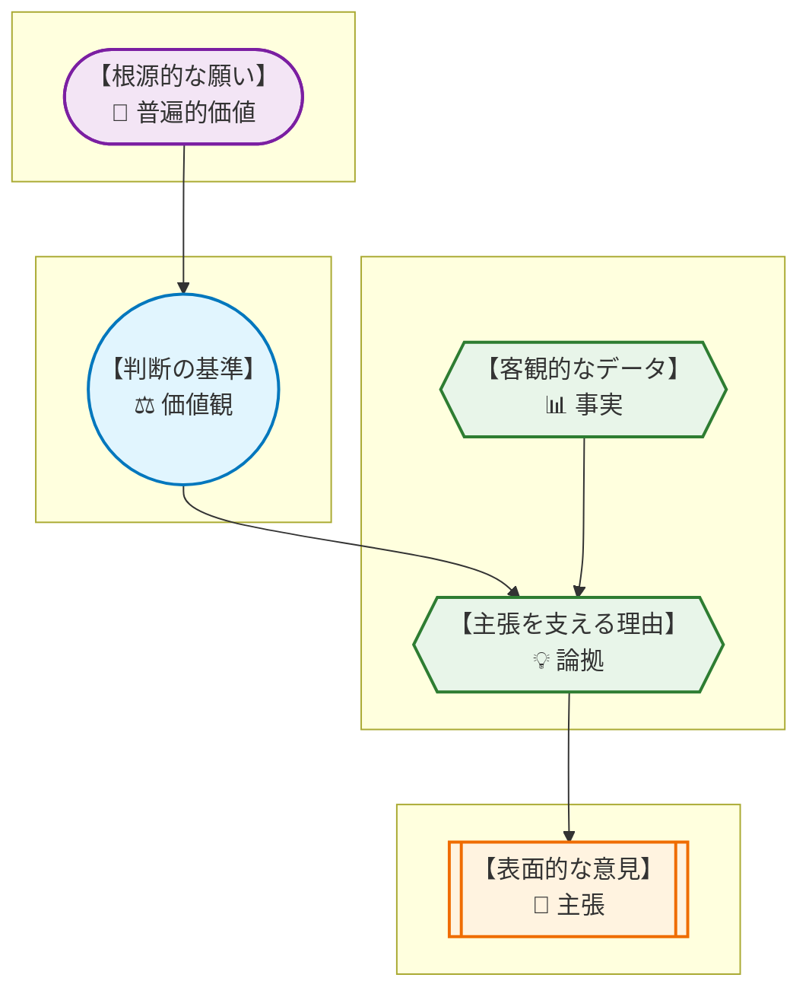
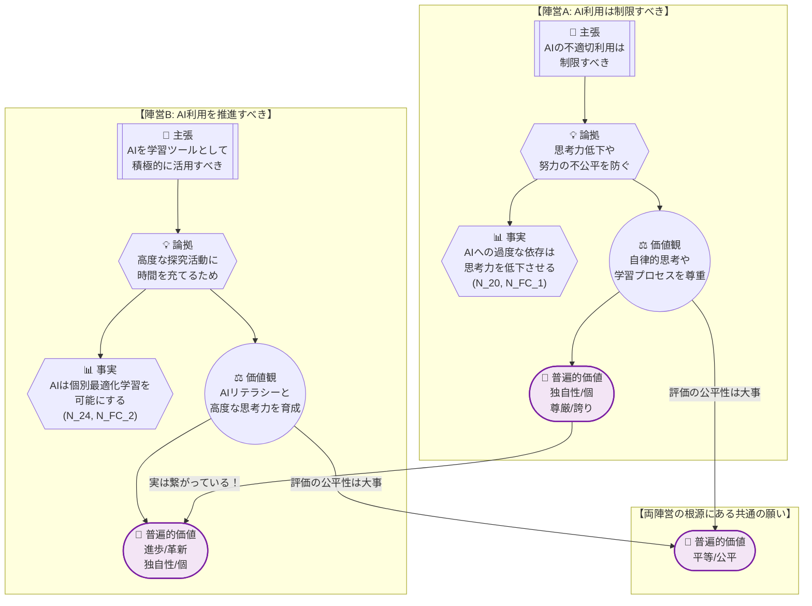
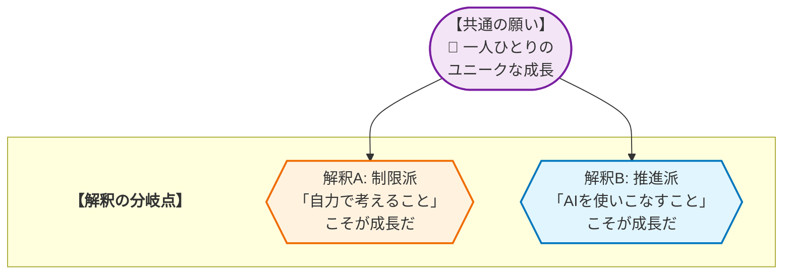

# 🧐 論理構造解析ワークシート：教育現場でのAI利用 を解き明かす
> **【学習者の皆さんへ】**
> このレポートは、AIが論理の組み立て方を提示した「思考のサンプル」です。AIが示した「事実」や「理由」が本当に正しいか、他に抜けている視点はないか、自分なりに疑い、検証してみてください。このレポートの内容を批判的に検討し、自分の言葉で議論を深めること自体が、最高のリテラシー教育となります。

## 1. AREの「逆推論」を理解する
> **【この章の要約】表面的な意見の奥にある「普遍的な願い」まで遡るプロセスを学びます。**

皆さん、こんにちは！「論理的思考」のインストラクターです。

「自分の考えをうまく伝えられない…」「意見が違う人とどう話せばいいんだろう？」そんな風に悩んだことはありませんか？ 大丈夫、それは君だけじゃありません。今日は、そんな悩みを解決する最強の「思考の道具」を手に入れるための、エキサイティングな冒険に出かけましょう！

その名も **「ARE（エー・アール・イー）モデル」**。これは、バラバラに見える意見を整理し、その奥に隠された「本当の願い」を見つけ出すための魔法の地図のようなものです。特に、意見の「根っこ」を探る **「逆推論」** というテクニックを一緒にマスターしていきましょう！

まずは、この地図の読み方から。

* **主張 (C: Claim)** : 「〜すべきだ」という具体的な意見・結論。
* **論拠 (W: Warrant)** : 「なぜなら〜だからだ」という、主張を支える理由付け。
* **事実 (F: Fact)** : 論拠を裏付ける客観的なデータや出来事。
* **価値観 (V: Value)** : 「〜は重要だ」という、個人や集団が持つ判断の軸。
* **普遍的価値 (UV: Universal Value)** : 「安全」「平等」「生命」など、文化や立場を超えてほとんどの人が反対しない根源的な願い。

さあ、この地図を使って、今回のテーマ「教育現場でのAI利用」について考えてみましょう。

例えば、学校の先生や親が「レポートや宿題でAIを使うのは、ズルだから禁止！」と言ったとします。これが **主張 (C)** ですね。

ここから、探偵のように「なぜ？」を繰り返して、意見の根っこを探っていきましょう。これが **「逆推論」** です！

1.  **【主張 C】** 「AIの利用は制限すべきだ！」
    *   **（なぜ？）**
2.  **【論拠 W】** 「だって、AIに頼ると自分で考えなくなってしまうからだ。」
    *   **（本当にそうなの？証拠は？）**
3.  **【事実 F】** 「実際に、AIに頼りすぎると、批判的に考える力や創造性が低下するという研究データがあるんだ。（データ: N_FC_1）」
    *   **（なぜ『自分で考えること』がそんなに大事なの？）**
4.  **【価値観 V】** 「自分の頭で悩み、試行錯誤する **学習プロセス** そのものに価値があるし、 **自律的な思考力** を尊重することが大切だからだよ。」
    *   **（その価値観の、さらに奥にある『みんなが願うこと』って何だろう？）**
5.  **【普遍的価値 UV】** 「それはきっと、『誰かの言いなりになるんじゃなく、一人ひとりが自分の力で未来を切り拓いてほしい』という **【独自性/個】** や **【尊厳/誇り】** という、誰もが大切にしたい根源的な願いに繋がっているんだね。」

どうでしょう？ ただ「禁止！」と聞くと反発したくなるかもしれませんが、その奥には「君に、自分だけの素晴らしい人生を歩んでほしい」という温かい願いが隠れていることが見えてきませんか？

このように、表面的な意見から一歩ずつ遡ることで、対立の裏にある「共通の願い」に気づくことができる。これが逆推論のパワーなんです！

## 2. 複数の主張から「共通の価値」を見つける
> **【この章の要約】一見違う2つの意見が、実は「同じ願い」を持っていることを解剖します。**

さて、ここからが本番です！ 世の中には、正反対に見える意見がぶつかり合っていますよね。

*   **陣営A（制限派）**：「AIの不適切な利用は制限すべきだ！ 思考力が低下する！」
*   **陣営B（推進派）**：「AIはツールとして積極的に活用すべきだ！ もっと創造的なことに時間を使おう！」

まるで水と油。絶対に分かり合えそうにないですよね。でも、本当にそうでしょうか？ 先ほどの逆推論を使って、両方の意見の「根っこ」まで探検してみましょう。まるで、同じ山の頂上を、別々のルートから目指す登山隊のようです。

この図を見て、何か気づきませんか？

そうです！ ルートは全く違いますが、両方の登山隊が目指している景色には、驚くべき共通点があるんです。

*   **共通点①：【独自性/個】の追求**
    *   **陣営A** は、「AIに頼らず **自分の頭で考える力** 」こそが、その人らしさ（独自性）を作ると考えています。
    *   **陣営B** は、「AIを使いこなし、**より高度で創造的な活動** をする」ことが、その人らしさ（独自性）を発揮することだと考えています。
    *   アプローチは違えど、「一人ひとりが、自分だけのユニークな能力を最大限に伸ばしてほしい」という **【独自性/個】** を願う気持ちは、全く同じなんです！

*   **共通点②：【平等/公平】の追求**
    *   **陣営A** は、「AIをズルして使った人が良い成績を取るのは **不公平** だ」と心配しています。（事実: N_40）
    *   もう一つの意見である **陣営C（改革派）** も、「AIが使えるかどうかで教育に差がつくのは **不公平** だ」と考えています。
    *   どちらも、「誰もが公正なルールのもとで評価され、チャンスを与えられるべきだ」という **【平等/公平】** の価値を、強く願っているのです。

*   **共通点③：【進歩/革新】の追求**
    *   **陣営B** はもちろん、AIという新しい技術で教育を **進歩** させたいと考えています。
    *   実は **陣営A** も、思考力低下という未来のリスクを憂い、「教育の本質を守りながら **より良い未来へ進みたい** 」と願っている点では同じです。

このように、一見対立している意見も、その根っこにある「みんなが大切にしたい願い（普遍的価値）」を探っていくと、たくさんの共通点が見つかります。

「敵か、味方か」の二択で世界を見るのではなく、「私たちは、同じ山頂を目指す、ルートの違う仲間なのかもしれない」。
そう考えるだけで、対話の可能性が無限に広がる気がしませんか？

---
**【前半はここまでです】**

さあ、ここからは君たちの出番です！
この「思考の地図」を片手に、次の問いについて考えてみましょう。

*   **問い①（批判的思考）：** この分析に、何か抜けている視点はないでしょうか？ 例えば、AIを使えない環境にいる人の視点、先生たちの視点、社会全体の視点など、もっと多くの立場から考えると、どんな「価値観」や「願い」が見えてくるでしょう？
*   **問い②（対話の設計）：** もし君が、この「制限派」と「推進派」の話し合いの司会をするとしたら、どんな質問を投げかけますか？ どうすれば、お互いの「共通の願い」に気づかせることができるでしょうか？
*   **問い③（アクションの創出）：** この分析を踏まえて、君たちの学校やクラスで「AIと上手に付き合うためのルール」を作るとしたら、どんなルールを提案しますか？ そのルールの根拠（W, F, V, UV）も合わせて説明してみてください。

このワークシートは、あくまで思考のスタート地点。本当の答えは、君たち自身の頭と心の中にあります。仲間と対話し、考えを深めるプロセスそのものを、楽しんでください！

## 3. 議論が噛み合わない「隠れた論拠(Warrant)」を発見する
> **【この章の要約】事実を「問題だ」と判断する背景にある、隠れた前提を探ります。**

さあ、ここからさらに思考の探検を深めていこう！

前半では、「制限派」の意見の裏にある「自律的な思考力を尊重する」という価値観 (V) を見つけ出したよね。では、今度は逆の立場、「推進派」の意見も同じように解剖してみよう。

**【推進派の主張】**
*   **主張 (C)**: 「AIは学習ツールとして積極的に活用すべきだ！」
*   **事実 (F)**: 「AIは、一人ひとりに合わせた学習（個別最適化学習）を可能にする。（データ: N_24, N_FC_2）」

ここまでは、データに基づいた客観的な話だ。でも、ちょっと待って。
「学習が効率的になる（事実）」からといって、なぜ「だから積極的に使うべきだ（主張）」と、すぐに結論が飛躍するんだろう？

この **「事実」と「主張」の間には、橋渡しをするための『隠れた前提』** が隠されているんだ。これが **論拠 (Warrant)** の正体。それは、話している本人も無意識のうちに「当たり前だ」と思っている考え方のクセのようなものなんだ。

さあ、君が探偵になったつもりで、この「隠れた前提」を探し出してみてほしい。

**【ワーク】**
「AIで学習が効率化できる」という事実から、「だからAIを積極的に使うべきだ」と結論づける人は、その心の中で、どんなことを「当たり前の前提」として信じているでしょうか？

▼ 考え方のヒントと解答例

**【ヒント】**
*   効率化して **「空いた時間」** で、何をすることが「良いこと」だと考えているんだろう？
*   **「新しい技術」** に対して、どんなスタンスでいることが「正しい」と思っているんだろう？
*   **「未来の社会」** で活躍するために、どんな能力が「不可欠だ」と信じているんだろう？

**【解答例】**
*   **隠れた論拠①**: 「単純作業に使う時間はムダだ。空いた時間は、もっと創造的で高度な探究活動に使うべきだ」という前提。
*   **隠れた論拠②**: 「新しい技術は、ただ怖がるのではなく、積極的に使いこなせるようになるべきだ」という前提。
*   **隠れた論拠③**: 「これからの社会では、AIを使いこなす能力（AIリテラシー）が、読み書きと同じくらい必須のスキルになる」という前提。

どうかな？ こんな風に、同じ事実を見ても、人によって違う「隠れた論拠（当たり前だと思っていること）」を持っているから、結論（主張）が正反対になることがあるんだ。相手の意見に「なんで？」と思ったら、その人の「隠れた論拠」を探ってみると、対話の突破口が見つかるかもしれないよ！

## 4. データが示す「対立の震源地」を特定する
> **【この章の要約】議論が平行線になる本当の理由（価値観の衝突）を特定します。**

「制限派」と「推進派」。
議論が噛み合わず、平行線になってしまうのはなぜだろう？

それは、彼らが目指す山の頂上、つまり **「普遍的価値 (UV)」** は同じなのに、そこに至るまでのルート、つまり **「価値観 (V) の解釈」** が全く違うからなんだ。

前半で見たように、両者とも「一人ひとりが、自分だけのユニークな能力を最大限に伸ばしてほしい」という **【独自性/個】** という共通の願いを持っている。でも、その「独自性の伸ばし方」についての解釈が、真っ二つに割れている。これこそが、対立の **「震源地」** なんだ。

この構造を、図で見てみよう。

この図が示すのは、衝撃的な事実だ。
彼らは、敵同士なんかじゃない。**「どうすれば君たちが最高に成長できるか」を、それぞれの立場で真剣に考えてくれている、同じ願いを持つ仲間** なんだ。

ただ、
*   **制限派** は、「AIに頼らず、自分の頭で悩み抜く **プロセス** 」にこそ、成長の価値があると考えている。
*   **推進派** は、「AIを相棒にして、今まで誰も解けなかったような **高度な問題に挑戦する** 」ことに、成長の価値があると考えている。

どちらが「絶対的に正しい」ということはない。どちらの価値も、とても大切だ。
この対立の震源地がわかれば、「どっちが勝つか」ではなく、「どうすれば両方の価値を大切にできるか？」という、まったく新しい問いを立てることができるようになるんだ！

## 5. 価値を統合して「第三の解決策」をデザインする
> **【この章の要約】AかBかの妥協ではなく、両方の価値を満たす新しい仕組みを考えます。**

さあ、いよいよこの冒険のクライマックスだ！
対立する2つの価値を、どちらも諦めない。A案とB案を足して2で割るような「妥協」ではなく、両方の価値を“両立”させる、まったく新しい **「第三の解決策」** をデザインしよう！

そのための思考プロセスは、こんな感じだ。

1.  **【対立する価値を並べる】**
    *   制限派が守りたい価値: **「自律的な思考力」** と **「学習プロセス」** の尊重。
    *   推進派が実現したい価値: **「AIを使いこなす力」** と **「高度な探究」** への挑戦。

2.  **【統合する“魔法の問い”を立てる】**
    *   「どうすれば、**AIを使いこなしながら**、同時に、**自律的な思考力も鍛える** ことができるだろう？」

3.  **【アイデアを組み合わせる】**
    *   この「魔法の問い」に答えるための、具体的なルールや仕組みを考えてみよう！

このプロセスから生まれる「第三の解決策」は、一つじゃない。君たちの数だけ、無限の可能性がある。ここでは、僕からのアイデアを一つ、たたき台として提案させてほしい。

---
**【第三の解決策の一例： 『AI壁打ち探究』ルール】**

これは、レポートや探究学習の進め方に関する新しいルール案だ。

*   **STEP 1: 発散フェーズ【推進派の価値を尊重】**
    *   テーマに関する情報収集やアイデア出しは、AIを「壁打ち相手」として、とことん活用してOK！ 自分の知らない視点や情報を、AIにどんどん引き出してもらおう。

*   **STEP 2: 深化フェーズ【制限派の価値を尊重】**
    *   AIが出した情報を鵜呑みにせず、その情報の「根拠 (Fact)」は本当か、「隠れた前提 (Warrant)」はないか、自分の頭で徹底的に検証する。AIの回答に対して、**批判的な視点から分析・考察するパート** を必ず設ける。

*   **STEP 3: 統合フェーズ【両方の価値を評価】**
    *   提出物は、最終的なレポートだけでなく、**「AIとの対話ログ」** と **「STEP 2の批判的分析」** をセットで提出する。
    *   評価のポイントは、完成度だけでなく、「AIにどんな質の高い質問を投げかけたか」「AIの回答をどう乗り越え、自分の思考を深めたか」という **「思考のプロセス」** そのもの。

---

どうだろう？ このルールなら、「AIを使いこなす力」と「自分の頭で考える力」を、同時に鍛えることができそうだと思わないかい？

さあ、今度は君の番だ！ このアイデアをヒントに、君だけの「第三の解決策」を考えてみよう。こんな問いから始めてみるのもいいかもしれない。

*   AIに「良い質問」をする能力そのものを、どうやって評価できるだろう？
*   あえて「AIが間違いやすいお題」を出して、その間違いを的確に指摘させる課題はどうかな？
*   クラスで「AI利用の成功例・失敗例」を共有し、みんなで学び合う会を開くのはどうだろう？

> **【次なる探究に向けた検証課題（たたき台としての自己開示）】**
>
> 僕が提案した『AI壁打ち探究』ルールが、本当にうまくいくかを確かめるために、君たちの生活の範囲でこんなことを調べてみてはどうだろう？
>
> *   **インタビュー調査:** クラスメイト5〜10人にこのルール案を説明し、「良いと思う点」と「逆に難しそう、心配な点」を聞いてみよう。
> *   **専門家へのヒアリング:** 国語や情報の先生にこのルール案を見せて、「評価する側から見て、実現可能か」「もっと良くするためのアドバイスはないか」を聞いてみよう。
> *   **自己実験:** 次のレポート課題で、このルールを自分に課して実際にやってみる。何がうまくいって、何に困ったか、そのプロセスを記録してみよう。

## 🎓 学習リフレクション

今日、僕たちは「教育現場でのAI利用」というテーマを題材に、対立の裏にある共通の願いを見つけ、新しい解決策を生み出す「思考の冒険」をしてきた。

最後に、少しだけ立ち止まって、今日の学びを振り返ってみよう。

*   もし自分が、今日考えた意見と **「反対の立場」** だったら、どんな気持ちになるだろう？ 相手が守ろうとしている「価値 (Value)」や、当たり前だと思っている「隠れた論拠 (Warrant)」を、想像できるだろうか？
*   今日の学びを、**日常のコミュニケーション** でどう活かせるだろう？ 例えば、家族とのちょっとした意見の食い違いや、友達とのLINEでのすれ違いが起きたとき、相手の言葉の奥にある「本当の願い」を想像してみることはできないだろうか。

論理的思考は、誰かを打ち負かすための「武器」じゃない。
意見が違う人とも、その奥にある「共通の願い」で繋がり、より良い未来を一緒に創るための **「架け橋」** なんだ。

君たちが、この「思考の道具」を手に、自分の周りにある対立を乗り越え、世界をほんの少しでも優しく、面白く変えていってくれることを、心から願っている。

君の探究を、いつでも応援しているよ！