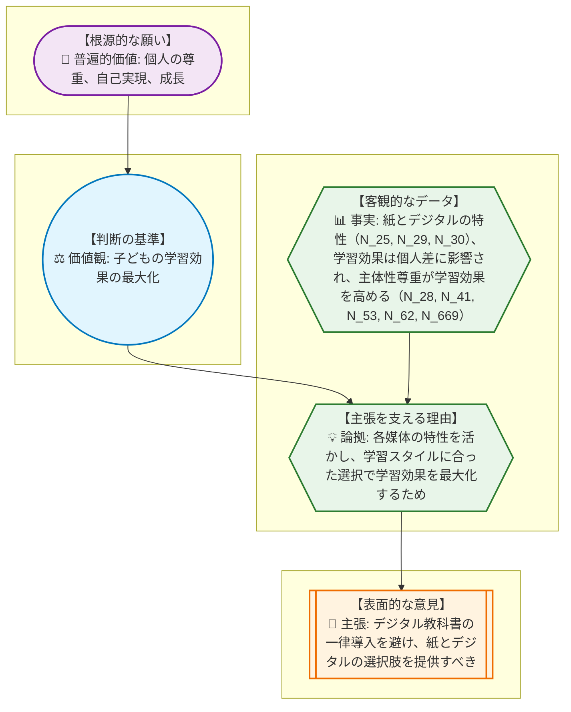
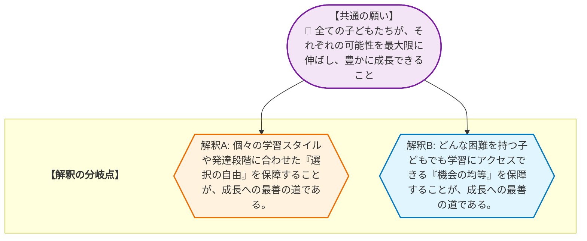

# 🧐 論理構造解析ワークシート：デジタル教科書 を解き明かす
> **【学習者の皆さんへ】**
> このレポートは、AIが論理の組み立て方を提示した「思考のサンプル」です。AIが示した「事実」や「理由」が本当に正しいか、他に抜けている視点はないか、自分なりに疑い、検証してみてください。このレポートの内容を批判的に検討し、自分の言葉で議論を深めること自体が、最高のリテラシー教育となります。

## 1. AREの「逆推論」を理解する
> **【この章の要約】表面的な意見の奥にある「普遍的な願い」まで遡るプロセスを学びます。**

みんな、こんにちは！ 論理的思考インストラクターの先輩だよ。今日は、みんなが普段何気なく言っている意見の奥に隠された「本当の願い」を見つける、ちょっと面白い思考のテクニックを伝授するね。その名も「逆推論」！ 意見（主張）からスタートして、その理由、根拠となる事実、そしてその背景にある価値観、最終的には誰もが共感できる普遍的な願いまで、まるで宝探しみたいに遡っていくんだ。

今回のテーマは、みんなの学校生活にも関わる「デジタル教科書」について。たくさんの意見がある中で、一つ選んで一緒に掘り下げてみよう。

---

**【主張を選んで逆推論してみよう！】**

今回選んだ主張はこれだ！

**📢 主張 (Claim - C)**: 「デジタル教科書の一律導入を避け、紙の教科書を無償配布しつつ、デジタル教科書も補助提供して、子どもたちが自身の学習スタイルや発達段階に応じて最適な媒体を選択できる環境を整備すべきである。」（N_6）

これってさ、まるで文化祭の出し物で「全員同じテーマじゃなくて、クラスごとに自由にテーマを選べるようにしてほしい！」って生徒会に訴えるのと似てると思わない？ みんなが一番力を発揮できるテーマを選びたいって気持ちだよね。

じゃあ、この主張の奥にあるものを探っていこう！

*   **💡 論拠 (Reason - R/W)**: なんでそう主張するんだろう？
    「なんでそう思うかっていうと、紙の教科書は直接書き込めるし、全体を見渡しやすいから記憶に残りやすいってメリットがある。一方で、デジタル教科書は動画で分かりやすく説明してくれたり、音声で読み上げてくれたりするから、理解が深まるってメリットもある。だから、それぞれの良いところを活かして、みんなが一番勉強しやすい方法を選べた方が、学習効果が上がるはずだ！」

*   **📊 事実 (Evidence - E/F)**: その論拠を裏付ける客観的なデータや証拠はあるかな？
    「実際、紙の教科書の方が手で書くことで記憶に残りやすいって研究結果もあるし（N_25）、デジタルの動画や音声が理解を助けるってデータもたくさんある（N_29, N_30）。それに、人によって得意な勉強法は違うから、自分に合った方法で勉強した方が成績が伸びるってことも分かってるんだ（N_28, N_669）。学習者が自分で選ぶことで、やる気も上がって、もっと深く学べるようになるってこともね（N_41, N_53, N_62）。」

*   **⚖️ 価値観 (Value - V)**: その論拠の背景にある、どんな判断基準があるんだろう？
    「つまり、この意見の背景には、『一人ひとりの学習効果を最大限に高めたい！』っていう強い思いがあるんだね。みんなが最高のパフォーマンスを出せるようにしたい、っていう価値観だ。」

*   **💎 普遍的価値 (Universal Value - UV)**: その価値観のさらに奥にある、誰もが共感できる根源的な願いってなんだろう？
    「さらに深く掘り下げると、それは『一人ひとりが自分の可能性を最大限に引き出して、大きく成長できること』、つまり『自己実現』や『個人の尊重』っていう、誰もが願う普遍的な価値に繋がっているんだ。みんなが自分らしく輝ける学校生活を送ってほしい、ってことだよね！」

---

## 2. 複数の主張から「共通の価値」を見つける
> **【この章の要約】一見違う2つの意見が、実は「同じ願い」を持っていることを解剖します。**

さて、次はちょっと視点を変えてみよう。デジタル教科書を巡る議論には、まるで水と油みたいに意見が違うように見える二つのグループがあるんだ。でもね、実は彼ら、目指している「山の頂上」は同じだったりするんだよ。ただ、そこに至るまでの「登山ルート」が違うだけなんだ。

例えば、こんな二つの意見を見てみよう。

---

### 【陣営A: 自分に合った教科書を選びたい！】
このグループは、まるで「自由な登山ルートを選んで、自分だけのペースで頂上を目指そうぜ！」っていう、個性重視の登山隊みたいだね。

*   **📢 主張**: 「デジタル教科書の一律導入を避け、紙の教科書を無償配布しつつ、デジタル教科書も補助提供して、みんなが自分に合った媒体を選べるようにすべきだ！」（N_6）
*   **💡 論拠**: 紙とデジタルのそれぞれの良いところを活かして、学習スタイルに合った選択をすることで、学習効果を最大限に高めたいから。
*   **📊 事実**: 紙には書き込みやすさや記憶定着の優位性があり（N_25）、デジタルには動画や音声による理解促進のメリットがある（N_29, N_30）。学習効果は個人の特性やスタイルに影響され（N_28, N_669）、主体的な選択が学習効果を高めることが分かっている（N_41, N_53, N_62）。
*   **⚖️ 価値観**: 子ども一人ひとりの学習効果を最大化すること。
*   **💎 普遍的価値**: 個人の尊重、自己実現、成長。

### 【陣営B: どんな子でも使えるデジタル教科書を！】
このグループは、「どんなに足が不自由な仲間でも、みんなで一緒に頂上までたどり着けるように、安全な道標と特別な装備を準備しようぜ！」っていう、みんなで助け合う登山隊みたいだ。

*   **📢 主張**: 「デジタル教材やデジタルコンテンツの提供において、教育機関やデジタルコンテンツ提供者は、ロービジョン、学習障害（LD）、書字障害等の困難を抱える子どもたちの学習を支援するために、ルビ振り、UDフォント、配色変更、音声読み上げ、拡大機能といった支援機能を標準搭載すべきである。」（N_74）
*   **💡 論拠**: ロービジョンや学習障害などの困難を抱える子どもたちが、学習内容にアクセスし、理解を深め、読書疲労を軽減できるように支援するため。
*   **📊 事実**: ロービジョンや学習障害を持つ子どもたちは、既存の教材では学習が困難な場合が多く（N_109, N_157）。しかし、ルビ振りや音声読み上げなどのデジタル支援機能が標準搭載されれば、彼らの学習機会が均等化され、理解が促進されることが多くの研究で示されている（N_116, N_118, N_125, N_139, N_158, N_280, N_306）。
*   **⚖️ 価値観**: 全ての学習者への学習機会の均等化、合理的配慮の実現。
*   **💎 普遍的価値**: 公平性、包摂性、尊厳、成長。

---

### 【両陣営の根源にある共通の願い】

一見すると、陣営Aは「自由に選ばせてくれ！」、陣営Bは「みんなに同じように使えるようにしてくれ！」って言ってて、真逆に見えるよね。でも、よーく見てみると、彼らの意見の奥底には、共通の「願い」が隠れているんだ。

1.  **💎 一人ひとりの可能性を最大限に伸ばしたい（個人の尊重・自己実現）**:
    陣営Aは、自分に合った方法で勉強することで、もっと成績を伸ばしたい、もっと深く学びたいって思ってる。陣営Bは、どんな困難があっても、その子の持っている力を最大限に引き出してあげたいって願ってる。どちらも、一人ひとりの「こうなりたい！」っていう気持ちや、

## 3. 議論が噛み合わない「隠れた論拠(Warrant)」を発見する
> **【この章の要約】事実を「問題だ」と判断する背景にある、隠れた前提を探ります。**

さて、議論がなぜか平行線になってしまうとき、その原因は「隠れた論拠（Warrant）」にあることが多いんだ。これは、まるで探偵が事件現場に残された手がかり（事実）から、犯人の動機（主張）へと繋がる、誰もが当たり前だと思っているけれど、実は明文化されていない「前提」を見つけ出すようなものだよ。

例えば、デジタル教科書に関するこんな意見を見てみよう。

*   **事実(F)**: 「デジタル教科書は、動画や音声、拡大機能など、多様な学習支援機能を持つ。」
*   **主張(C)**: 「だから、デジタル教科書は、学習困難な子どもたちにとって必須のツールだ。」

この「事実」から「主張」へと飛躍する間に、どんな「隠れた論拠」が潜んでいると思う？

探偵になったつもりで考えてみてほしい。この意見の持ち主は、どんな「当たり前」を前提として、この主張をしているんだろう？

---

**【ワーク】隠れた論拠を探せ！**

次に示す「事実」と「主張」の間に隠された「論拠」を、君の頭の中で探偵のように推理してみよう。

*   **事実(F)**: 「デジタル教科書は、タブレットやPCの画面で読むため、長時間使用すると目の疲れや集中力の低下を引き起こす可能性がある。」
*   **主張(C)**: 「だから、デジタル教科書の一律導入は慎重に検討すべきだ。」

この「事実」から「主張」へと飛躍する、無意識の前提は何だろう？

▼ 考え方のヒントと解答例

**【ヒント】**
*   「目の疲れや集中力の低下」が「問題だ」と判断されるのはなぜだろう？
*   それが「学習」にどう影響すると考えているのだろう？
*   「健康」や「学習環境」に対する、この意見の持ち主の無意識の前提はなんだろう？

**【解答例】**
*   **隠れた論拠**: 「学習者の健康（特に視力）や集中力の維持は、学習効果を最大化するために不可欠である。」

どうだったかな？ このように、私たちは普段、意識せずに多くの「隠れた論拠」を前提として意見を述べているんだ。そして、この隠れた論拠が人それぞれ違うからこそ、同じ事実を見ても、全く違う主張が生まれて、議論が噛み合わなくなることがあるんだね。

## 4. データが示す「対立の震源地」を特定する
> **【この章の要約】議論が平行線になる本当の理由（価値観の衝突）を特定します。**

前章で、一見すると対立しているように見える二つの意見が、実は「全ての子どもたちが、それぞれの可能性を最大限に伸ばし、豊かに成長できること」という共通の願い（普遍的価値）を持っていることを見つけたよね。

でも、なぜ共通の願いを持っているのに、意見が対立してしまうんだろう？ それは、その共通の願いを「どうすれば実現できるか」という解釈が、それぞれの陣営で異なっているからなんだ。まるで、同じ山の頂上を目指しているのに、A隊は「自由なルートで登るのが一番だ！」と言い、B隊は「安全な道標を整備してみんなで登るのが一番だ！」と言い張っているようなものだね。

この「解釈の相違」こそが、議論が平行線になる「対立の震源地」なんだ。

例えば、デジタル教科書を巡る議論では、共通の願いである「全ての子どもたちの成長」に対して、次のような解釈の分岐が見られるよ。

陣営Aは「個人の尊重」を重視し、選択の自由が学習効果を最大化すると考える。一方、陣営Bは「公平性・包摂性」を重視し、どんな子どもでも学習できる環境が成長の基盤だと考える。どちらも「子どもの成長」を願っているのに、その実現方法に対する「解釈」が異なるために、意見がぶつかり合ってしまうんだ。

この対立の震源地を特定することで、私たちは表面的な主張の応酬ではなく、その奥にある「解釈の違い」に焦点を当てて、より深い議論ができるようになるんだよ。

## 5. 価値を統合して「第三の解決策」をデザインする
> **【この章の要約】AかBかの妥協ではなく、両方の価値を満たす新しい仕組みを考えます。**

対立の震源地が「共通の願いに対する解釈の違い」だと分かったら、次は「AかBか」という二者択一の妥協ではなく、両方の解釈、つまり両陣営の価値観をどちらも犠牲にしない、新しい「第三の解決策」をデザインする番だ。これは、ドイツの哲学者ヘーゲルが提唱した「アウフヘーベン（止揚）」という考え方に似ているね。対立するものを否定するのではなく、より高い次元で統合し、新しいものを生み出すんだ。

デジタル教科書を巡る対立において、陣営Aは「選択の自由と学習効果の最大化」を、陣営Bは「学習機会の均等化と合理的配慮」を重視していた。この二つの価値を統合する「第三の解決策」の一例を提案してみよう。

---

**【第三の解決策の一例】パーソナライズド・ハイブリッド学習環境の構築**

この解決策は、生徒一人ひとりが自分に最適な学習方法を選べる自由を保障しつつ、同時に、どんな困難を抱える子どもでも学習にアクセスできる機会を均等に提供することを目指すものだ。

1.  **UD（ユニバーサルデザイン）対応デジタル教科書の標準化**:
    *   全てのデジタル教科書に、ルビ振り、UDフォント、配色変更、音声読み上げ、拡大機能といった支援機能を標準搭載する。これにより、ロービジョン、学習障害、書字障害など、様々な困難を抱える子どもたちが、紙の教科書では得られなかった学習機会を享受できるようになる。
2.  **紙とデジタルの「選択的併用」制度**:
    *   全ての教科書を「UD対応デジタル版」と「紙版」の両方で提供する。
    *   生徒は、学期ごと、あるいは単元ごとに、自身の学習スタイルやその時の学習内容、体調などに応じて、紙とデジタルのどちらを主として使うか、あるいは両方を組み合わせて使うかを「選択」できる。
    *   学校は、生徒が最適な選択をするためのガイダンス（各媒体の特性、学習効果に関する情報提供）と、必要に応じた個別相談の機会を設ける。
3.  **デバイスと環境の整備**:
    *   デジタルデバイスは学校から貸与し、家庭環境による格差を解消する。
    *   学校内には、デジタル学習に適した環境（充電スペース、Wi-Fi環境）と、紙の学習に適した環境（集中できる自習スペース）の両方を整備する。

この「パーソナライズド・ハイブリッド学習環境」は、陣営Aが求める「個人の尊重と選択の自由」を保障しつつ、陣営Bが求める「学習機会の均等化と合理的配慮」を同時に実現する。どちらかの価値を犠牲にするのではなく、両方の価値を最大限に引き出す新しい仕組みと言えるだろう。

---

**【自己開示としての検証課題】**

もし君たちの学校でこの「パーソナライズド・ハイブリッド学習環境」が導入されたら、君はどんな風に教科書を選び、どんな風に勉強してみたいかな？

実際に1週間、紙とデジタルを使い分けてみて、それぞれのメリット・デメリットを記録し、自分にとっての最適な組み合わせを考えてみよう。その際、もし君が学習に困難を抱える友達だったら、どんな機能が一番役立つと思うか、想像して書き出してみてほしい。

## 🎓 学習リフレクション

みんな、今日の「思考の冒険」お疲れ様！

今日は、表面的な意見の奥に隠された「本当の願い」を探し、一見対立する意見の「共通の価値」を見つけ出し、さらに議論が噛み合わない原因となる「隠れた前提」を発見する旅をしてきたね。そして最後には、対立する価値観を統合する「第三の解決策」をデザインするという、創造的な挑戦もした。

このARE（主張-理由-根拠）の思考法は、単に論理的に考えるだけでなく、相手の気持ちや背景にある価値観を深く理解し、より良い未来を共に創り出すための強力なツールなんだ。

さあ、この「思考のレンズ」を手に、君たちの日常のコミュニケーションに飛び込んでみよう。友達との意見の食い違い、家族との話し合い、ニュースで報じられる社会問題…どんな場面で、このAREの思考法を活かして、より深く理解し、より良い解決策を見つけ出すことができるだろうか？