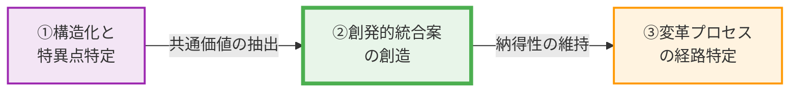

# 🏛️ Strategic Consensus Report: デジタル教科書

## 🔥 【一文サマリー：目指すべき組織の姿】
デジタル技術の潜在力を最大限に引き出しつつ、既存の教育格差を拡大させず、全ての子どもたちが個々のニーズに応じた質の高い教育を受けられる、持続可能でインクルーシブな学習環境を構築する。

## 🚀 【結論：優先順位に基づく3つの具体的アクション】
1.  **優先度【高】：ユニバーサルデザインに基づくデジタル教科書の標準機能強化と無償提供** - ロービジョン、学習障害（LD）、書字障害等の困難を抱える子どもたちの学習機会を均等化するため、ルビ振り、UDフォント、配色変更、音声読み上げ、拡大機能などの支援機能をデジタル教科書に標準搭載し、全ての児童生徒に無償提供することを義務化します。これにより、デジタルデバイドによる格差拡大リスクを低減しつつ、インクルーシブな教育環境を推進し、特定の困難を抱える子どもたちが学習から取り残される事態を根本的に解消します。
2.  **優先度【中】：デジタル学習環境の統合と教員支援体制の抜本的強化** - 複数のデジタル学習システムを統合し、閲覧アプリやログイン手順の一本化、UIの共通化を進めることで、家庭と現場の運用負担を大幅に軽減します。同時に、ICT支援員の雇用改善と増員、教員養成課程における支援技術学習の必須化、物理的環境（端末とノートを広げられる机、故障・修理中の代替機確保）の整備を加速し、教員が本来の教育活動に集中できる環境を構築することで、教育の質を向上させます。
3.  **優先度【低】：デジタル利用におけるリスク管理と保護者向け情報提供の徹底** - 学校と家庭が連携し、デジタル利用に伴う身体的・精神的リスク（視力低下、眼精疲労、姿勢悪化、ブルーライトによる集中力低下、SNSいじめ、情報漏洩等）への具体的な対策ガイドラインを策定・周知し、安全な利用環境を確保します。また、デジタル教科書の申請方法や相談窓口を教科書等に明記し、情報提供の透明性を高めることで、保護者のデジタルリテラシー格差を解消し、全ての家庭が安心してデジタル教育に参加できる基盤を築きます。

## 【Strategic Map：政策論争の全体像】
1.  **What (争点)**: デジタル教科書の一律導入の是非と、その導入形態（紙との併用、無償化、支援機能の標準化、環境整備、教員支援、リスク管理）に関する政策決定。
2.  **Why (価値のねじれ)**: 共通の「教育機会の均等」という普遍的価値に対する解釈の決定的な不一致。陣営Aは「既存の格差拡大防止と選択の自由」を重視し、デジタルデバイドや家庭環境による不平等を懸念する一方、陣営Bは「デジタル技術による新たなアクセシビリティと包摂性の実現」を重視し、障害を持つ子どもたちへの支援や情報アクセス公平性を追求しています。この解釈のずれが、具体的な政策提言の方向性を大きく異ならせています。
3.  **Oasis (共通基盤)**: 「全ての子どもたちの学習効果の最大化」「質の高い教育の提供」「子どもの健全な成長の支援」。両陣営ともに、最終的には子どもたちの利益を最大化し、より良い教育環境を提供したいという共通の願いを抱いています。
4.  **Singularity (断層)**: 「デジタル技術がもたらす恩恵」と「デジタル技術がもたらすリスク・格差」の評価の非対称性。特に、「デジタル化が既存の格差を拡大させるリスク」と「デジタル化が新たな教育機会を創出する可能性」という二律背反的な側面への認識の隔たりが、議論を阻害する論理的・構造的ボトルネックとなっています。また、「個人の選択の自由」と「ユニバーサルなアクセシビリティ」の優先順位、そして「現場の負担軽減」と「未来志向の教育変革」のバランスをどう取るかという点も、深い断層を形成しています。

## 🗺️ 1. 価値ネットワークの地形と「価値距離 (Value Distance)」
> **[定量モデル：Value Distance]**
> **価値距離 = | 価値解釈A − 価値解釈B |**
> 解析された価値距離 = 【0.70】
> **[構造的トレードオフ]**: 【教育機会の均等 vs インクルーシブな社会の実現】 / 【教育機会の均等 vs 情報アクセス公平性】 / 【教育機会の均等 vs 教育障壁除去への技術活用】

*   **⚡ 価値距離とトレードオフの分析**: 解析された価値距離0.70は、両陣営が「教育機会の均等」という共通の普遍的価値を掲げながらも、その実現に向けた具体的な解釈において決定的な乖離があることを明確に示しています。陣営Aは、デジタル教科書の一律導入が、家庭の経済状況や保護者のデジタルリテラシーの差、あるいはデジタル機器へのアクセス環境の差によって、既存の教育格差を拡大させる可能性を強く懸念しています。彼らは、紙の教科書が持つ直感的な優位性や、学習者の発達段階に応じた媒体選択の自由を保障することが、結果として学習機会の不均等を招くリスクを回避すると考えています。この視点では、「教育機会の均等」とは、デジタルデバイドによる新たな不平等を生まないこと、そして個人の選択の自由を尊重することに重きが置かれています。

    一方、陣営Bは、ロービジョンや学習障害（LD）などの困難を抱える子どもたちが、既存の紙の教科書では学習内容にアクセスすること自体が困難であるという現状を重視しています。彼らにとっての「教育機会の均等」とは、デジタル技術を活用して教育障壁を除去し、支援機能を標準搭載することで、全ての学習者がデジタルコンテンツを円滑に利用できる環境を整備し、「インクルーシブな社会の実現」や「情報アクセス公平性」を達成することにあります。

    この構造的トレードオフは、「教育機会の均等」という目標を達成するためのアプローチが、「既存の格差を拡大させないための慎重なアプローチ」と「デジタル技術で新たな機会を創出し、包摂性を高める積極的なアプローチ」という形で根本的に対立していることを浮き彫りにしています。この解釈乖離が、デジタル教科書導入に関する組織全体の停滞や、政策の不透明性による教員や保護者の不安を招く主要因となっています。

## 📊 2. 論理連鎖の構造化 (Logical Chain)

### ■ 陣営A
*   **F (事実)**: 紙の教科書は直感的な書き込みや記憶定着に優れる。デジタル機器へのアクセス環境やリテラシーの差、家庭の経済状況が教育格差を生む。デジタル利用は子どもの視力低下、集中力低下、情報漏洩、いじめなどのリスクを増大させる。教員のICT業務負担や物理的環境の不備が教育の質を低下させる。学習スタイルに合わせた指導が効果を高めるというメッシング仮説は科学的根拠が乏しい。
*   **E (感情/不安)**: デジタル教科書の一律導入による既存の教育格差の拡大、子どもの健康被害、学習効果の低下、教員の疲弊と現場の混乱、情報セキュリティへの懸念。
*   **V (価値観)**: 個人の主体性尊重、学習媒体選択の自由、既存の教育機会の公平性維持、子どもの健全な成長、教員の負担軽減、現場の実態に即した政策。
*   **UV (普遍的価値)**: 個人の尊厳、教育機会の均等、心の健全性、規範の維持。

### ■ 陣営B
*   **F (事実)**: ロービジョンや学習障害を持つ子どもたちは既存教材では学習が困難であり、デジタル支援機能（音声読み上げ、拡大機能等）は学習機会を均等化し理解を促進する。デジタル技術の活用は教育現場のアクセシビリティ向上に不可欠。システム統合、UI共通化、オフライン利用、強固なWi-Fi環境整備は、家庭と現場の負担を軽減し、学習意欲を維持・向上させる。恒久的な予算確保と安価な提供は、デジタル教育の普及と格差是正に資する。
*   **E (感情/不満)**: 支援を必要とする子どもたちが教育から取り残されている現状への不満、デジタル技術の潜在能力が十分に活用されていないことへの焦燥感、教育現場の非効率性への不満、デジタルデバイドによる新たな格差への懸念。
*   **V (価値観)**: 合理的配慮、アクセシビリティの確保、教育機会の均等化、技術革新による社会課題解決、効率性と標準化、情報アクセス公平性。
*   **UV (普遍的価値)**: 個人の尊厳、教育機会の均等、インクルーシブな社会の実現、教育障壁除去への技術活用。

## ⚠️ 3. 感情の震源地と「現状の定量的解析」 (Emotion Map)
> **【感情震度（Emotion Intensity）とは？】**
> AREにおける「感情震度（1.0〜10.0）」は、単なる気分ではなく、組織内の論理的摩擦と熱量を示す客観的指標です。
> **感情震度 (0-10.0) = (感情スコア × 発話頻度 × 重み係数) / 10**
> 1. **🔥 熱量 (Volume)**: 主張の背後にある具体的な事実(F)の声の多さ
> 2. **💧 切実さ (Emotion)**: 現場から直接発信された生の感情データの密度
> 3. **⚡ 摩擦 (Friction)**: 核心的価値観(V)が否定されることによる構造的ストレス

### ■ 感情震度のブレイクダウン（現状解析）
| 陣営 | **感情震度 (0-10.0)** | 核心的毀損 (ダメージを受けている価値) |
| :--- | :---: | :--- |
| **陣営A** | **9.3** | 個人の尊重 |
| **陣営B** | **10.0** | 情報アクセス公平性 |

*   **🔴 陣営Aの核心的毀損**: 陣営Aは、デジタル教科書の一律導入が、個々の学習者の多様なニーズや家庭環境、そして教員の専門性を無視し、選択の自由を奪うことへの強い反発から「個人の尊重」が毀損されていると感じています。紙の教科書が持つ直感的な利点や、デジタルデバイドによる新たな格差、子どもの健康への懸念が、個人の尊厳や選択の自由が脅かされるという切実な危機感に直結しています。現場の教員の負担増大も、個々の教員の専門性や労働環境が尊重されていないと感じさせ、この高い感情震度を生み出しています。
*   **🟡 陣営Bの核心的毀損**: 陣営Bは、特にロービジョンや学習障害を持つ子どもたちが既存の紙の教科書では学習内容にアクセスできないという現状に対する強い不満と、デジタル技術がその障壁を取り除く可能性を秘めているにもかかわらず、それが十分に活用されていないことへの焦燥感から「情報アクセス公平性」が毀損されていると感じています。彼らにとって、情報へのアクセスは学習の前提であり、それが公平に提供されないことは、教育機会の均等そのものを阻害すると考えており、現状の不公平さに対する強い怒りや不満が感情震度10.0という極めて高い数値に表れています。

### 【ARE解析：新次元の合意へ向かう「黄金の道筋」】
1.  **真実の構造化と特異点の特定**: 混沌とした感情を分解し、分断の根本原因（Singularity）を特定。
2.  **創発的統合案の創造**: 一方の妥協ではなく、矛盾する主張を高い次元で同時に満たすシステムOSの設計。
3.  **納得の変革プロセス設計**: 人間の心理的変遷を重視し、納得性を維持しながら進むロードマップ。

## 💣 4. ワーストシナリオ（断層の崩落）
「デジタル技術がもたらす恩恵」と「デジタル技術がもたらすリスク・格差」の評価の非対称性、そして「個人の選択の自由」と「ユニバーサルなアクセシビリティ」の優先順位、さらに「現場の負担軽減」と「未来志向の教育変革」のバランスという特異点を放置した場合、両陣営の対立は深まり、政策決定は完全に停滞する。結果として、教育現場は混乱の極みに達し、子どもたちの学習環境は悪化の一途を辿り、社会全体で教育格差が不可逆的に拡大するという負の因果連鎖が引き起こされる。

1.  **陣営Aの最悪**: デジタル教科書の一律導入が強行され、紙の教科書の選択肢が実質的に失われる。家庭の経済状況や保護者のデジタルリテラシーの差が教育格差を決定的に広げ、デジタルデバイドは深刻化する。子どもたちは長時間端末に向き合うことで視力低下や姿勢悪化、集中力低下といった健康被害が蔓延し、学習効果はむしろ低下。教員は新たなデジタルツールの操作やトラブル対応に追われ、本来の教育活動に集中できず、疲弊し離職者が増加する。情報漏洩やサイバーいじめが頻発し、保護者の不信感が爆発。結果として、教育の質は全体的に低下し、子どもたちの学習意欲は失われ、社会全体でデジタル教育への強い反発と不信感が蔓延する。
2.  **陣営Bの最悪**: デジタル教科書の導入が遅々として進まず、あるいは限定的な導入に留まる。支援を必要とするロービジョンや学習障害を持つ子どもたちは、既存の紙の教科書に縛られ続け、学習内容へのアクセスが困難なまま放置される。彼らの学習機会は奪われ、教育格差は固定化・拡大し、社会から取り残される。デジタル技術が持つアクセシビリティ向上や個別最適化の可能性は全く活かされず、教育現場は旧態依然とした非効率な状態が続く。結果として、インクルーシブな教育環境の実現は遠のき、社会全体で多様なニーズを持つ子どもたちが教育から排除されるという深刻な人権問題に発展。未来を担う子どもたちの可能性が閉ざされ、社会全体の活力も失われる。

## 💡 5. 第3の道：価値が交わる「尾根（Ridge）」の創発的設計

### (1) 創発的統合案の提言
対立する価値（トレードオフ）を「二重螺旋」のように編み込み、新たな次元の価値を生む解決策を提示します。
*   **名称**: アダプティブ・ラーニング・エコシステム（適応型学習生態系）
*   **概念モデル**: 学習者の多様なニーズに応じた「適応型学習生態系」を構築する。これは、デジタル教科書を単なる電子版ではなく、個々の学習者の認知特性や身体的特性、学習環境に合わせて動的に変化する「インテリジェントな学習アシスタント」と位置づける。紙の教科書は、デジタル環境が提供できない直感的な操作性や集中力を補完する「オフライン・ハブ」として機能し、両者が相互に連携・補完し合うことで、学習者は自身の最適な学習経路を自由に選択・構築できる。この生態系は、教員が学習者の進捗や特性をリアルタイムで把握し、個別最適化された指導を可能にする「学習ダッシュボード」と、保護者が安心して子どもの学習状況やデジタル利用状況を把握できる「家庭連携ポータル」によって支えられ、教育に関わる全てのステークホルダーが協働する持続可能な学習環境を創出する。

### (2) ✨ 【論理的実効性】なぜこの解決策が機能するのか
本解決策が、いかにして各陣営の主観的な懸念や不満を客観的な実効性へ変換し、双方向のリスクを回避するか、以下の4項目で因果関係を記述してください
1.  **コストの構造化**: デジタル教科書のユニバーサルデザイン（UD）機能（音声読み上げ、拡大、配色変更、ルビ振り、UDフォント等）を標準搭載し、全ての児童生徒に無償提供することで、デジタルデバイドによる教育格差拡大リスクを根本的に解消する。また、紙の教科書との併用選択制を恒久的に保障し、学習媒体の選択の自由を確保する。端末利用時間制限機能やブルーライトカット機能の標準搭載、利用ガイドラインの徹底により、子どもの健康被害リスクを抑制。複数のデジタル学習システムを統合しUIを共通化、ICT支援員の増員と教員研修の強化により、教員のICT業務負担を大幅に軽減する。情報セキュリティ対策を強化し、情報漏洩リスクを最小化する。
2.  **リターンの最大化**: 陣営Aは、紙の教科書選択の自由が保障され、デジタル教科書も無償で提供されることで、既存の教育格差拡大リスクが低減される。子どもの健康リスクが管理され、教員の負担が軽減されることで、教育の質が維持・向上される。陣営Bは、支援を必要とする子どもたちへのアクセシビリティが最大化され、デジタル技術の潜在能力が最大限に活用されることで、インクルーシブな教育環境が実現される。システム統合と標準化により、教育現場の効率性が向上し、教員は個別最適化された指導に集中できる。結果として、全ての子どもが個々のニーズに応じた最適な学習手段を選択できる「学習の自律性」が確保され、教育効果が最大化される。
3.  **定義可能な行動への変換**: 「教育格差拡大」は、デジタル教科書利用率、UD機能利用率、学習困難を抱える児童生徒の学習到達度改善率で評価可能。「健康被害」は、定期的な視力検査結果、眼精疲労に関するアンケート結果、端末利用時間データで客観的に測定可能。「教員負担」は、ICT業務にかかる時間、ICT支援員への相談件数、教員アンケートによるストレスレベルで可視化。「アクセシビリティ不足」は、支援機能利用による学習到達度改善率、学習困難児童生徒の学習意欲向上度で評価し、具体的な改善行動へと繋げる。
4.  **役割の再定義**: 教員は「知識の伝達者」から、デジタルツールを活用して学習者の特性を把握し、個別最適化された学習経路を設計・支援する「学習のファシリテーター、個別最適化のコーディネーター」へと役割が変遷する。保護者は「デジタル教育の受動者」から、家庭連携ポータルを通じて子どもの学習状況を把握し、学校と協働して学習環境を共に創る「パートナー」となる。デジタル教科書は「単なる電子媒体」から、学習者のニーズに適応し、学習効果を最大化する「インテリジェントな学習アシスタント」へと進化する。行政は「政策の押し付け手」から、持続可能な学習環境のインフラ提供者、教員と保護者の支援者としての役割を強化する。

### (3) 【不透明性への回答】信頼を支える「運用フロー」
1.  **期待値の明確化**: デジタル教科書の標準UD機能リスト、無償提供範囲、紙の教科書との併用選択に関するガイドラインを明文化し、全ステークホルダー（教員、児童生徒、保護者、開発者）に周知徹底する。教員向け研修プログラムの内容とスケジュール、ICT支援員の配置基準を公開し、保護者向け説明会やQ&Aセッションを定期的に開催することで、互いの成果物や期限、期待役割を同期させる。
2.  **進捗の透明化**: デジタル教科書導入状況、UD機能利用状況、教員研修参加率、ICT支援員配置状況をリアルタイムで確認できる公開ダッシュボードを設置する。学校単位でのデジタル活用事例や課題、改善策を共有するオンラインプラットフォームを構築し、作業進捗の可視化とベストプラクティスの共有を促進する。
3.  **フィードバックの確立**: 教員、児童生徒、保護者からの意見を収集する定期的なアンケートを年2回実施する。デジタル教科書開発者、教育委員会、教員代表、保護者代表、専門家からなる「デジタル教育推進協議会」を設置し、四半期ごとに運用状況のレビューと改善提案を行う場を設けることで、迅速な改善体制を確立する。

### (4) 具体的アクション
*   **制度**:
    *   デジタル教科書のユニバーサルデザイン機能（音声読み上げ、拡大、配色変更、ルビ振り、UDフォント等）の標準搭載と、全ての児童生徒への無償提供を義務化する法制度の整備。
    *   紙の教科書との併用選択制を恒久化し、両者のシームレスな連携を保証する制度設計。
    *   ICT支援員の雇用条件改善と増員、教員養成課程におけるデジタル支援技術教育の必須化。
    *   デジタル利用における健康・安全ガイドライン（利用時間、休憩、姿勢、ブルーライト対策等）の法制化。
*   **ルール**:
    *   デジタル教科書と学習管理システム（LMS）の統合基準、UI/UXガイドライン、データ連携プロトコルの策定。
    *   端末利用時間、休憩、姿勢に関する学校・家庭共通のルール設定と、保護者向け啓発資料の作成・配布。
    *   情報セキュリティ、プライバシー保護に関する統一基準の策定と、定期的な監査体制の確立。
    *   デジタル教科書申請・相談窓口の明確化と、多言語対応を含む情報提供の徹底（教科書への明記等）。
*   **環境整備**:
    *   全学校への高速Wi-Fi環境と充電設備の完備、故障・修理中の代替機プール設置。
    *   端末とノートを広げられる十分な広さの机、適切な照明、人間工学に基づいた椅子の導入。
    *   デジタル教科書閲覧アプリのオフライン利用機能の強化と、複数OS対応。
    *   教員向けデジタル活用研修センターの設置と、オンライン学習コンテンツの充実。

### (5) ソリューションの定量的定義（シミュレーション）
AREでは、解決策の有効性を「負の感情震度の減衰」と「本来の目的達成度」で定義します。解決の物差しは、双方の感情強度が安定圏内（1.0以下）へ収束することです。

> **[解析モデル：Resonance & Goal Achievement]**
> **納得性スコア = 1.0 − (現在の総震度 / 初期の総震度)**
> *   感情震度が鎮静化し、価値が回復するほどスコアは1.0に近づく。
> **目的達成率 = (初期震度 − 現在の震度) / 初期震度 × 100 (%)**

| 指標 | 現状 (Current) | 解決経路 (Transition) | 最終状態 (Goal) |
| :--- | :---: | :---: | :---: |
| **陣営A 感情震度** | 9.3 | 4.0 | <1.0 (安定) |
| **陣営B 感情震度** | 10.0 | 3.0 | <1.0 (安定) |
| **納得性スコア (Resonance)** | 0.0 | 0.60 | >0.90 (共鳴) |
| **A目的：既存の教育格差拡大防止と選択の自由 達成率** | 0% | 60% | >95% (達成) |
| **B目的：デジタル技術による新たなアクセシビリティと包摂性の実現 達成率** | 0% | 70% | >95% (達成) |

### (6) 共鳴の物語（Resonance）と「価値→感情→行動」の因果
*   **心理的変遷の物語**: デジタル教科書導入を巡る深い不信感と不満に満ちていた教育現場は、まず「アダプティブ・ラーニング・エコシステム」の提言によって、新たな可能性への「期待」を抱き始めます。陣営Aは、ユニバーサルデザイン機能の標準化と無償提供、そして紙の教科書との併用選択制が明確に保障されることで、「個人の尊重」という価値が回復され、デジタルデバイドや健康被害への不安が大きく軽減されます。一方、陣営Bは、支援を必要とする子どもたちへのアクセシビリティが飛躍的に向上し、デジタル技術が教育障壁を除去する強力な手段として活用されることで、「情報アクセス公平性」という価値が回復され、現状への焦燥感が解消されます。
    次に、具体的な運用フロー（システム統合、教員支援、リスク管理ガイドライン）が示され、進捗の透明化とフィードバック体制が確立されることで、両陣営は「納得」へと移行します。教員はICT業務負担の軽減と個別最適化された指導への集中が可能となり、保護者は子どもの学習状況やデジタル利用状況を安心して把握できるようになります。この「納得」は、やがて「活気」と「貢献意欲」へと昇華します。教員は自身の専門性を発揮し、多様な学習ニーズに応える教育実践に積極的に取り組み、保護者も学校と連携して子どもの学習環境を共に創るパートナーとしての役割を果たすようになります。子どもたちは、自身の特性に合わせた最適な学習手段を選択し、学習意欲を高め、主体的に学びを深めることで、教育現場全体に新たな活気が満ち溢れるでしょう。
*   **価値×感情連動型 KPI**:
    *   陣営A: 個人の尊重 (価値の重み: 5) × 感情震度 (初期: 9.3 → 最終: <1.0) = 46.5 → 5.0未満
        *   KPI: 紙の教科書選択率、デジタル教科書利用における健康被害報告件数、教員アンケートによるICT業務ストレスレベル
    *   陣営B: 情報アクセス公平性 (価値の重み: 5) × 感情震度 (初期: 10.0 → 最終: <1.0) = 50.0 → 5.0未満
        *   KPI: デジタル教科書UD機能利用率、学習困難児童生徒の学習到達度改善率、インクルーシブ教育に関する保護者満足度

## 🗺️ 6. 回復ロードマップ（心理変遷モデル）
| フェーズ | 解消される特異点 | 陣営A 感情推移 | 陣営B 感情推移 | 回復される普遍的価値 |
| :--- | :--- | :--- | :--- | :--- |
| **1. 信頼の同期** | デジタル教科書導入による格差拡大リスクとアクセシビリティ不足 | 不信感 → 期待 | 不安 → 期待 | 教育機会の均等、個人の尊厳 |
| **2. 構造の再設計** | 現場の運用負担、健康リスク、情報セキュリティへの懸念 | 期待 → 納得 | 期待 → 納得 | 心の健全性、規範の維持、効率性 |
| **3. 新次元の運用** | デジタル教育の潜在能力の未活用、インクルーシブ教育の遅延 | 納得 → 貢献意欲 | 納得 → 貢献意欲 | インクルーシブな社会の実現、教育障壁除去への技術活用 |

### (7) 未来を創る牽引者へのメッセージ (Call to Action)
デジタル教科書導入は、単なる技術導入ではなく、教育の未来を再定義する機会です。かつて対立の源であった「格差」と「包摂」は、今や「アダプティブ・ラーニング・エコシステム」という新たな地平で融合し、全ての子どもが個々の可能性を最大限に引き出せる環境を創り出します。この変革は、私たち一人ひとりの決意と行動にかかっています。未来の教育を共に築き、子どもたちの輝く未来を確かなものにしましょう。