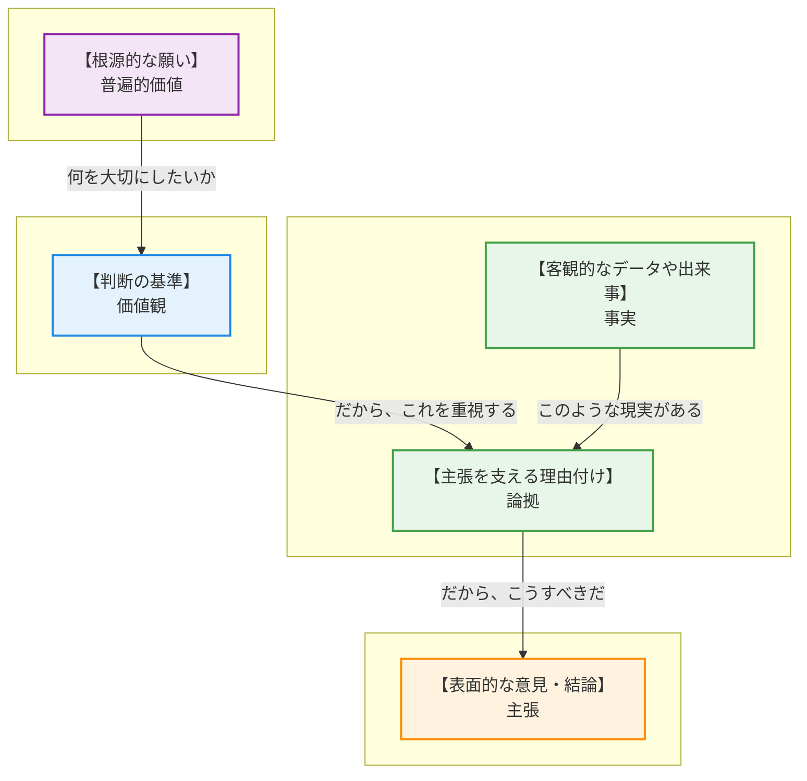
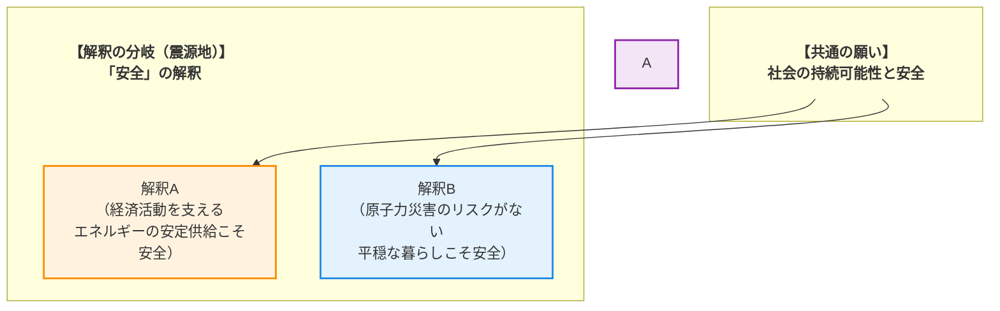

# 🧐 論理構造解析ワークシート：原子力発電の再稼働を巡る合意形成 を解き明かす

## 1. AREの「逆推論」を理解する
> **【この章の要約】表面的な意見の奥にある「普遍的な価値」まで遡るプロセスを学びます。**

皆さん、こんにちは！「論理的思考と合意形成」ワークショップへようこそ！ファシリテーターを務めます。どうぞ、リラックスして参加してくださいね。

さて、今日のテーマは **原子力発電の再稼働** です。非常に重要で、だからこそ様々な意見が飛び交う、まさに「生きた教材」です。私たちの目的は、どちらかの意見が正しいと決めることではありません。この複雑なテーマを題材に、対立する意見の奥に隠された「共通の願い」を見つけ出し、合意形成への道筋を探るための「思考のOS」をインストールすることです。

そのための強力なツールが、これから紹介する **AREの「逆推論」** です。まずは、その基本構造を一緒に見ていきましょう！

* **主張 (C: Claim)** : 「〜すべきだ」という具体的な意見・結論。
* **論拠 (W: Warrant)** : 「なぜなら〜だからだ」という、主張を支える理由付け。
* **事実 (F: Fact)** : 論拠を裏付ける客観的なデータや出来事。
* **価値観 (V: Value)** : 「〜は重要だ」という、個人や集団が持つ判断の軸。
* **普遍的価値 (UV: Universal Value)** : 「安全」「平等」「生命」など、文化や立場を超えてほとんどの人が反対しない根源的な願い。

---

素晴らしい！基本構造はバッチリですね。では、このツールを使って、実際の意見を分解してみましょう。

例えば、ここに「 **安全性が確保された原子力発電所の再稼働を推進すべきである** 」という意見があったとします。これが一番表面にある **主張 (C)** です。

ここから、「なぜ？」を繰り返して、意見の根っこまで遡ってみましょう。これが **逆推論** です！

1.  **【主張 C】** → なぜ、再稼働を **推進すべき** なのか？
2.  **【論拠 W】** → 「なぜなら、エネルギーの安定供給を確保し、電力コストを抑制し、地球温暖化対策に貢献する **からだ** 」
    *   なるほど、理由が見えてきましたね。この論拠は、どんな **事実 (F)** に支えられているでしょう？
    *   例えば、「エネルギーの安定供給は、私たちの経済活動の **基盤である** 」という事実や、「原子力発電は、他の火力発電に比べて発電 **コストが安い** 」といったデータが挙げられます。
3.  **【価値観 V】** → では、なぜ「エネルギーの安定供給」や「コスト抑制」をそれほど **重視する** のか？
    *   それは、その先に「国民の生活や経済活動の **基盤が安定していることは重要だ** 」という **価値観** があるからです。
4.  **【普遍的価値 UV】** → さらに、その奥にある根源的な願いは何でしょう？
    *   それはきっと、「この社会が豊かで安定し、将来にわたって **持続的に発展してほしい** 」という、誰もが願う **普遍的価値** にたどり着きます。

どうでしょう？ただ「再稼働に賛成！」と聞くのと、その裏にある「社会の持続的な発展を願う気持ち」まで見えるのとでは、対話の可能性が大きく変わると思いませんか？これが逆推論の力です！

## 2. 複数の主張から「共通の価値」を見つける
> **【この章の要約】一見違う2つの意見が、実は「同じ願い」を持っていることを解剖します。**

さあ、ここからがこのワークショップの醍醐味です！先ほど学んだ逆推論を使って、今度は一見すると真っ向から対立する2つの意見を分析し、その奥にある「共通の土台」を探しに行きましょう！

ここに、2つの典型的な主張があります。

*   **意見A（安全優先）** : 「原子力発電所の再稼働にあたっては、住民の **安全と安心を何よりも優先** し、安全対策を **徹底すべきである** 」
*   **意見B（再稼働推進）** : 「エネルギーの安定供給や経済のために、安全性が確保された原発の **再稼働を推進すべきである** 」

一見すると、この2つは水と油、決して交わらないように見えますよね。しかし、本当にそうでしょうか？先ほどの逆推論で、それぞれの意見の「根っこ」を探ってみましょう！

**【意見A：安全優先の逆推論】**
*   **主張 (C)** : 安全対策を徹底すべきだ。
*   **論拠 (W)** : なぜなら、住民の安全と安心を最優先し、災害リスクを抑える必要があるからだ。
*   **価値観 (V)** : 「個人の **生命や平穏な暮らし** を守ること」が何よりも重要だ。
*   **普遍的価値 (UV)** : その根源には、「誰もが脅かされることなく、安心して生きたい」という **【安全】** や **【生命】** を尊ぶ根源的な願いがあります。

**【意見B：再稼働推進の逆推論】**
*   これは先ほどやりましたね！
*   **主張 (C)** : 再稼働を推進すべきだ。
*   **論拠 (W)** : なぜなら、エネルギーを安定供給し、経済活動を支える必要があるからだ。
*   **価値観 (V)** : 「社会全体の **生活基盤や経済の安定** を守ること」が重要だ。
*   **普遍的価値 (UV)** : その根源には、「社会が豊かさを保ち、将来にわたって発展してほしい」という **【富】** や **【持続可能性】** を願う気持ちがあります。

さて、皆さん、面白いことが見えてきませんか？

価値観のレベルでは、「個人の安全」と「社会の安定」、どちらをより優先するかで対立しているように見えます。これが、いわゆる **対立点（Divergence Point）** です。

しかし、さらにその奥、普遍的価値のレベルまで潜ってみるとどうでしょう？

「安心して生きたい」という願いも、「豊かな社会が続いてほしい」という願いも、突き詰めれば **「未来の世代まで含めて、人々が安心して幸せに暮らし続けられる社会であってほしい」** という、一つの大きな願いの一部だとは言えませんでしょうか。

そうです！「安全」を求める声も、「安定」を求める声も、実は **【社会の持続可能性】** という共通の願いに繋がっているのです。

対立しているのは、その大切な未来を実現するための「手段」や「優先順位」の考え方が違うだけなのかもしれません。

このように、一見対立する意見の根源に「共通の願い」を見出すこと。これこそが、分断を乗り越え、建設的な対話、そして合意形成を始めるための、最も重要でパワフルな第一歩なのです！

## 3. 議論が噛み合わない「隠れた論拠(Warrant)」を発見する
> **【この章の要約】事実を「問題だ」と判断する背景にある、隠れた前提を探ります。**

皆さん、素晴らしい！対立の奥に共通の願いがあること、体感していただけたでしょうか？

さて、ここからはもう一歩、思考の解像度を上げていきます。議論が噛み合わなくなる、もう一つの大きな原因。それは、お互いが気づいていない **「隠れた論拠 (Warrant)」** の存在です。

論拠とは、「事実」と「主張」を繋ぐ、個人の価値観に基づいた「理由付け」のことでしたね。多くの場合、私たちはこれを無意識に使っています。だからこそ、同じ事実を見ても、全く違う結論に至ってしまうのです。

例えば、こんな主張を見てみましょう。

*   **主張(C)** : 「政府は、再生可能エネルギーの導入を **一層推進すべきである** 」

この主張の背景には、どんな **事実(F)** があるでしょうか？
例えば、「再生可能エネルギーの導入は世界的に進んでいる」という事実や、「再生可能エネルギーには、安定供給やコスト面でまだ課題がある」といった事実が挙げられます。

さあ、ここが今日の山場です！
「課題がある」という事実(F)を認識しているにも関わらず、「それでも推進すべきだ」という主張(C)が出てくる。この間には、一体どんな **「隠れた論拠(W)」** が橋渡しをしているのでしょうか？

ぜひ、少し時間を取って考えてみてください。なぜ、この人はそう判断するのでしょう？

▼ 考え方のヒントと解答例

**【考え方のヒント】**
「なぜ、コストや安定供給に課題があると分かっていながら、それでも再エネを推進すべきだと考えるのだろう？」
「その判断の裏には、どんな『〜だから、こちらの方が重要だ』という、声に出していない理由付けが隠れているだろう？」
「原子力発電と比較して、何をより『善い』または『重要』だと考えているのだろう？」
と考えてみましょう。

---

**【解答例】**
この「事実」と「主張」の間には、例えば以下のような **「隠れた論拠(W)」** が考えられます。

*   **隠れた論拠 (W) の例１**
    *   「なぜなら、使用済み核燃料のような、未来世代に負担を先送りする問題を生まないことの方が、目先のコストよりも **重要だからだ** 」
*   **隠れた論拠 (W) の例２**
    *   「なぜなら、特定の資源に依存せず、国内でエネルギーを生み出す多様な選択肢を持つことこそが、長期的な国のエネルギー安全保障に **繋がるからだ** 」
*   **隠れた論拠 (W) の例３**
    *   「なぜなら、地球環境への負荷を低減することは、国際社会の一員としての責務であり、企業の競争力にも **繋がるからだ** 」

いかがでしょう？
これらの論拠は、事実データから直接導き出されるものではありません。その人が持つ **「未来への責任」** や **「安全保障のあり方」** といった価値観が、事実を解釈し、主張へと繋げているのです。

議論がすれ違う時、私たちはつい「事実」や「主張」の正しさをぶつけ合ってしまいます。しかし、本当に探るべきは、相手の心の中にある、この **「隠れた論拠」** なのです！

---

## 4. データが示す「対立の震源地」を特定する
> **【この章の要約】議論が平行線になる本当の理由（価値観の衝突）を特定します。**

さあ、皆さん、核心に迫ってきました！
「隠れた論拠」の存在に気づくと、議論が平行線になる本当の理由、つまり **「対立の震源地」** が見えてきます。

「再稼働推進」の背景には、「経済の安定こそが国民の生活を守る」という価値観がありました。
一方、「安全優先」や「再エネ推進」の背景には、「万が一の事故リスクや未来への負担を避けることこそが重要だ」という価値観がありました。

どちらも、根源では **「社会の持続可能性と人々の安全な暮らし」** という共通の願いを持っています。
しかし、その大切な願いを実現するための「手段」や「解釈」が、ある一点で鋭く分岐しているのです。

この分岐点こそが、議論の平行線を生み出す **「対立の震源地」** です。
今回のテーマで言えば、それは **「安全」という言葉の解釈の違い** にあります。

*   **解釈A** の人々は、エネルギーが止まれば経済が混乱し、社会機能が麻痺し、多くの人々の生活が脅かされる、と考えます。彼らにとって、**エネルギーの安定供給** は、社会を守るための最優先課題なのです。
*   **解釈B** の人々は、万が一の過酷事故が起きれば、人々の生命や故郷、平穏な日常が取り返しのつかない形で失われる、と考えます。彼らにとって、**原子力災害のリスクをゼロに近づけること** が、何よりも守るべき安全なのです。

どうでしょう？
こうして構造化すると、「どちらが正しいか」という不毛な争いから、「なるほど、あなたは『安全』をそう捉えているのですね」という、**相互理解の対話** へとステージが変わるのが分かりますか？

対立の震源地を特定すること。それは、相手を論破するためではなく、相手が何を大切にし、何を恐れているのかを深く理解するための、最も誠実なアプローチなのです。

---

## 5. 価値を統合して「第三の解決策」をデザインする
> **【この章の要約】AかBかの妥協ではなく、両方の価値を満たす新しい仕組みを考えます。**

ここまで来れば、ゴールはもうすぐです！
共通の願いを確認し、対立の震源地を特定した今、私たちのゴールは「A案とB案のどちらかを選ぶ」ことでも、「間をとって妥協する」ことでもありません。

目指すのは、**両方の価値を統合し、誰もが想像しなかった「第三の解決策」をデザインすること** です！

そのための思考プロセスは、驚くほどシンプルです。

**【思考プロセス】**

1.  **対立する価値を並べる**
    *   **価値A** : エネルギーの安定供給と経済性
    *   **価値B** : 住民の安全と安心（災害リスクの回避）

2.  **統合する問いを立てる**
    *   「AかBか (Either/Or)」ではなく、「A **しつつ** Bも (Both/And)」で考えます。
    *   **「エネルギーの安定供給と経済性を確保しつつ、住民の安全と安心を最高レベルで実現するには、どうすればよいか？」**

3.  **アイデアを組み合わせる**
    *   この「統合の問い」を羅針盤に、全く新しいアイデアの航海に出ましょう！

**【第三の解決策の一例】**

この問いから、例えばこんなアイデアが生まれるかもしれません。

*   **アイデア１：ハイブリッド型エネルギー・ポートフォリオ**
    *   平常時は再生可能エネルギーを最大限活用し、電力需要が逼迫する時期や災害時のバックアップ電源としてのみ、安全審査をクリアした原発を限定的に稼働させる。これにより、「環境負荷の低減」と「供給の安定性」を両立させる。

*   **アイデア２：徹底した情報公開と住民参加による「信頼の醸成」**
    *   安全性に関する全てのデータを、独立した第三者機関が管理し、リアルタイムで一般公開する。さらに、避難計画の策定や安全対策のレビューに住民が直接参加できる仕組みを法制化し、「安心」を国や電力会社任せにしない。

*   **アイデア３：次世代エネルギー技術への集中投資**
    *   原子力発電の維持コストの一部を、核融合や次世代蓄電池など、より安全でクリーンな未来のエネルギー技術開発に振り向ける国家プロジェクトを立ち上げる。「現在の安定」を確保しつつ、「未来の安全」への具体的な道筋を示す。

さあ、今度はあなたの番です！
この「統合の問い」を頭の中に置いて、自由に発想を広げてみてください。

*   あなたが政策立案者なら、この2つの価値を両立させるために、他にどんなアイデアを考えますか？
*   「経済性」と「安全性」、この2つを同時に高めるテクノロジーや社会システムは考えられないでしょうか？

AかBかの二者択一を超えた先にこそ、真の合意形成と、より良い未来への扉があるのです！

---

## 🎓 学習リフレクション

皆さん、本日のワークショップ、本当にお疲れ様でした！
頭をフル回転させて、少し疲れたかもしれませんね。でも、皆さんの表情は、来た時よりもずっと深く、そして明るく見えます。

最後に、今日の学びを皆さんの日常に繋げるための、いくつかの問いを投げかけさせてください。

*   もし自分が、今日考えた意見とは **全く逆の立場** だったら、どんな事実や論拠を重視するだろうか？
*   今日の議論で、相手の意見のどこに **「なるほど」** と思える部分があっただろうか？
*   あなたの職場や家庭で起きている **「小さな対立」** （例：会議での意見の対立、家族との価値観の違いなど）に、このAREの逆推論はどのように応用できるだろうか？

今日私たちが手に入れたのは、単なる議論のテクニックではありません。
意見が合わない相手を前にした時、「なぜ、この人はそう考えるんだろう？」と、その人の背景にある価値観や願いに思いを馳せる **「想像力」という名のOS** です。

このOSがインストールされれば、日常のコミュニケーションは劇的に変わります。
無用な衝突は減り、対話はより建設的になり、そして何より、自分とは違う考えを持つ人々と共に、新しい価値を創造する喜びを知ることができるはずです。

論理的思考は、誰かを打ち負かすための武器ではありません。
**他者と深く繋がり、より良い未来を共に創るための、希望のツールです。**

皆さんのこれからのコミュニケーションが、より豊かで創造的なものになることを心から応援しています！
本日は、本当にありがとうございました！