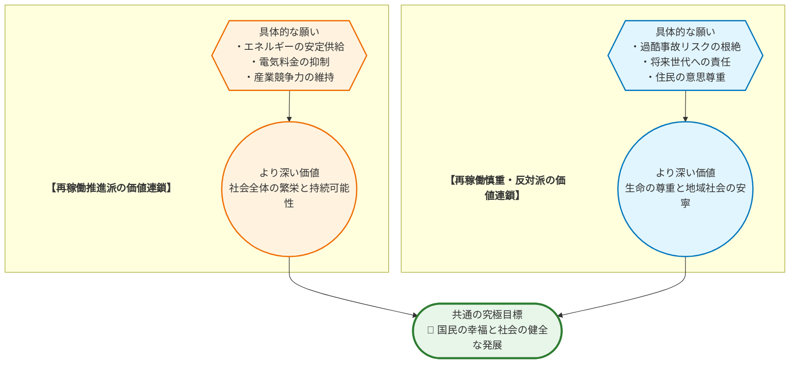
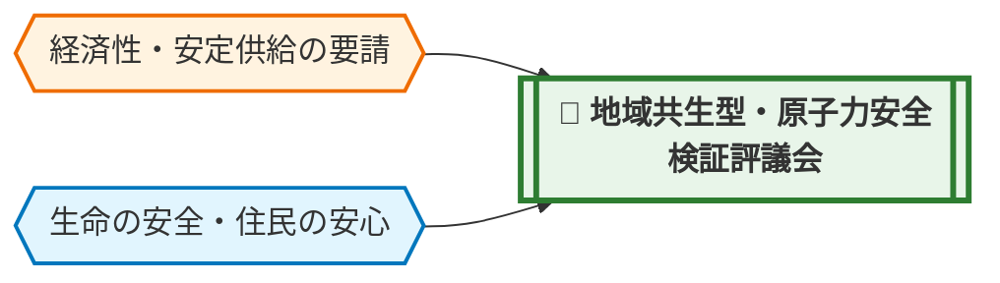

# 💡 価値統合ソリューション提案書：原子力発電所の再稼働

> **【本レポートの活用にあたって】**
> 本レポートは、公開情報を基にAIが論理構造を整理・統合した「合意形成のためのたたき台」です。記述された事実関係はウェブ上の公開情報に基づいており、AIによるファクトチェックの限界から、最新性や正確性を完全に保証するものではありません。重要な意思決定に際しては、必ず一次情報や最新の統計データとの照合を行ってください。

## 📋 0. Executive Summary
> **【この章の視点】議論の全体像と本質的な対立構造（Context & Singularity）**

日本のエネルギー政策の根幹を揺るがす **原子力発電所の再稼働** 問題は、単なる技術や経済の議論に留まりません。その核心には、福島第一原子力発電所の事故という深刻な経験を経て、私たちの社会が **「何を最も大切な価値とするか」** という根源的な問いが存在します。

一方では、エネルギーの安定供給と経済活動の維持、そして脱炭素社会の実現に向け、原子力を重要な選択肢と位置づける声があります。他方では、万が一の事故がもたらす壊滅的な被害と、将来世代にわたる核のゴミ問題への懸念から、再稼働に極めて慎重、あるいは反対する強い声があります。

この議論が平行線をたどる最大の理由は、両者が用いる中心的な概念、特に **「安全」** という言葉の定義と前提が、根本的に異なっている点にあります。

| 概念の比較 | **再稼働推進の立場から見た「安全」** | **再稼働慎重・反対の立場から見た「安全」** |
| :--- | :--- | :--- |
| **定義** | 最新の科学的知見に基づく **工学的・確率論的なリスク管理** が徹底された状態。 | 万が一の事故も許容しない、住民の **心からの安心感** が得られる状態。 |
| **前提** | リスクはゼロにはできないが、社会的に受容可能なレベルまで低減できる。 | どんなに確率が低くても、一度起これば被害が無限大になるリスクは受容できない。 |
| **重視点** | エネルギー供給停止による経済・社会活動の停滞リスクとの比較衡量。 | 放射能汚染による生活基盤や国土の喪失という、回復不能なリスクの回避。 |

このように、対立の根源は事実認識の差以上に、価値観の置き方の違いにあります。本レポートは、どちらか一方の正当性を主張するものではありません。この根深い対立構造を可視化し、異なる価値観を持つ人々が同じテーブルで建設的な対話を行うための **強力な「たたき台」（議論の出発点）** となることを目指しています。

## 1. 議論の構造と「価値ネットワーク」
> **【この章の視点】主張（Claim）の根底にある価値観（Value）の連鎖**

「再稼働すべき」「すべきでない」という表面的な主張の奥底には、それぞれが大切にしている価値観が連なっています。一見すると正反対に見える主張も、その根源をたどると、実は **「国民が豊かで安全に暮らせる社会」** という共通の目標に行き着くことが少なくありません。この構造を理解することが、対話の第一歩となります。

## 2. 対称的リスクのワーストシナリオ
> **【この章の視点】事実（Fact）に基づく因果予測**

どちらか一方の主張だけを極端に推し進めた場合、社会はどのような破滅的な未来を迎える可能性があるのでしょうか。ここでは、両極端のシナリオを冷静に予測し、バランスの取れた議論の必要性を浮き彫りにします。

*   **【再稼働推進派の主張を強行・放置した場合のリスク】**
    *   **因果チェーン**: (X) 経済性や効率を優先し、安全対策の検証や住民合意形成が不十分なまま再稼働を拙速に進めると → (Y) 万が一、自然災害や人為的ミスによって過酷事故が発生し、広範囲な放射能汚染、住民の強制避難、そして故郷という生活基盤の完全な喪失を招き → (Z) 日本の国土の一部が永久に失われ、食や産業に対する国際的信用も失墜。経済活動も根本から崩壊し、 **国家の存続そのものを揺るがす回復不能なダメージ** をもたらす。

*   **【慎重・反対派の主張を強行・放置した場合のリスク】**
    *   **因果チェーン**: (X) 再生可能エネルギーなど十分な代替電源を確保できないまま、全ての原子力発電所を即時停止・廃炉にすると → (Y) 電力供給が慢性的に不安定化し、大規模停電（ブラックアウト）が頻発。電気料金は記録的に高騰し、製造業などの国内産業は国際競争力を失い、海外移転が加速する。→ (Z) 国富は流出し、経済は深刻な不況に陥る。国民生活は困窮し、エネルギーを海外の化石燃料にさらに依存することで地政学的リスクが増大し、 **国家の経済安全保障が根本から脅かされる** 。

## 2.5 国際比較から見る「合意形成」の視点
> **【この章の視点】世界の動向（事実：Fact）を鏡として、本テーマを客観視する**

日本のエネルギー問題を考える上で、世界的な潮流を客観視することは不可欠です。政府は第7次エネルギー基本計画において、原子力を「優れた安定供給性」を持つ「重要なベースロード電源」と位置づけています。これは、多くの先進国が直面している、エネルギー安全保障、経済性、そして脱炭素という **「エネルギーのトリレンマ」** を反映したものです。世界各国が、原子力、化石燃料、そして導入が進む再生可能エネルギー（日本では2024年に全発電量の26.7%に到達）の最適な組み合わせ（エネルギーミックス）を模索しており、絶対的な正解がない中で、それぞれの国情に応じた困難な意思決定を迫られています。この問題は日本特有のものではなく、世界共通の重い課題なのです。

## 3. デッドロックの核心（特異点分析）
> **【この章の視点】対立の震源地（Singularity）の特定**

なぜこの議論はこれほどまでに膠着（デッドロック）するのでしょうか。その震源地は、単なる意見の相違ではなく、社会の根幹に関わる価値観の衝突と、リスクと便益の不均衡な構造にあります。

| 分析項目 | 評価(高/中/低) | 理由・背景（価値観の対立構造に基づく） |
| :--- | :--- | :--- |
| **価値の衝突度** | **高** | 「国家全体の経済的繁栄と安定（富/資産）」を重視する価値観と、「地域住民の生命と生活の安全（生命/生存）」を絶対視する価値観が正面から衝突しているためです。一方は確率論に基づきリスクを受容しようとしますが、もう一方は「万が一」の壊滅的被害を前に確率論を無意味と考えます。この **「許容できるリスク」の定義** が根本的に異なるため、対話が噛み合いません。 |
| **影響の非対称性** | **高** | 再稼働がもたらす便益（安価で安定した電力）は国民全体が広く享受する一方、そのリスク（過酷事故）は立地自治体とその周辺住民に **集中的かつ不可逆的な被害** をもたらす可能性があるためです。この「リスクを負う者」と「便益を受ける者」が一致しない構造が、特に立地自治体における合意形成を極めて困難にし、社会全体の分断を深刻化させています。 |

## 4. 「 **第3の解決策** 」の実装と価値統合モデル
> **【この章の視点】対立する価値（Value）を両立させる新たな制度（Claim）の具体化**

「経済性・安定供給」と「生命の安全・住民の安心」という二つの価値は、本来トレードオフの関係にある必要はありません。対立を乗り越える鍵は、一方を犠牲にするのではなく、両者の健全な緊張関係を制度化し、社会全体の利益へと昇華させる「動的なガバナンス」を構築することです。

私たちはここに、単なる理念ではない、具体的な実装メカニズムを持つ解決策として **「地域共生型・原子力安全検証評議会」** の設立を提案します。これは、原子力発電所の運転可否を、技術的な安全性だけでなく、社会的な信頼性も含めて継続的に評価し、その結果を稼働率や予算配分に直接反映させる、透明性の高い仕組みです。

### ① 評価指標（KPI）とガバナンス

「評議会」は、政府、電力会社から独立した第三者機関とし、委員は原子力工学の専門家、社会学者、法律家、そして **公募で選ばれた立地・周辺自治体の住民代表** がそれぞれ同数で構成され、意思決定の偏りを防ぎます。評価は四半期ごとに行われ、以下のKPIに基づいて総合スコアを算出します。

| 評価指標（KPI） | 配点ウェイト | なぜこの配点なのか（理由） |
| :--- | :--- | :--- |
| **1. 技術的安全性** （新規制基準への適合度、設備更新状況、トラブル発生率など） | **35%** | 制度の根幹であり、工学的な安全確保が最低条件であるため、最も高い基礎配点とします。しかし、これだけでは住民の不安は払拭できないため、過半数にはしません。 |
| **2. 情報公開の透明性** （データ公開の迅速性・網羅性、住民説明会の質と量、議事録の即時公開など） | **25%** | 福島第一原発事故の教訓から、信頼の欠如が最大の課題であることが明らかです。「隠蔽できない仕組み」を制度化することが、住民の安心感に直結するため、高いウェイトを置きます。 |
| **3. 地域住民の信頼度** （立地・周辺自治体住民への無作為抽出アンケートによる信頼度スコア） | **20%** | 「工学的な安全」と「心理的な安心」のギャップを埋めるための最重要指標です。住民の主観的な評価を直接制度に組み込むことで、住民の声を政策に反映させ、当事者意識を醸成します。 |
| **4. 避難計画の実効性** （避難訓練の参加率、要支援者対策の具体性、複合災害時の代替経路確保など） | **20%** | 「万が一」への備えが、日々の安心感の土台となります。計画が「絵に描いた餅」でなく、実際に機能するかどうかを具体的に評価することで、最悪の事態への現実的な備えを担保します。 |

### ② 制度のメカニズム（マトリクス表）

評価スコアは、S, A, B, C, Dの5段階にランク付けされ、そのランクに応じて、原子力発電所の運転状態が以下のように自動的に調整されます。これにより、「一度動かしたら止められない」という懸念を払拭し、常に社会の信頼度に応じた運転状態を維持します。

| 評価ランク | 総合スコア | 稼働率上限 | 安全対策・地域還元への 追加予算義務（利益剰余金より拠出） | 国・評議会による 追加監査頻度 |
| :--- | :--- | :--- | :--- | :--- |
| **S** (極めて良好) | 90点以上 | 100% | 基準額 | 年1回 |
| **A** (良好) | 75-89点 | 90% | 基準額の **1.2倍** | 半年に1回 |
| **B** (標準) | 60-74点 | 70% | 基準額の **1.5倍** | 四半期に1回 |
| **C** (要改善) | 40-59点 | 40% | 基準額の **2.0倍** | 毎月 |
| **D** (重大な懸念) | 39点以下 | **即時停止** | **全利益を安全対策に再投資** | **常駐監査** |

### ③ ステークホルダー別の心理的変容

この制度は、特に再稼働に懐疑的な人々の心理に寄り添い、その構造を変えることを目指します。

*   **不信から「監視」へ**: これまでブラックボックスの中で決められていた安全評価が、住民代表も参加する評議会によって、全てのプロセスとデータが公開されます。これにより、政府や電力会社を一方的に「信じる」か「信じない」かという不毛な二元論から脱却し、市民が自らの手で「監視する」という主体的な立ち位置へと変わります。
*   **不安から「安心」へ**: 「万が一、何か問題が起きても、どうせ運転は止まらないだろう」という漠然とした不安は、この制度によって具体的な安心感に変わります。評価ランクがCやDに下がれば、稼働率が自動的に制限・停止されるという明確なルールが「セーフティネット」として機能します。問題が起きれば、必ずブレーキがかかるという信頼が、日々の安心を支えます。
*   **無力感から「当事者意識」へ**: 「どうせ自分たちの声は届かない」という政治的な無力感は、「地域住民の信頼度」がKPIとして正式に組み込まれることで解消されます。自分たちの評価が、実際に発電所の稼働率や予算に影響を与えるという実感は、住民を単なる「保護されるべき対象」から、地域の未来を左右する「責任ある当事者」へと変える力を持っています。

## 5. 3つの未来シナリオ
> **【この章の視点】解決策の有無がもたらす未来の事実（Fact）の予測**

私たちが今、どのような選択をするかによって、日本の未来は大きく分岐します。ここでは3つのシナリオを提示し、選択の重みを可視化します。

*   **シナリオ1: 現状維持（緩やかな衰退）の未来**
    対立と不信が解消されないまま、再稼働の議論は膠着。一部の原発は再稼働するものの、多くの原発は稼働と停止を繰り返し、エネルギー政策は場当たり的な対応に終始します。再生可能エネルギーへの移行も中途半端に終わり、電力コストは高止まりしたまま。国民は慢性的なエネルギー不安と経済の停滞感の中で暮らし、社会の分断は固定化。日本は決定的な成長も破局も迎えないまま、じわじわと国際社会での競争力を失っていきます。

*   **シナリオ2: ワースト（分断と破局）の未来**
    どちらか一方の価値観が強行された結果、社会は深刻なダメージを負います。
    *   **（推進強行の場合）**: 経済性を優先し、住民の合意形成や安全検証を軽視したまま再稼働を強行。その結果、大規模な自然災害をきっかけに過酷事故が発生。国土の一部は永久に失われ、国家の信頼は失墜し、経済は回復不能なダメージを受けます。
    *   **（即時全廃の場合）**: 十分な代替エネルギーを確保しないまま、全ての原発を停止。火力発電への依存が極端に高まり、燃料費は急騰。データによれば、原発停止後の燃料費増加は **国民一人当たり約12万円の負担増** （FACTS: N_FC_1）に繋がり、これが恒常化します。電気料金の高騰で国内産業は空洞化し、大規模な失業が発生。経済安全保障は崩壊し、国民生活は深刻な貧困に直面します。

*   **シナリオ3: ベスト（価値統合と再生）の未来**
    「地域共生型・原子力安全検証評議会」が社会に実装され、機能した未来です。透明なガバナンスの下、安全と信頼の基準を満たした原発が安定的に稼働。これにより、例えば家庭用電気料金が **約11%値下げ** される（FACTS: N_FC_1）といった具体的な恩恵が国民生活に行き渡ります。エネルギーコストの低下は産業競争力を回復させ、その利益は更なる安全対策や再生可能エネルギー開発へと再投資されます。何よりも、対立していた人々が「監視と対話」という共通の土俵に立つことで、社会の分断は乗り越えられ、日本はエネルギー問題における新たな合意形成モデルを世界に示す、成熟した社会へと生まれ変わります。

## 6. 政策の実効性（反論耐性とフェイルセーフ）
> **【この章の視点】現実社会への実装に向けたリスク検証（Warrant）**

この解決策は理想論ではなく、現実の課題と向き合うための実践的な仕組みです。想定される反論に応え、その実効性を担保します。

▼ 想定される反論と、真の論点への昇華

*   **A派（推進派）からの想定される反論と回答**:
    *   **反論**: 「住民アンケートのような主観的な指標で稼働率が左右されるのでは、エネルギーの安定供給が脅かされる。手続きが煩雑で、迅速な再稼働の足かせになる。」
    *   **回答**: そのご懸念は、エネルギー供給の責任を担う立場として当然のものです。しかし、私たちは福島の事故から、 **住民の信頼なくして原子力の安定利用はあり得ない** という厳しい現実を学びました。この制度は、再稼働を遅らせるための「障害」ではなく、長期的な安定稼働を実現するための「信頼醸成プロセス」です。拙速な再稼働で国民の不信を買い、訴訟や政治的混乱で結局停止に追い込まれるリスクこそ、最大の不安定要因です。真の論点は、短期的な効率か、長期的な持続可能性か。この制度は、後者を確実にするための、最も現実的な投資です。

*   **B派（慎重・反対派）からの想定される反論と回答**:
    *   **反論**: 「どうせ『評議会』も国や電力会社の影響下にある『御用学者』で固められ、形骸化するに決まっている。住民代表も懐柔されるだけだ。」
    *   **回答**: その不信感は、これまでの行政の進め方を考えれば、痛いほどよく分かります。だからこそ、この提案の核心は「人を信じる」ことではなく、 **「仕組みを信じる」** ことにあります。真の論点は、誰が委員になるか以上に、 **いかにして評議会の独立性と透明性を法的に担保するか** です。委員選定プロセスの完全公開、議事録や全評価データのリアルタイム公開の義務化、そして内部告発者の保護制度などを法制化することで、「隠蔽や懐柔が構造的に不可能な仕組み」を構築します。この仕組み自体の設計に、市民が参画することが不可欠です。

*   **フェイルセーフ設計**:
    制度が万が一、意図通りに機能しなかった場合に備え、以下の安全網を設けます。
    1.  **自動停止条項**: 評価ランクが2期連続（半年間）で「D」を記録した場合、評議会は当該発電所の稼働許可を一時停止し、国に対して廃炉計画の策定を勧告する権限を持ちます。
    2.  **住民投票による撤退権**: 立地自治体において、有権者の一定数以上の署名が集まった場合、この制度（評議会）の是非、および発電所の稼働継続の是非を問う住民投票を実施できるものとします。これは、制度そのものが民意から乖離することを防ぐ最終的な安全装置です。

## 7. 結語（絶対回避ラインと対話への行動喚起）
> **【この章の視点】絶対に守るべき普遍的価値（UV）の再確認とネクストアクション**

この複雑な議論の先に、私たちがどのような結論を選ぶとしても、絶対に守らなければならない一線があります。それは、いかなる経済的利益、国家の威信、エネルギーの安定供給も、 **「回復不可能な国土の喪失と、そこに住む人々の生活基盤、そして未来世代の可能性を根こそぎ奪う事態」** を正当化することはできない、という絶対的な原則です。この一点において、私たちは決して妥協してはなりません。

このレポートは、完成された答えではありません。むしろ、これまで感情的な対立に陥りがちだったこの問題を、建設的な対話のステージに引き上げるための、あくまで「たたき台」です。

このレポートを読んだあなたの第一歩は、巨大な問題に立ち向かうことではありません。まずは、あなたの地域のハザードマップや避難計画がどうなっているか、自治体のウェブサイトで確認してみませんか。あるいは、このレポートで気になった点を一つだけ、家族や友人に「こんな考え方があるらしいんだけど、どう思う？」と話してみることから始めてみませんか。その小さな行動こそが、分断を乗り越え、私たちの社会をより賢明な未来へと導く、最も確かな力となるのです。