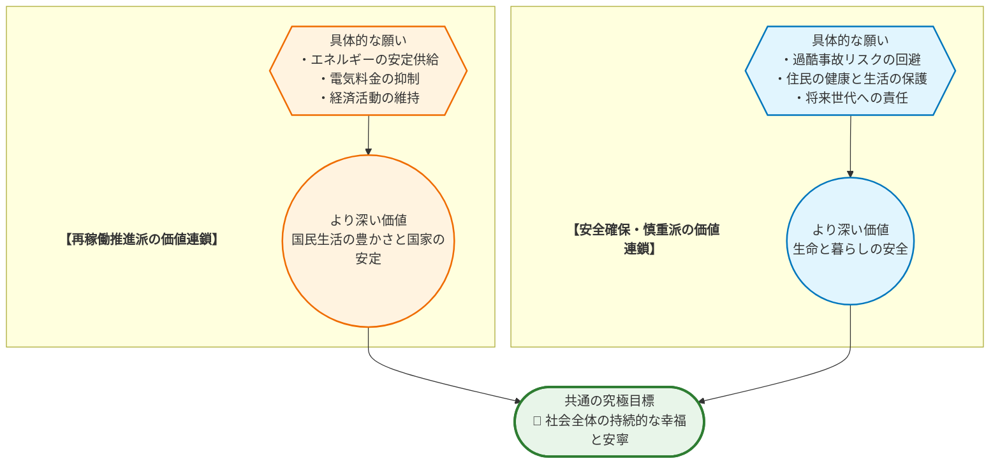
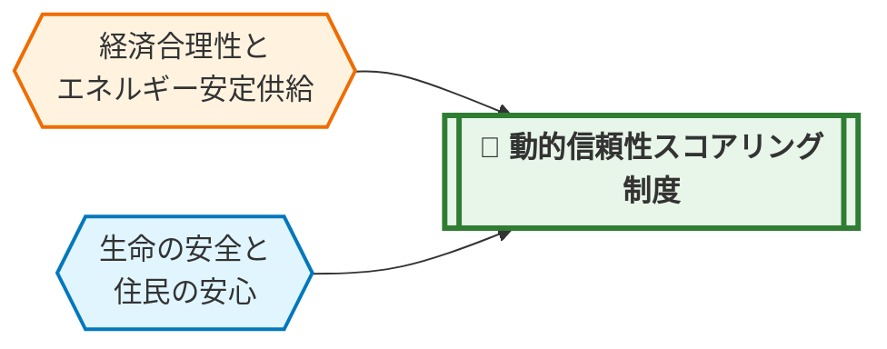

# 💡 価値統合ソリューション提案書：原子力発電所の再稼働を巡る合意形成

## 📋 0. Executive Summary
> **【この章の視点】議論の全体像と本質的な対立構造（Context & Singularity）**

原子力発電所の再稼働問題は、現代日本が直面する最も複雑で重要な課題の一つです。その背景には、福島第一原子力発電所事故の記憶からくる **深刻な安全への懸念** 、ウクライナ情勢などに起因する **エネルギー価格の高騰** 、そして地球規模で取り組むべき **脱炭素社会への移行** という、それぞれが正当性を持つ複数の要請が複雑に絡み合っているという現実があります。

この議論が平行線をたどりやすい本質的な理由は、単なる技術的な安全性の評価や経済合理性の比較に留まらない、より根源的な **価値観の対立** にあります。特に、議論の中心で使われる「 **安全** 」という言葉の定義が、それぞれの立場によって大きく異なっている点が、対話の断絶を生む核心（特異点）となっています。

| 立場 | 「安全」の解釈・定義 |
| :--- | :--- |
| **再稼働を推進する立場** | 最新の科学的知見と厳格な規制基準に基づき、リスクが社会的に **許容可能なレベルまで管理・低減された状態** 。技術的に達成可能であり、経済や社会の安定という便益とのバランスで評価されるべきもの。 |
| **安全確保を最優先する立場** | 住民が心から **「安心」して暮らせる状態** 。万が一の事故がもたらす被害が非可逆的かつ甚大であるため、ゼロリスクに近い水準が求められ、他のいかなる便益よりも優先されるべきもの。 |

このように、一方が「管理可能なリスク」として捉えるものを、もう一方が「許容できない脅威」と捉える構造が、議論のデッドロックを生み出しています。

本レポートは、どちらか一方の正当性を証明するものではありません。また、唯一絶対の正解を提示するものでもありません。目的は、この複雑な対立構造を客観的に可視化し、異なる価値観を持つ人々が建設的な対話を通じて、より良い社会的な合意形成へと向かうための、強力な「 **たたき台** 」（議論の出発点）を提供することにあります。

## 1. 議論の構造と「価値ネットワーク」
> **【この章の視点】主張（Claim）の根底にある価値観（Value）の連鎖**

「原発再稼働に賛成」「反対」といった表面的な主張の奥底には、それぞれが大切にしている価値観が連鎖し、ネットワークを形成しています。対立する両陣営も、その根源をたどれば「 **社会の持続的な幸福** 」という共通の目標に行き着くことを理解することが、対話の第一歩となります。以下の図は、その構造を可視化したものです。

図が示すように、再稼働推進派の主張は、エネルギーの安定供給や経済合理性といった願いを通じて、「 **国民生活の豊かさと国家の安定** 」という価値を追求しています。一方で、安全確保・慎重派の主張は、事故リスクの回避という願いを通じて、「 **生命と暮らしの安全** 」という根源的な価値を最優先しています。

重要なのは、これらがどちらも社会にとって不可欠な価値であるという点です。対立は「善と悪」の戦いではなく、「 **守るべき複数の正義** 」の間で、どの価値を、どの程度、どのように優先すべきかという、極めて困難な選択を迫られている状態なのです。

## 2. 対称的リスクのワーストシナリオ
> **【この章の視点】事実（Fact）に基づく因果予測**

どちらか一方の価値観だけを絶対視し、極端な政策を強行した場合、社会はどのような未来を迎えるのでしょうか。ここでは、両極端のシナリオがもたらす破滅的なリスクを、客観的な因果連鎖として示します。これは、安易な二元論に陥ることの危険性を理解するための思考実験です。

*   **【再稼働推進派の主張を強行・放置した場合のリスク】**
    *   **因果チェーン**: (X) 経済合理性と効率を最優先し、住民合意や安全対策の検証プロセスを軽視したまま再稼働を強行すると → (Y) 現場では安全文化が形骸化し、小さな異常やデータの不備が見過ごされるようになります。地域社会では、国や電力会社への不信感が決定的なものとなり、実効性のある避難計画の策定・訓練といった協力体制が崩壊します → (Z) その結果、万が一過酷事故が発生した際、住民の生命と健康、財産が大規模に失われるだけでなく、広大な国土が長期にわたり汚染されます。日本の産業と国際的信用は完全に失墜し、社会全体が回復困難なダメージを負うことになります。

*   **【安全確保・慎重派の主張を強行・放置した場合のリスク】**
    *   **因果チェーン**: (X) ゼロリスクを追求するあまり、科学的・技術的な安全評価を考慮せず、全ての原子力発電所を即時停止・廃炉にすると → (Y) 現場では、電力供給の大部分を、天候に左右されやすい再生可能エネルギーと、国際情勢の影響を受けやすい高コストな化石燃料に依存せざるを得なくなります。電気料金は継続的に高騰し、家計を圧迫すると同時に企業の国際競争力を奪います。電力需給は恒常的に逼迫し、大規模停電（ブラックアウト）のリスクが国民生活や産業活動の前提となります → (Z) その結果、経済は深刻な停滞に陥り、国民生活は困窮します。エネルギー安全保障は極度に脆弱化し、国際紛争や資源価格の変動に対して無防備な国家となります。同時に、化石燃料への依存が深まることで、脱炭素目標の達成も不可能となり、気候変動という別の地球規模のリスクを増大させることになります。

## 3. デッドロックの核心（特異点分析）
> **【この章の視点】対立の震源地（Singularity）の特定**

なぜこの問題は、これほどまでに解決が困難なのでしょうか。その核心は、単なる意見の相違ではなく、社会の根幹に関わる価値観が、特殊な構造で衝突している点にあります。

| 分析項目 | 評価(高/中/低) | 理由・背景（価値観の対立構造に基づく） |
| :--- | :--- | :--- |
| **価値の衝突度** | **高** | 「 **経済活動の基盤と国家の安定** 」（富/資産）と、「 **住民の生命と暮らしの安全** 」（生命/生存）という、どちらも社会の存立に不可欠な普遍的価値が正面から衝突しています。これは、日常的な便益と、発生確率は低いものの被害が壊滅的なリスクとのトレードオフであり、単純な比較や計算で優劣を決めることが極めて困難なためです。 |
| **影響の非対称性** | **高** | 再稼働がもたらす **便益** （電力の安定供給や料金抑制）は、国民全体に広く薄く分配されます。一方で、事故が発生した際の **リスク** （健康被害、故郷の喪失）は、立地自治体およびその周辺住民に極めて集中的に降りかかります。この「 **便益の受益者とリスクの負担者の地理的なズレ** 」が、当事者間の深刻な分断を生み、合意形成を著しく困難にしています。加えて、使用済み核燃料の最終処分問題は、リスクを「 **未来世代** 」に先送りするという時間的な非対称性も内包しています。 |

## 4. 「 **第3の解決策** 」の実装と価値統合モデル
> **【この章の視点】対立する価値（Value）を両立させる新たな制度（Claim）の具体化**

「経済合理性」と「生命の安全」という二つの正義は、本来トレードオフの関係にある必要はありません。対立の核心が「信頼の欠如」にある以上、その信頼を客観的かつ継続的に醸成する仕組みこそが、両価値を統合する鍵となります。

私たちはここに、従来の「一度合格すれば終わり」という静的な安全審査から脱却し、**地域社会との共生と信頼度を継続的に評価し、それに応じて運転の裁量を変動させる「動的信頼性スコアリング制度」**を提案します。これは、安全への努力が経済的メリットに直結し、透明性の確保が社会の安心に繋がる、新しい形のガバナンスモデルです。

### ① 評価指標（KPI）とガバナンス

本制度の根幹は、国、電力会社、規制委員会から独立した、**多様なステークホルダーで構成される第三者機関「地域共生・安全評価委員会」**の設立です。この委員会が、以下の4つの視点から各原子力発電所を継続的に評価し、そのスコアを完全に公開します。

| 評価項目 | 配点ウェイト | なぜその配点なのか（理由） |
| :--- | :--- | :--- |
| **1. 技術的安全性** （規制基準超過の自主対策、設備更新率、軽微なトラブル報告件数と対応速度など） | **40%** | 安全の物理的な根幹であり、客観的評価の基礎となるため最も高いウェイトを置く。 |
| **2. 情報公開と透明性** （データ公開の即時性・網羅性、独立監査の受入、住民説明会の双方向性など） | **30%** | 住民の「安心」は技術だけでは醸成されず、信頼できる情報へのアクセスが不可欠なため。 |
| **3. 地域との共生・対話** （実効性のある避難計画への住民参加率、地域からの意見聴取と改善への反映実績など） | **20%** | リスクを直接負担する地域社会との信頼関係構築こそが、持続可能な運営の鍵となるため。 |
| **4. 未来世代への責任** （使用済み核燃料の処理技術開発への投資額・進捗、廃炉計画の具体性と積立状況など） | **10%** | 現世代の便益のために、将来世代へ問題を先送りしないという倫理的責任を制度に組み込むため。 |

### ② インセンティブとルールの可視化（マトリクス表）

評価スコアは、単なるお飾りではありません。以下の表に示す通り、**スコアのランクに応じて、原子力発電所の運転条件や地域への還元策が自動的に変動**します。これにより、電力会社には安全と透明性を追求する強い経済的インセンティブが生まれます。

| 評価ランク | 総合スコア | 運転条件（稼働率上限） | 地域への還元（交付金等） | 規制当局の対応 |
| :--- | :--- | :--- | :--- | :--- |
| **S** (卓越) | 90点以上 | **上限なし** (100%) | 基準額の **120%** | 次期審査期間の延長 |
| **A** (良好) | 75-89点 | **90%** | 基準額の **100%** | 通常審査 |
| **B** (要改善) | 60-74点 | **70%** | 基準額の **80%** | 短期集中審査・改善計画提出義務 |
| **C** (重大な懸念) | 59点以下 | **稼働停止** | 基準額の **50%** | 稼働停止命令・国の特別監査 |

この仕組みは、「頑張れば報われる、怠れば罰せられる」という公正なルールを可視化し、ブラックボックスになりがちな原子力発電所の運営を、社会の誰もが理解・監視できるものへと変革します。

### ③ ステークホルダー別の具体的メリット

この制度は、各ステークホルダーが抱える根源的な不安や不満を解消し、その立場を尊重しながら、共通の目標へと向かわせる力を持っています。

*   **反対・慎重派（特に立地・周辺住民）にとっての変容**:
    これまで抱いてきた「どうせ国や電力会社は重要な情報を隠蔽する」「私たちの声はどうせ届かない」という根深い不信感と無力感。これが、**制度によって大きく変容します**。情報公開と対話が具体的な「点数」となり、それが稼働率という電力会社の経営に直結する以上、彼らはもう情報を隠したり、対話を軽視したりすることはできません。住民は、単なる「反対者」から、評価委員会への参加や情報開示請求を通じて、原発を監視し、改善を促す**「主体的なガバナンスの担い手」**へと変わります。ゼロリスクは実現できなくとも、「信頼できる管理下にあり、いつでも自分たちの手で止められる」という感覚が、恐怖を「管理可能なリスク」へと変え、心の「安心」を醸成します。

*   **推進派（電力会社・産業界）にとっての変容**:
    安全対策や地域対話は、これまで「規制をクリアするためのコスト」と見なされがちでした。しかし、この制度下では、それらの活動は稼働率の向上や安定操業に直結する**「未来への戦略的投資」**に変わります。社会的な信頼を勝ち取ることこそが、最も合理的で予見可能性の高い経営戦略となるのです。事故や訴訟による突発的な稼働停止リスクを最小化し、長期安定的なエネルギー供給を実現できます。

*   **社会全体にとっての変容**:
    感情的な二元論に終始してきた不毛な対立から脱却し、「どうすれば、より安全に、より信頼される形で、社会に必要なエネルギーを確保できるか」という、**建設的でデータに基づいた対話**が生まれます。エネルギーの安定供給と、住民の安心という、これまで両立が難しいとされてきた価値が、一つの制度の中で統合され、社会全体の持続可能性を高めることに繋がります。

## 5. 3つの未来シナリオ
> **【この章の視点】解決策の有無がもたらす未来の事実（Fact）の予測**

私たちが今、どのような選択をするかによって、未来の姿は大きく変わります。ここでは、3つのシナリオを具体的に描き出します。

*   **シナリオ1: 現状維持（対立の先送り）**
    再稼働を巡る議論は平行線をたどり、一部の原発は地域の不信感を抱えたまま、なし崩し的に再稼働します。エネルギーコストは一時的に抑制されますが、根本的な信頼関係が構築されていないため、小さなトラブルが起きるたびに大規模な抗議運動や訴訟に発展し、運転は不安定なままです。使用済み核燃料の最終処分地選定は全く進まず（FACTS: `N_FC_6`）、負担は未来へと先送りされ続けます。社会の分断は温存され、エネルギー政策は常に政争の具となり、長期的な見通しが立たない未来です。

*   **シナリオ2: ワースト（どちらかの正義の暴走）**
    もし「経済合理性」のみを優先し、安全対策や住民対話を軽視して再稼働を強行すれば、その先にあるのは福島の悲劇の再来です。万が一の過酷事故は、国土と国民の生命を再び取り返しのつかない形で毀損します。
    逆に、もし「ゼロリスク」のみを追求し、全ての原発を即時停止すれば、社会は別の形で破綻します。火力発電への依存が増加した結果、すでに国民は一人あたり約12万円の追加負担を強いられました（FACTS: `N_FC_1`）。これが恒常化・悪化し、企業の国際競争力は失われ、経済は深刻な停滞に陥ります。電力需給は常に逼迫し、大規模停電が現実の脅威となる脆弱な社会が到来します。

*   **シナリオ3: ベスト（第3の解決策が導入された未来）**
    「動的信頼性スコアリング制度」が社会に定着。電力会社は最高のSランク評価を目指し、世界で最も透明で安全な原子力発電所の運営を競い合っています。その結果、電気料金は安定し、ある電力会社は再稼働により家庭向け料金を約11%値下げしました（FACTS: `N_FC_1`）。立地自治体は、評価委員会を通じて主体的に地域の安全確保に関与し、手厚い交付金によって地域振興を実現しています。国民は、公開された客観的なスコアを見て、エネルギー政策を冷静に議論できるようになりました。エネルギーの安定と地域の安心が両立し、社会は分断を乗り越え、持続可能な未来への確かな一歩を踏み出しています。

## 6. 政策の実効性（反論耐性とフェイルセーフ）
> **【この章の視点】現実社会への実装に向けたリスク検証（Warrant）**

いかなる制度も、現実の複雑さの中で試されなければなりません。ここでは、本提案に対する現実的な反論を想定し、その懸念に答えることで、制度の実効性を検証します。

▼ 想定される反論と、真の論点への昇華

*   **A派（推進派）からの想定される反論と回答**:
    *   **反論**: 「評価プロセスが過度に複雑で、事業者の負担が大きすぎる。これでは迅速な再稼働ができず、経済合理性が損なわれるではないか。」
    *   **回答**: そのご懸念はもっともです。確かに、短期的に見れば手続きは増え、コストもかかるでしょう。しかし、これは**社会の信頼という最も重要な『無形資産』を構築するための必要投資**です。信頼なくして、長期にわたる安定的な事業運営はあり得ません。むしろ、事故や訴訟によってある日突然、無期限に稼働が停止してしまうという最大のリスクを大幅に低減させ、**予見可能性の高い事業環境を構築することに繋がる**のです。真の論点は、短期的なコストではなく、長期的な事業の持続可能性です。

*   **B派（慎重派）からの想定される反論と回答**:
    *   **反論**: 「結局、『地域共生・安全評価委員会』も国や電力会社に都合の良い専門家で固められ、形骸化する『御用委員会』になるのではないか。」
    *   **回答**: そのご懸念は、これまでの日本の意思決定プロセスを考えれば、痛いほどよく分かります。だからこそ、この制度では**委員の選定プロセスそのものを法律で定め、完全に公開する**ことが絶対条件です。住民代表枠、地域外のNPO推薦枠、さらには国際的な専門機関からの派遣枠などを設け、構成の多様性と独立性を担保します。全ての議事録と評価データは、即時にオンラインで公開され、誰でも検証できるようにします。制度が形骸化するか否かは、**徹底した透明性によって市民社会の監視の目に晒され続けるかどうかにかかっている**のです。

*   **フェイルセーフ設計**:
    この制度は、万が一、想定通りに機能しなかった場合に備えた安全網を内包しています。
    1.  **自動停止条項**: 評価スコアが2期連続で一定基準（例: Cランク）を下回った場合、あるいは情報隠蔽などの重大な不正が発覚した場合は、議論の余地なく、**法に基づいて自動的に稼働許可が一時停止**され、国の特別監査が入る仕組みとします。
    2.  **定期的見直し義務**: 委員会の構成、KPIの項目や配点ウェイトは固定的なものではありません。社会情勢や技術の進展に合わせ、**3年ごとに見直すことを法律で義務付け**、制度そのものの陳腐化を防ぎます。

## 7. 結語（絶対回避ラインと対話への行動喚起）
> **【この章の視点】絶対に守るべき普遍的価値（UV）の再確認とネクストアクション**

私たちは、エネルギー政策という複雑な問いに向き合う中で、様々な価値や利益を比較衡量しなければなりません。しかし、その全ての議論の前提として、決して譲ってはならない一線が存在します。

それは、**いかなる経済合理性や国家の威信を理由にしようとも、そこに住む人々の生命と健康、そして故郷の環境を、回復不可能なリスクに晒す決定は決して行われてはならない**、という絶対的な原則です。そして、現世代の便益のために、解決策のないまま未来世代に深刻な負担を押し付けることは、断じて許されません。この倫理的な絶対回避ラインこそが、私たちの議論が道を踏み外さないための、最後の砦なのです。

このレポートが提示した「第3の解決策」は、唯一絶対の完成された答えではありません。むしろ、これまで感情的な対立に陥りがちだったこの困難な問題について、建設的な対話を再開するための、一つの「 **たたき台** 」です。

どうか、このレポートをきっかけに、あなたの家族や友人と、私たちの社会のエネルギーの未来について、少しだけ話してみてください。その小さな対話の一歩こそが、分断を乗り越え、より良い合意形成へと向かう、最も確かな力となるのです。