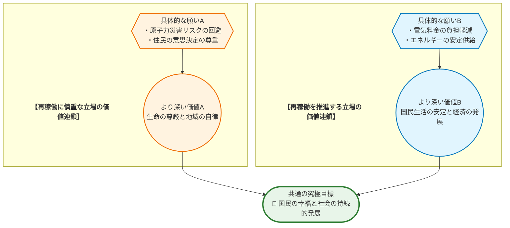
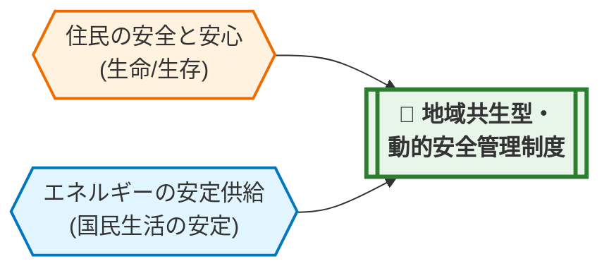

# 💡 価値統合ソリューション提案書：原子力発電所の再稼働

## 📋 0. Executive Summary
> **【この章の視点】議論の全体像と本質的な対立構造（Context & Singularity）**

日本のエネルギー政策の岐路において、原子力発電所の再稼働は極めて重要なテーマです。一方では、エネルギーの安定供給、高騰する電気料金の抑制、そして脱炭素社会の実現に向けた有効な選択肢として、安全が確認された原発の活用を期待する声があります。事実、火力発電への依存は燃料費を年間15.5兆円増加させ、国民一人あたり約12万円の負担増につながったというデータも存在します (N_FC_1)。

その一方で、福島第一原子力発電所の事故の記憶は社会に深く刻まれており、住民の **安全** と **安心** を最優先すべきだという強い懸念があります。放射性廃棄物の最終処分地が未定であるという現実 (N_FC_6) も、将来世代への責任を問う声につながっています。

この議論の根底にある対立の核心は、関係者が用いる中心的な概念、特に **「安全」** という言葉の解釈・定義のズレにあります。両者の視点の違いを整理すると、以下のようになります。

| 概念 | 再稼働を推進する立場からの解釈 | 再稼働に慎重な立場からの解釈 |
| :--- | :--- | :--- |
| **安全の確保** | エネルギー供給や経済活動の **安定** を守ること。厳格な新規制基準を満たし、技術的にリスクを管理可能な状態にすること。 | 住民の生命や生活を脅かす **脅威** を根源から断つこと。万が一の事故の可能性をゼロに近づけ、絶対的な安心を追求すること。 |

このように、両者は異なる「守るべき対象」を念頭に「安全」を語っているため、議論が噛み合わない状況が生まれています。

本レポートは、どちらか一方の正しさを証明するものではありません。対立する価値観を客観的に可視化し、事実に基づいた冷静な対話を促進することで、より良い合意形成に向けた建設的な議論を生み出すための **「強力な『たたき台』（議論の出発点）」** となることを目的としています。

## 1. 議論の構造と「価値ネットワーク」
> **【この章の視点】主張（Claim）の根底にある価値観（Value）の連鎖**

原子力発電所の再稼働を巡る議論では、表面的な主張の対立の奥底に、それぞれが大切にしている価値観の連鎖、すなわち「価値ネットワーク」が存在します。再稼働を推進する側も、慎重な姿勢を求める側も、最終的には「社会をより良くしたい」という共通の目標を持っています。しかし、そこに至るまでの道のり、つまり、どの価値をより優先するかの違いが、現在の対立構造を生み出しています。この構造を理解することが、相互理解の第一歩となります。

## 2. 対称的リスクのワーストシナリオ
> **【この章の視点】事実（Fact）に基づく因果予測**

どちらか一方の主張だけを極端に推し進め、もう一方の価値観を完全に無視した場合、社会はどのような未来を迎えるのでしょうか。ここでは、双方の主張を強行・放置した場合に起こりうる、最悪のシナリオを事実に基づき予測します。これは、どちらかの立場を否定するためではなく、両者が共有するリスクを認識し、極論を避けるための思考実験です。

*   **【A派（慎重派）の主張を強行・放置した場合のリスク】**
    *   **因果チェーン**: (X) 安全性への懸念から全ての原子力発電所の再稼働を無期限に停止し、代替エネルギーへの移行が不十分なまま火力発電に依存し続けると → (Y) 国際情勢に左右されやすい化石燃料の価格高騰が電気料金に直接反映され続け、電力需給の逼迫による大規模停電のリスクも増大する (N_FC_3) → (Z) 国民生活は深刻な経済的困窮に陥り、企業の生産活動は停滞して国際競争力を失います。結果として、日本の経済・社会基盤そのものが崩壊に向かう可能性があります。

*   **【B派（推進派）の主張を強行・放置した場合のリスク】**
    *   **因果チェーン**: (X) 経済性や安定供給を優先するあまり、安全対策の検証や地域住民との合意形成プロセスを軽視して再稼働を強行すると (N_32) → (Y) 万が一、再び深刻な原子力災害が発生した場合、その被害は計り知れないものとなる → (Z) 多くの人命が失われ、広大な国土が汚染され、地域社会は完全に崩壊します。同時に、日本の科学技術とガバナンスへの信頼は国内外で失墜し、エネルギー政策は取り返しのつかない破綻を迎えることになります。

## 2.5 国際比較から見る「合意形成」の視点
> **【この章の視点】世界の動向（事実：Fact）を鏡として、本テーマを客観視する**

日本のエネルギー問題を考える上で、グローバルな視点は欠かせません。多くの先進国は、「エネルギーの安定供給」「経済性（コスト）」「環境保全（脱炭素）」という、時に相反する3つの目標を同時に達成しようとする「エネルギー・トライレンマ」という共通の課題に直面しています。その中で、原子力発電をどう位置づけるかは国ごとに判断が分かれていますが、いずれの国においても、技術的な安全性確保と並行して、国民や地域社会からの信頼を得るための「社会的受容性（合意形成）」が極めて重要な政策課題となっている点は世界的な潮流と言えます。日本が現在、再生可能エネルギーの導入比率を高めつつ (N_FC_4)、原子力の活用も模索している (N_FC_3) のは、この世界的な難題に対する日本なりの解決策を追求するプロセスの一環と捉えることができます。

## 3. デッドロックの核心（特異点分析）
> **【この章の視点】対立の震源地（Singularity）の特定**

なぜこの問題は、これほどまでに解決が困難なのでしょうか。その震源地は、単なる意見の違いではなく、根深い価値観の衝突と、影響の受け方の不均衡にあります。この構造を客観的に分析することで、議論の行き詰まり（デッドロック）の核心が見えてきます。

| 分析項目 | 評価(高/中/低) | 理由・背景（価値観の対立構造に基づく） |
| :--- | :--- | :--- |
| **価値の衝突度** | **高** | 「住民の生命・生活の安全」（生命/生存）という根源的な価値と、「国民生活の基盤となるエネルギーの安定供給」（富/資産、持続可能性）という社会全体の価値が直接的に衝突しています。これは、どちらも譲ることが極めて難しい、社会の根幹をなす価値観同士の対立です。 |
| **影響の非対称性** | **高** | 原子力災害が発生した場合のリスクは、立地・周辺自治体の住民が最も直接的かつ深刻な被害を受けます。一方で、再稼働による電気料金の抑制や安定供給といった恩恵は、国全体に広く薄く及びます。このように、**リスクとベネフィットを享受する範囲が地理的に偏在している**ことが、特に立地自治体と他の地域との間の合意形成を著しく困難にしています (N_32, N_FC_5)。 |

## 4. 「 **第3の解決策** 」の実装と価値統合モデル
> **【この章の視点】対立する価値（Value）を両立させる新たな制度（Claim）の具体化**

対立する「住民の安全・安心」と「エネルギーの安定供給・経済性」という二つの価値は、本来トレードオフの関係にあるものではありません。両者は、国民の幸福と社会の持続的発展という共通目標（UV）を支える車の両輪です。ここでは、この二つの価値を統合し、対立を協調へと転換させるための具体的な制度設計として **「地域共生型・動的安全管理制度」** を提案します。これは、技術的な安全性だけでなく、社会的な信頼度を客観的な指標として組み込み、その評価に応じて原子力発電所の稼働条件を動的に調整する、透明性の高いガバナンス・モデルです。

### ① 評価指標（KPI）とガバナンス

本制度の根幹は、国、事業者、規制当局から独立した **「原子力安全・信頼性評価委員会」** （仮称）が担います。この委員会は、技術専門家、法律家、社会科学者、そして公募によって選ばれた立地・周辺自治体の住民代表で構成され、委員の選定プロセスは完全に公開されます。委員会は、以下の3つの領域にまたがるKPIを定期的に評価し、その結果をリアルタイムで国民に公表します。

| 評価領域 | KPI（主要項目例） | 配点ウェイト | なぜその配点なのか（理由） |
| :--- | :--- | :--- | :--- |
| **技術的安全性** | ・新規制基準への適合度 ・経年劣化対策の実施状況 ・インシデント発生率と対応評価 | **40%** | 科学的・客観的な安全確保は、議論の絶対的な大前提であるため。 |
| **地域社会の信頼度** | ・立地・周辺自治体住民への定期的な意識調査 ・情報公開の透明性と迅速性 ・避難計画の実効性評価（訓練参加率等） | **40%** | 影響の非対称性を是正し、最もリスクを負う住民の安心感を制度の中心に据えるため。 |
| **経済・供給貢献度** | ・電力供給の安定性への寄与率 ・発電コストの妥当性 ・CO2削減への貢献度 | **20%** | エネルギー政策としての便益を評価しつつも、安全や信頼を犠牲にした経済優先に陥ることを防ぐため。 |

### ② インセンティブとルールの可視化（マトリクス表）

委員会の総合評価スコアに基づき、対象となる原子力発電所はS〜Dの5段階でランク付けされます。このランクに応じて、稼働率の上限や国から自治体への交付金、事業者が負うべき安全対策投資義務などが、以下の表のように自動的かつ透明に決定されます。これにより、「信頼を高める努力が報われ、安全を疎かにすれば明確な不利益が生じる」という健全なインセンティブが働きます。

| 評価ランク | 総合スコア | 最大稼働率 | 安全対策投資義務 | 情報公開頻度 | 自治体への交付金 |
| :--- | :--- | :--- | :--- | :--- | :--- |
| **S** (極めて良好) | 90点以上 | 100% | 基準レベル | 毎月 | 基準額の **120%** |
| **A** (良好) | 75-89点 | 90% | 基準レベル | 四半期毎 | 基準額の **100%** |
| **B** (標準) | 60-74点 | 70% | 基準の **1.2倍** | 半期毎 | 基準額の **80%** |
| **C** (要改善) | 40-59点 | 50% (要監視) | 基準の **1.5倍** | 随時（要請対応） | 基準額の **60%** |
| **D** (重大な懸念) | 39点以下 | **稼働停止** | 抜本的見直し | 常時公開 | **停止** |

### ③ ステークホルダー別の具体的メリット

この制度は、各ステークホルダーが抱える不安や不満を解消し、信頼に基づく新たな関係性を構築することを目指します。

*   **【再稼働に慎重な住民・自治体】**
    *   **心理的変容**: 「どうせ自分たちの声は届かない」という **無力感** や、「国や事業者は情報を隠蔽するのではないか」という **不信感** が、制度への積極的な関与へと変わります。自分たちの意識調査の結果や避難訓練への参加率が、KPIを通じて原発の稼働に直接影響を与えるという事実が、「自分たちが地域の安全の担い手である」という **当事者意識** と **自己効力感** を育みます。評価プロセスが完全に透明化されることで、不都合な真実が隠されることへの恐怖が和らぎ、冷静な対話の土台が生まれます。

*   **【再稼働を推進する事業者・経済界】**
    *   **メリット**: これまで不透明な政治交渉や感情的な対立に費やしてきた膨大なコストを削減できます。KPIという明確な目標に向かって安全投資や地域貢献を行うことが、結果的に安定的かつ長期的な事業継続につながるため、経営の予見可能性が高まります。社会からの信頼獲得が、企業の持続可能性を高めるという、新しい形の企業価値を創造できます。

*   **【国民全体】**
    *   **メリット**: エネルギー政策という複雑な問題が、客観的な評価指標によって「見える化」されます。これにより、感情論やイデオロギー対立から脱却し、事実に基づいた建設的な国民的議論が可能になります。安全性と経済性のバランスが取れたエネルギー供給が実現し、将来世代への責任を果たすことにも繋がります。

## 5. 3つの未来シナリオ
> **【この章の視点】解決策の有無がもたらす未来の事実（Fact）の予測**

第4章で提案した解決策を導入するか否かによって、私たちの未来は大きく分岐します。ここでは、3つのシナリオを具体的に描き出します。

*   **【シナリオ1: 現状維持（対立の永続）】**
    再稼働を巡る議論は平行線をたどり、明確な合意形成モデルがないまま、個別の政治判断が続きます。再生可能エネルギーの導入は進むものの (N_FC_4)、火力発電への高い依存構造 (N_FC_3) は変わらず、国際情勢の変動による燃料費高騰のリスクに常に晒され続けます。国民は、電気料金の上昇という形で、年間 **15.5兆円** もの追加的な国富流出の影響を受け続けます (N_FC_1)。立地自治体と他の地域との間の溝は埋まらず、社会の分断は固定化されます。

*   **【シナリオ2: ワースト（分断の激化と複合的危機）】**
    どちらか一方の主張が強行され、社会の分断が決定的なものとなります。
    もし **経済優先で再稼働が強行されれば** 、住民の不信は頂点に達し、万が一の事故発生時には、その被害は計り知れないものとなります。国土は汚染され、国家への信頼は完全に失墜します。
    逆に、**全ての原発が即時停止されれば** 、火力発電への依存が極限まで高まり、電気料金はさらに高騰。国民一人あたりの負担は年間 **12万円** をはるかに超え (N_FC_1)、企業の国際競争力は失われ、経済は深刻な停滞に陥ります。このシナリオの最悪の形は、政策が迷走し、中途半端な安全対策のまま一部の原発が稼働し、経済的負担と事故リスクの両方が同時に高まるという **複合的危機** です。

*   **【シナリオ3: ベスト（価値統合による協調）】**
    「地域共生型・動的安全管理制度」が導入され、原子力に関する意思決定プロセスに革命が起きます。安全性と信頼性の高い原子力発電所が、安定供給と経済性に貢献し、火力発電への依存を低減させます。これにより削減された年間数千億円規模の燃料費 (N_FC_1) は、再生可能エネルギーの技術開発や、次世代エネルギーの研究、社会保障の充実といった未来への投資に振り向けられます。何よりも、対立していたステークホルダーが「共通のルール」の下で対話し、協働する文化が醸成され、エネルギー問題だけでなく、他の社会課題をも解決していくための強靭な社会基盤が築かれます。

## 6. 政策の実効性（反論耐性とフェイルセーフ）
> **【この章の視点】現実社会への実装に向けたリスク検証（Warrant）**

いかなる制度も完璧ではありません。現実社会に実装するためには、想定される批判や懸念に真摯に向き合い、その実効性を担保する仕組みをあらかじめ組み込んでおく必要があります。

▼ 想定される反論と、真の論点への昇華

*   **A派（慎重派）からの想定される反論と回答**:
    *   **想定反論**: 「独立した第三者委員会といっても、結局は国や電力会社の影響力を受け、形骸化するのではないか？ KPIのデータも、彼らに都合よく操作される恐れがある。」
    *   **懸念の承認と回答**: そのご懸念は、これまでの経緯を考えれば至極もっともです。信頼性の担保こそがこの制度の生命線です。だからこそ、① **委員の選定プロセスを完全に公開** し、国や事業者からの独立性を法律で担保します。② 住民代表枠を複数設け、拒否権に近い強い権限を与えます。③ KPIの根拠となる全ての生データ（観測データ、議事録、会計情報等）は、原則として **ブロックチェーン技術などを活用して改竄不可能な形でリアルタイム公開** し、市民やメディアによる多角的な監視を可能にします。真の論点は「誰が評価するか」だけでなく、「評価のプロセスとデータが、いかにして恒久的な透明性を保てるか」であり、本制度は技術的にもその透明性を担保する設計となっています。

*   **B派（推進派）からの想定される反論と回答**:
    *   **想定反論**: 「『住民の信頼度』のような曖昧で感情的な指標をKPIに組み込むと、非科学的な理由で稼働が制限され、エネルギーの安定供給という国家的な要請が損なわれるのではないか？」
    *   **懸念の承認と回答**: エネルギーの安定供給が国民生活の基盤であることは論をまちません。その懸念にお応えするため、本制度は感情論で稼働を左右するものではありません。「信頼度」は、無作為抽出による大規模な **定量アンケート調査** 、情報公開請求への対応率、住民説明会の参加率と事後評価など、**客観的に数値化・追跡可能な指標** に基づいて評価されます。真の論点は「感情を排除すること」ではなく、「社会的な受容性という、長期的な安定稼働に不可欠な要素をいかに客観的に測定し、経営リスクとして管理するか」です。これは、無用な対立を未然に防ぎ、結果として安定供給に資する、極めて合理的なリスク管理手法です。

*   **フェイルセーフ設計**:
    制度が万が一、意図通りに機能しない場合に備え、二重の安全網を設けます。
    1.  **自動停止条項**: いずれかの原発が評価ランク「D（稼働停止）」に分類された場合、当該原発の再稼働プロセスは即時凍結されます。
    2.  **制度見直し条項**: 3年ごとに、国会に設置された超党派の特別委員会が制度全体の有効性を検証します。もし、国民の大多数が制度の公正性に疑問を呈するような事態（例：内閣府の世論調査で不支持が6割を超える等）が発生した場合は、制度そのものを抜本的に見直すプロセスが自動的に開始されます。

## 7. 結語（絶対回避ラインと対話への行動喚起）
> **【この章の視点】絶対に守るべき普遍的価値（UV）の再確認とネクストアクション**

私たちは、エネルギー政策という複雑な問いの前に立ち尽くす必要はありません。対立の構造を理解し、共有するリスクを認識し、そして互いの価値を尊重する新たな仕組みを創造することは可能です。しかし、その議論の過程で、私たちが決して譲ってはならない一線が存在します。

それは、**いかなる経済合理性やエネルギーの安定供給を理由にしても、そこに住む人々の生命と安全が脅かされる事態、そして将来世代に取り返しのつかない負担を強いる決定は、断じて許容されない** という絶対回避ラインです。この人間性の根幹に触れる普遍的価値（UV）こそが、私たちのあらゆる議論の出発点であり、帰着点でなければなりません。

本日提示した「地域共生型・動的安全管理制度」は、完璧な答えではないかもしれません。しかし、これは絶望的な対立から脱却し、建設的な未来を築くための **「議論のたたき台」** です。

このレポートを読んだあなたの、明日からの具体的な第一歩を提案します。まずは、あなたの家族や友人と、「私たちの暮らしとエネルギーの未来について、どう思う？」と問いかけてみてください。その小さな対話の積み重ねこそが、分断を乗り越え、誰もが納得できる社会を築くための、最も確かな力となるのです。