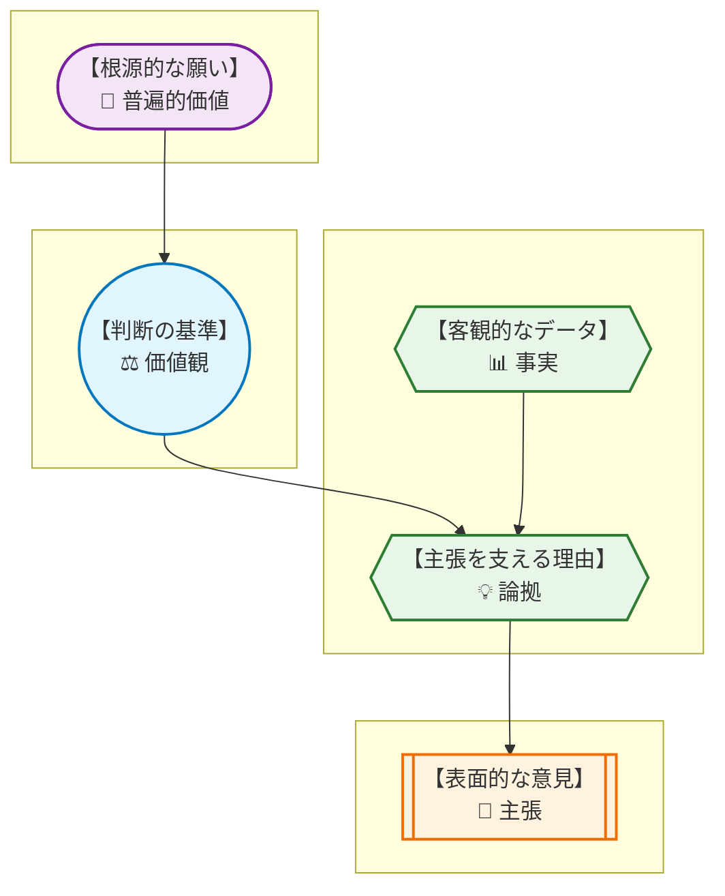
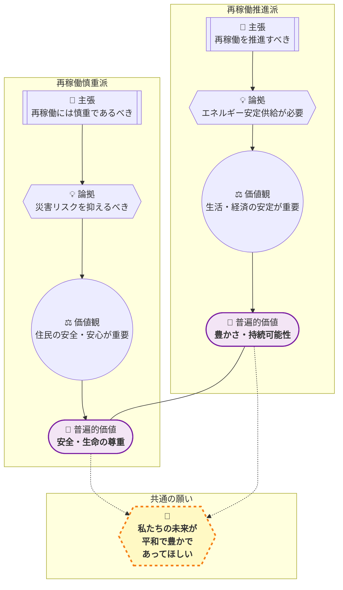
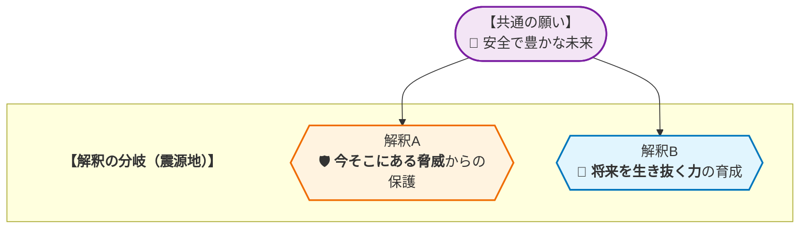

# 🧐 論理構造解析ワークシート：原子力発電を巡る議論 を解き明かす
> **【学習者の皆さんへ】**
> このレポートは、AIが論理の組み立て方を提示した「思考のサンプル」です。AIが示した「事実」や「理由」が本当に正しいか、他に抜けている視点はないか、自分なりに疑い、検証してみてください。このレポートの内容を批判的に検討し、自分の言葉で議論を深めること自体が、最高のリテラシー教育となります。

## 1. AREの「逆推論」を理解する
> **【この章の要約】表面的な意見の奥にある「普遍的な価値」まで遡るプロセスを学びます。**

皆さん、こんにちは！ これから皆さんと一緒に、「論理的思考」という、最強の武器を手に入れるための冒険に出かけたいと思います。論理的思考なんて聞くと、「難しそう…」「理屈っぽいのは苦手…」と感じるかもしれません。でも、心配しないでください！ これは、対立を乗り越え、みんなが納得できる答えを見つけるための、いわば **「魔法のメガネ」** のようなものなんです。

この章では、誰かの意見を聞いたときに、「なんで、この人はそう考えているんだろう？」とその意見の **“根っこ”** を探る旅に出ます。この根っこ探しの技術を **「逆推論」** と呼びます。さあ、まずは意見がどういうパーツで出来ているのか、その設計図を見てみましょう！

*   **主張 (C: Claim)** : 「〜すべきだ」という具体的な意見・結論。
*   **論拠 (W: Warrant)** : 「なぜなら〜だからだ」という、主張を支える理由付け。
*   **事実 (F: Fact)** : 論拠を裏付ける客観的なデータや出来事。
*   **価値観 (V: Value)** : 「〜は重要だ」という、個人や集団が持つ判断の軸。
*   **普遍的価値 (UV: Universal Value)** : 「安全」「平等」「生命」など、文化や立場を超えてほとんどの人が反対しない根源的な願い。

どうでしょう？ 意見は、こんな風にいくつかの層でできています。まるで地層みたいですよね。僕たちが普段目にするのは、一番上の **「主張 (C)」** だけです。でも、本当に大切なのは、その下に隠れている **「価値観 (V)」** や **「普遍的価値 (UV)」** なんです。

では、実際に今回のテーマで逆推論の旅をしてみましょう。例えば、こんな主張があったとします。

📢 **主張 (C)** : 「政府は、住民の安全を最優先し、原発の安全対策を徹底すべきだ。」

ここから、「なんでそう思うの？」と自分に問いかけながら、地層を掘り進めていきます。

*   **【なぜ？①】** なぜ、安全対策を徹底すべきなの？
    *   💡 **論拠 (W)** : なぜなら、原子力災害のリスクを社会が許容できるレベルに抑える必要があるからだ。
*   **【なぜ？②】** なぜ、リスクを抑える必要があるの？
    *   ⚖️ **価値観 (V)** : それは、何よりも **「住民の安全や安心」** が重要だからだ。
*   **【なぜ？③】** なぜ、住民の安全や安心がそんなに重要なの？
    *   💎 **普遍的価値 (UV)** : 究極的には、誰もが **「安全な社会で生きたい」** という根源的な願いを持っているからだ。

見えましたか？ 「安全対策を徹底しろ！」という具体的な **主張 (C)** の根っこには、「安全な社会で生きたい」という、ほとんどの人が「そりゃそうだよね」と頷ける **普遍的価値 (UV)** が眠っていたんです。この「根っこ」を見つける力が、次のステップでめちゃくちゃ重要になります！

## 2. 複数の主張から「共通の価値」を見つける
> **【この章の要約】一見違う2つの意見が、実は「同じ願い」を持っていることを解剖します。**

さて、ここからが本番です！ 社会には、まるで水と油のように、決して交わらないように見える対立した意見がありますよね。今回のテーマである原子力発電もまさにそうです。

*   **意見A** : 「安全が確保された原発は、エネルギー安定供給のために **再稼働を推進すべきだ！**」
*   **意見B** : 「どんな理由があっても、住民の安全を最優先し、 **再稼働には慎重であるべきだ！**」

これだけ見ると、AさんとBさんは絶対に分かり合えそうにないですよね。でも、本当にそうでしょうか？ ここで、さっき手に入れた「逆推論」という魔法のメガネを使ってみましょう。それぞれの意見の根っこを探る旅に出ます！

---

### **【意見A：再稼働推進派】の根っこを探る旅**

📢 **主張 (C)** : 安全性が確保された原発の **再稼働を推進すべきだ**。

*   **【なぜ？①】**
    *   💡 **論拠 (W)** : なぜなら、エネルギーの安定供給や電力コストの抑制、地球温暖化対策が必要だからだ。
    *   📊 **事実 (F) の一部** : エネルギーの安定供給は経済活動の基盤である (N_57)。原発は火力発電よりコストが安く、燃料費を削減できる (N_FC_1)。
*   **【なぜ？②】**
    *   ⚖️ **価値観 (V)** : それは、国民の生活や経済活動の **「基盤の安定」** が重要だからだ。
*   **【なぜ？③】**
    *   💎 **普遍的価値 (UV)** : 究極的には、私たちの社会がこれからも **「豊かで持続可能であってほしい」** という願いがあるからだ。 (持続可能性 / 富)

---

### **【意見B：再稼働慎重派】の根っこを探る旅**

📢 **主張 (C)** : 住民の安全を最優先し、 **再稼働には慎重であるべきだ**。

*   **【なぜ？①】**
    *   💡 **論拠 (W)** : なぜなら、原子力災害のリスクを社会全体で許容できる水準に抑える必要があるからだ。
    *   📊 **事実 (F) の一部** : 日本には放射能汚染で立ち入りできない区域が今もある (N_146, N_FC_8)。過去の事故では経営陣が「想定外」を理由に責任を免れる判例がある (N_140, N_FC_11)。
*   **【なぜ？②】**
    *   ⚖️ **価値観 (V)** : それは、何よりも **「住民の安全と安心」** が重要だからだ。
*   **【なぜ？③】**
    *   💎 **普遍的価値 (UV)** : 究極的には、私たちの社会が **「安全で、生命が脅かされないものであってほしい」** という願いがあるからだ。 (安全 / 生命)

---

さあ、両者の旅の結果を見比べてみてください。

驚きませんか？
表面的な **主張 (C)** は正反対なのに、その根っこにある **普遍的価値 (UV)** は、「豊かさ」「持続可能性」「安全」「生命」… これらはすべて、 **「私たちの未来が、平和で豊かで、安心して暮らせる社会であってほしい」** という、たった一つの大きな願いの一部なんです。

つまり、彼らは敵同士なのではなく、**同じ山の頂上（理想の未来）を目指している登山仲間** なんです。ただ、登っているルートが違うだけ。「経済の安定」というルートから登るか、「住民の安全」というルートから登るか。

この **「共通の願い」** を見つけ出すこと。これこそが、対立を乗り越え、建設的な対話、つまり **「合意形成」** を始めるための、最も重要で、最もパワフルな第一歩なのです！

## 3. 議論が噛み合わない「隠れた論拠(Warrant)」を発見する
> **【この章の要約】事実を「問題だ」と判断する背景にある、隠れた前提を探ります。**

皆さん、お疲れ様です！ 前半では、対立しているように見える意見も、根っこでは **「同じ願い」** で繋がっていることを見てきましたね。でも、こう思いませんでしたか？

「願いが同じなら、なんであんなに意見が食い違うんだろう？」

その謎を解くカギが、この章のテーマである **「隠れた論拠 (Warrant)」** です。論拠とは、ある **事実 (F)** を見て、「だから、こうすべきだ (C)」と結論付けるまでの、**思考のジャンプ台** のようなものです。このジャンプ台が、人によって高さも角度も全然違う。だから、同じ事実を見ても、全く違う結論にたどり着いてしまうんです。

例えば、こんな主張と事実があったとします。

📢 **主張 (C)** : 「政府や社会は、原発事故で経営陣が『想定外』を言い訳に責任を免れることを、決して許すべきではない。」

📊 **事実 (F)** : 過去の原発事故を巡る裁判で、経営陣が「巨大な津波は想定外だった」として、無罪になった判例がある。 (N_140, N_FC_11)

さあ、ここからがワークです！
この **主張 (C)** と **事実 (F)** の間には、どんな **「隠れた論拠 (W)」** 、つまり **「思考のジャンプ台」** があると思いますか？ なぜ、この人は「経営陣が無罪になった」という事実を見て、「これは絶対に許すべきではない問題だ！」と強く感じたのでしょうか？ 少しだけ、その人の心の中を想像してみてください。

▼ 考え方のヒントと解答例

**【考え方のヒント】**
「もし、経営陣が『想定外』で許されるのが当たり前になったら、将来どんなマズいことが起きるだろう？」と考えてみてください。この主張をしている人は、その「マズい未来」を強く恐れているはずです。その恐れこそが、隠れた論拠に繋がっています。

---

**【解答例】**
この主張の背景には、例えばこんな論拠 (W) や価値観 (V) が隠れていると考えられます。

*   💡 **隠れた論拠 (W)** : なぜなら、経営陣が責任を免れる前例ができてしまうと、**将来の安全対策への真剣さが失われ、また同じような悲劇が繰り返される危険性が高まる** からだ。
*   ⚖️ **価値観 (V)** : そもそも、企業の利益や効率よりも、**人々の生命や安全、そして社会全体の信頼の方が、比較にならないほど重要だ** という強い信念がある。

どうでしょう？ 「無罪になった」という一つの事実から、「将来の危険」や「社会の信頼」という大きなテーマに思考がジャンプしていますよね。この **「隠れた論拠 (W)」** をお互いに言葉にして確認し合わないと、「なんでそんなに怒ってるの？」と、議論が感情的なすれ違いに終わってしまうのです。

## 4. データが示す「対立の震源地」を特定する
> **【この章の要約】議論が平行線になる本当の理由（価値観の衝突）を特定します。**

さて、いよいよ核心に迫ります。なぜ、原発を巡る議論は、あれほどまでに平行線になってしまうのでしょうか？

それは、両者が大切にしている **「価値観 (V)」** が、ある一点で激しく衝突しているからです。僕たちはその衝突点を **「対立の震源地」** と呼んでいます。

前半で見たように、推進派も慎重派も、根っこでは **「私たちの未来が、平和で豊かで、安心して暮らせる社会であってほしい」** という **共通の願い (UV)** を持っていました。しかし、その「安心できる社会」をどう実現するか、その解釈が大きく二つに分かれてしまうのです。

*   **解釈A (🛡️ 今そこにある脅威からの保護)** : こちらは、**「原発事故」** という、一度起これば取り返しのつかない、具体的で甚大な被害をもたらすリスクを何よりも避けたい、という価値観です。目の前にある崖から、誰かが落ちないように守りたい、というイメージ。再稼働慎重派の意見は、主にこの価値観に基づいています。

*   **解釈B (🌱 将来を生き抜く力の育成)** : こちらは、**「エネルギー不足」** や **「経済の停滞」** という、じわじわと社会全体の活力を奪っていく、将来的なリスクを何としても避けたい、という価値観です。未来の世代が、食料不足や貧困に苦しまないように、今のうちから畑を耕しておきたい、というイメージ。再稼働推進派の意見は、主にこの価値観に基づいています。

どうですか？
どちらも「社会を守りたい」という強い正義感から来ていますよね。**誰も間違っていない** んです。ただ、**守りたいものの優先順位** と **時間軸の捉え方** が違うだけ。

この「震源地」を特定せずに、「再稼働すべきだ！」「いや、すべきでない！」と主張 (C) だけをぶつけ合っても、議論は永遠に噛み合いません。大切なのは、「あなたは、未来のどんなリスクを一番心配しているんですね」「あなたは、今そこにあるこの危険を一番重く見ているんですね」と、お互いの **価値観 (V) の違い** を認め、尊重することから始めることなのです。

## 5. 価値を統合して「第三の解決策」をデザインする
> **【この章の要約】AかBかの妥協ではなく、両方の価値を満たす新しい仕組みを考えます。**

さあ、いよいよ最後のステップです！
対立の震源地が分かったら、僕たちはA案とB案のどちらかを選んだり、間をとって妥協したりする必要はありません。対立する二つの価値を **“両方とも”** 満たす、全く新しい **「第三の解決策」** をデザインすることができるんです！

「そんなことできるの？」と思いますよね。できます！ そのための思考プロセスは、実はとてもシンプルです。

---
### **【思考プロセス：対立を創造のエネルギーに変える３ステップ】**

1.  **【並べる】対立する価値を、横に並べて書き出す。**
    *   （🛡️ 価値A）住民の **直接的な安全・安心** を、何よりも確保したい。
    *   （🌱 価値B）未来の社会を支える **エネルギーと経済の安定** も、絶対に必要だ。

2.  **【問いを立てる】「どうすれば、A “かつ” B を両立できるか？」という魔法の問いを作る。**
    *   「住民の直接的な安全・安心を最大限に確保 **しつつ**、エネルギーと経済の安定も実現する、画期的な方法はないだろうか？」

3.  **【組み合わせる】両方の価値を満たすアイデアを、自由に出し合う。**
    *   この「ANDで考える問い」を立てた瞬間、僕たちの脳は「0か100か」の戦いから解放され、創造的なモードに切り替わります。

---

このプロセスから、どんな **「第三の解決策」** が生まれる可能性があるでしょうか？
これはあくまで一例ですが…

**【第三の解決策の一例】**

*   **「防災特化型スマートシティ」構想**
    *   再稼働の議論とは別に、**世界最高水準の廃炉技術と防災システム** を開発することに、国が集中投資する。
    *   その技術開発の拠点として、原発周辺地域を「防災特化型スマートシティ」に指定。研究機関や企業を誘致し、新しい雇用を生み出す。
    *   開発した廃炉技術や防災システムを、**世界中に輸出してビジネスにする**。
    *   これにより、「安全技術の向上（価値A）」と「新しい産業による経済の安定（価値B）」を両立させる。

これは、**「再稼働するか、しないか」という元の対立軸とは全く違う次元の解決策** ですよね。対立していた二つのエネルギーを、全く新しい未来を作るための推進力に変えたのです。

さあ、今度は君の番です！
この思考プロセスを使って、君ならどんな「第三の解決策」を考えますか？ 完璧じゃなくていい、突拍子もなくてもいい。君だけのアイデアを考えてみてください。

*   もし君がこの地域のリーダーだったら、他にどんなアイデアを考える？
*   「避難訓練」と「エンターテイメント」を組み合わせて、地域の一大イベントにできないだろうか？
*   エネルギー問題について、世界中の同世代とオンラインで繋がって、新しいエネルギー源を発明するコンテストを開けないだろうか？

## 🎓 学習リフレクション

皆さん、今日一日、本当にお疲れ様でした！
「論理的思考」という、少し硬いテーマでしたが、ここまでついてきてくれて本当に嬉しいです。

最後に、少しだけ今日の冒険を振り返ってみましょう。

*   もし、自分が今日までとは全く逆の意見（推進派 or 慎重派）を、説得力をもって主張しなければならなくなったら、どんな **事実 (F)** と **論拠 (W)** を使って説明しますか？
*   今日の学びは、学校のクラス会議や、部活での意見の対立、友達とのちょっとした言い合い、あるいは家族との話し合いで、どんな風に活かせそうでしょうか？

意見が対立したとき、私たちはつい、相手を「敵」だと見なしてしまいます。でも、今日の学びを通して、その見方が少し変わったのではないでしょうか。

対立は、乗り越えるべき壁ではなく、**新しいアイデアを生み出すための最高のエネルギー源** です。相手の意見の奥にある「価値観」や「願い」に耳を澄ませることができれば、そこには必ず、より良い未来へのヒントが隠されています。

あなたの言葉には、世界をほんの少しだけ良くする力があります。
その力を信じて、明日から、身の回りの小さな対話から始めてみてください。

恐れず、焦らず、そして何より楽しんで。
皆さんのこれからの対話の旅を、心から応援しています！