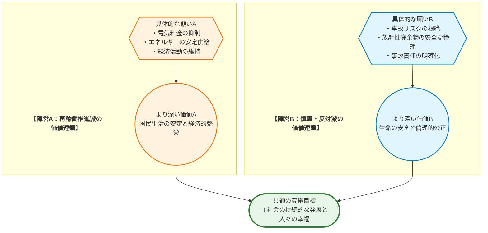
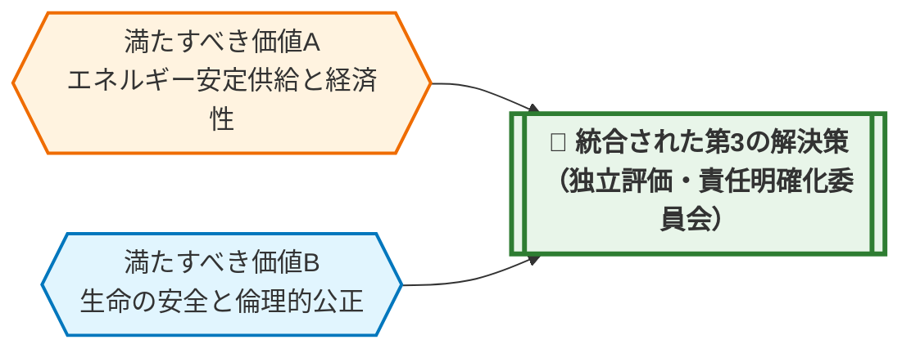

# 💡 価値統合ソリューション提案書：原子力発電の再稼働と社会的責任

> **【本レポートの活用にあたって】**
> 本レポートは、公開情報を基にAIが論理構造を整理・統合した「合意形成のためのたたき台」です。記述された事実関係はウェブ上の公開情報に基づいており、AIによるファクトチェックの限界から、最新性や正確性を完全に保証するものではありません。重要な意思決定に際しては、必ず一次情報や最新の統計データとの照合を行ってください。

## 📋 0. Executive Summary
> **【この章の視点】議論の全体像と本質的な対立構造（Context & Singularity）**

福島第一原子力発電所の事故以降、日本のエネルギー政策は大きな岐路に立たされています。一方で、エネルギーの安定供給と経済性の観点から **原子力発電所の再稼働を推進すべき** という主張があり、他方で、事故の深刻な教訓から **住民の安全確保と厳格な責任追及を最優先すべき** という主張が根強く存在します。この議論は、単なるエネルギー源の選択に留まらず、私たちの社会が「何を最も大切にするか」という価値観の根幹を問うものです。

この対立の核心には、中心的な概念である **「責任」** という言葉に対する、双方の解釈の根本的なズレが存在します。

| 比較項目 | **再稼働推進派が重視する「責任」** | **慎重・反対派が重視する「責任」** |
| :--- | :--- | :--- |
| **時間軸** | **未来** に対する責任 | **過去・現在** に対する責任 |
| **具体的な内容** | エネルギーを安定的に供給し、国民生活と経済活動の基盤を守る義務。 | 事故の教訓を忘れず、二度と悲劇を繰り返さない義務。万一の際の被害を最小限に抑え、原因と結果に厳格に向き合う義務。 |
| **思考の起点** | 「エネルギーがなければ社会は成り立たない」 | 「安全がなければ社会は成り立たない」 |

このように、両者が語る「責任」は、どちらも社会にとって不可欠な要素ですが、その焦点が異なっています。この根本的な認識のズレが、議論を平行線に終わらせる一因となっています。

本レポートは、どちらか一方の正当性を主張するものではありません。むしろ、この複雑に絡み合った論点を多角的に解きほぐし、異なる価値観の間に橋を架けることで、より良い合意形成に向けた建設的な対話を生み出すための **「強力な『たたき台』（議論の出発点）」** となることを目指すものです。

## 1. 議論の構造と「価値ネットワーク」
> **【この章の視点】主張（Claim）の根底にある価値観（Value）の連鎖**

「再稼働すべき」「すべきでない」という表面的な主張の奥底には、それぞれが大切にしている価値観の連鎖が存在します。両者は異なる道を主張しているように見えますが、その最終的な願いをたどっていくと、実は共通の目標に行き着くことが少なくありません。この構造を理解することが、対立を乗り越える第一歩となります。

この図が示すように、両陣営の主張は、異なる価値観を経由しながらも、最終的には **「社会の持続的な発展と人々の幸福」** という共通の目標を目指しています。対立しているのは目標そのものではなく、そこに至るまでの「手段」や「優先順位」なのです。

## 2. 対称的リスクのワーストシナリオ
> **【この章の視点】事実（Fact）に基づく因果予測**

どちらか一方の主張だけを極端に推し進めた場合、社会はどのような未来を迎えるのでしょうか。ここでは、両極端のシナリオがもたらす破滅的なリスクを、事実に基づく因果関係の連鎖として描き出します。これは、バランスの取れた解決策がいかに重要であるかを理解するための思考実験です。

*   **【A派（再稼働推進）の主張を強行・放置した場合のリスク】**
    *   **因果チェーン**: (X) 安全性への懸念や住民の合意形成を軽視し、経済合理性のみを優先して再稼働を強行すると → (Y) 万が一、再び重大な事故が発生した場合、取り返しのつかない人的・環境的被害が生じるだけでなく、国民の政府・企業への信頼は完全に失墜します。また、事故が起きなくとも、社会の深刻な分断と対立を招き、長期的なエネルギー政策そのものが国民の支持を失い、不安定化します → (Z) 結果として、日本の国土と国民の安全を脅かし、国際社会からの信用を失墜させ、経済的利益を追求したはずが、逆に計り知れない社会的・経済的損失をもたらします。

*   **【B派（慎重・反対）の主張を強行・放置した場合のリスク】**
    *   **因果チェーン**: (X) わずかなリスクも許容せず、全ての原子力発電所の即時停止と恒久的な廃炉を強行すると → (Y) エネルギー供給の大部分を占める火力の燃料費が国際情勢によって高騰し、電気料金は国民や企業の負担が限界を超えるレベルまで上昇します。電力需給も極めて不安定になり、大規模停電のリスクが常に付きまといます → (Z) 結果として、国民生活は困窮し、製造業をはじめとする国内産業は国際競争力を失い、海外へ流出。経済は深刻な停滞に陥り、社会全体の活力が失われ、安全保障上の脆弱性も増大します。

## 2.5 国際比較から見る「合意形成」の視点
> **【この章の視点】世界の動向（事実：Fact）を鏡として、本テーマを客観視する**

日本の原子力発電を巡る議論は、世界的に見ても特殊なものではありません。多くの国々が、エネルギーの安定供給、脱炭素化という環境目標、そして経済性という三つの課題、いわゆる **「エネルギーのトリレンマ」** に直面しています。福島第一原発事故を教訓に、世界中で安全基準を抜本的に強化する動きが進んだ一方で、近年の世界的なエネルギー危機や気候変動対策の要請から、原子力発電を重要な選択肢として再評価する国も増えています。この国際的な潮流は、日本の議論が「推進か、全廃か」という二者択一ではなく、いかにして **「最高水準の安全性を確保しつつ、社会が許容できる形で活用するか」** という、より現実的で困難な課題であることを示唆しています。

## 3. デッドロックの核心（特異点分析）
> **【この章の視点】対立の震源地（Singularity）の特定**

なぜこの問題の議論は、しばしば平行線をたどり、袋小路に陥ってしまうのでしょうか。その根本原因は、以下の二つの構造的な要因に集約されます。

| 分析項目 | 評価(高/中/低) | 理由・背景（価値観の対立構造に基づく） |
| :--- | :--- | :--- |
| **価値の衝突度** | **高** | 「経済合理性や効率性」を重視する価値観と、「生命の安全や倫理的な正義」を重視する価値観が正面から衝突しています。これらは共に社会を支える根源的な価値であり、単純な優劣をつけることができないため、対立が深刻化しやすくなります。 |
| **影響の非対称性** | **高** | 再稼働による利益（安価で安定した電力、交付金など）を享受する層と、万が一事故が起きた際に最も深刻な被害（健康被害、生活基盤の喪失）を受ける層が、地理的・社会的に必ずしも一致しません。この **「利益とリスクの担い手のズレ」** が、特に立地地域と大都市消費地との間で深刻な不信感と対立を生み、合意形成を極めて困難にしています。 |

## 4. 「 **第3の解決策** 」の実装と価値統合モデル
> **【この章の視点】対立する価値（Value）を両立させる新たな制度（Claim）の具体化**

対立する二つの「責任」— **未来への責任（安定供給）** と **過去・現在への責任（安全確保）** —は、どちらか一方を切り捨てては成り立ちません。真の解決策は、これらをトレードオフの関係から脱却させ、両立させる新しい仕組みを社会に実装することです。

ここでは、そのための具体的な制度として **「原子力レジリエンス独立評価委員会」** の設立を提案します。この委員会は、再稼働の是非を直接決定するのではなく、「原子力発電所が、社会の信頼に足るだけの安全性と透明性を維持し、稼働を許容できる状態にあるか」を継続的に評価し、その評価結果が稼働条件に直接反映される仕組みです。これにより、感情論や政治的圧力から距離を置き、客観的なデータに基づいた動的なリスク管理を実現します。

### ① 評価指標（KPI）とガバナンス

この制度の心臓部は、信頼性と客観性を担保するガバナンスと、明確な評価指標（KPI）にあります。

*   **ガバナンス（仕組みを誰がどう監視するのか）**:
    *   **構成**: 政府・電力会社から完全に独立した第三者機関として設置。委員は、原子力工学、地震学、危機管理の専門家に加え、法律家、社会学者、経済学者、そして **立地・周辺自治体の住民代表** や第三者NPOからの代表者を必ず含めることで、多様な視点を確保します。
    *   **透明性**: 委員の選定プロセス、議事録、評価に用いた全データは、原則としてリアルタイムで一般公開し、徹底した透明性を確保します。

*   **評価指標（KPI）と配点ウェイト**:
    評価は以下の4つの大項目で行い、総合スコアを算出します。

    1.  **技術的安全性とリスク管理（配点: 40%）**
        *   **内容**: 最新の科学的知見に基づくストレステストの結果、重大事故対策の進捗、サイバーセキュリティを含む新たな脅威への対応力。
        *   **理由**: これは全ての土台となる最低条件です。技術的な安全が確保されなければ、他の議論は成り立たないため、最も高い配点を設定します。

    2.  **住民合意と情報透明性（配点: 30%）**
        *   **内容**: 避難計画の実効性（住民参加率を伴う実地訓練の評価）、地域住民への情報公開の迅速性・分かりやすさ、住民説明会での質疑応答に対する満足度調査の結果。
        *   **理由**: 「利益とリスクの担い手のズレ」という対立の核心を是正するため、極めて重要です。住民の信頼なくして、原子力発電の持続可能性はあり得ません。当事者の納得感を定量化し、評価の柱とします。

    3.  **経済的・社会的便益（配点: 20%）**
        *   **内容**: 電力コスト削減効果の実績値、エネルギー安定供給への貢献度、立地地域への経済的貢献（雇用創出、税収等）の客観的データ。
        *   **理由**: 「未来への責任」という推進派の価値観も正当な社会的要請です。この便益を客観的に評価し、安全性とのバランスを議論するための根拠とします。

    4.  **バックエンド対策と将来世代への責任（配点: 10%）**
        *   **内容**: 使用済み核燃料の最終処分地選定プロセスの進捗、廃炉技術開発への投資と成果。
        *   **理由**: 配点は低いですが、これは「減点方式」に近い意味合いを持ちます。将来世代への責任を放棄する事業者に、現在世代のための発電を許容するわけにはいかない、という倫理的規範を制度に組み込みます。

### ② 制度のメカニズム（マトリクス表）

評価委員会の総合スコアは、単なる「お墨付き」で終わらせません。以下のマトリクス表に示す通り、評価ランクに応じて、対象となる原子力発電所の運転条件が **自動的に** 変更されるメカニズムを導入します。

| 評価ランク | 総合スコア | 運転条件（稼働率上限） | 追加措置・義務 |
| :--- | :--- | :--- | :--- |
| **S** (極めて良好) | 90点以上 | 90% | 安全対策・地域貢献への投資奨励金（交付金増額） |
| **A** (良好) | 80-89点 | 75% | 現状維持 |
| **B** (要改善) | 60-79点 | 50% | 改善計画の提出と、安全対策予算の10%強制増額 |
| **C** (重大な懸念) | 40-59点 | 25% (出力抑制運転) | 第三者による特別監査の受け入れ義務 |
| **D** (許容不可) | 39点以下 | **稼働停止** | 稼働再開には、最低2期間連続でBランク以上の評価が必要 |

このメカニズムにより、「評価のための評価」に終わらず、社会的な信頼度が実際のプラントの稼働に直結する、実効性のあるガバナンスが実現します。

### ③ ステークホルダー別の心理的変容

この制度は、単なる技術的な解決策ではなく、対立によって深く傷ついた人々の心理に変容をもたらすことを目指します。

*   **慎重・反対派の心理変容**:
    *   **「どうせ重要な情報は隠蔽される」という不信感** → 委員会の徹底した情報公開と、住民代表の参加により、「自分たちの代表が、自分たちの目で直接監視できる」という **当事者意識と安心感** へ。
    *   **「リスクだけを一方的に押し付けられる」という不公平感** → 避難計画の実効性や住民合意が評価の30%を占め、それが稼働率に直結することで、「私たちの声が、プラントの運転を左右する力を持つ」という **エンパワーメント（権能付与）と納得感** へ。
    *   **「事故が起きても誰も責任を取らない」という諦め** → 評価が低ければ自動的に稼働が停止する仕組みは、「責任の所在が明確で、最悪の事態を未然に防ぐセーフティネットがある」という **信頼感** へ。

*   **推進派の心理変容**:
    *   **「感情的な反対で議論が進まない」という苛立ち** → 客観的なKPIに基づく評価制度により、「感情論ではなく、クリアすべき基準がデータで示される」という **建設的な対話の土壌** へ。
    *   **「いつまでも再稼働できず、国益を損なう」という焦り** → 高い評価を得れば安定的な稼働が社会的に認められる道筋が示されることで、「安全への投資が、結果的に安定供給への最短ルートになる」という **健全なインセンティブ** へ。

この「第3の解決策」は、対立する価値を統合し、不信を信頼へ、分断を協調へと転換させるための、具体的かつ実行可能な社会システムなのです。

## 5. 3つの未来シナリオ
> **【この章の視点】解決策の有無がもたらす未来の事実（Fact）の予測**

私たちが今、どのような選択をするかによって、未来の姿は大きく変わります。ここでは、「第3の解決策」を導入しなかった場合の2つのシナリオと、導入した場合のベストシナリオを具体的に描きます。

*   **シナリオ1: 現状維持（緩やかな衰退）**
    「第3の解決策」のような抜本的な合意形成メカニズムを導入せず、これまで通りの議論を続けた未来です。一部の原発は再稼働しますが、そのたびに地域社会との間に深刻な分断が生まれます。エネルギー政策は常に政治的な駆け引きの対象となり、長期的な見通しは立ちません。電力コストは高止まりし、国民生活をじわじわと圧迫し続けます。廃炉や最終処分場の問題は先送りされ、社会は漠然とした不安と不信感を抱えたまま、エネルギー問題のリスクとコストの両方を中途半端に負担し続けることになります。

*   **シナリオ2: ワースト（破局）**
    どちらか一方の主張が極端に推し進められた結果、対称的リスクが現実化した未来です。
    *   **【経済性優先の破局】**: 安全性や住民合意を軽視し、再稼働を強行した結果、再び重大な事故が発生。福島第一原発事故で発生した **「帰還困難区域」** （N_FC_8）が日本の別の地域にも生まれ、回復不能な国土の喪失とコミュニティの崩壊を招きます。国民の政府・企業への信頼は完全に地に落ち、経済合理性を追求したはずが、その代償として計り知れない社会的・経済的損失を被る未来です。
    *   **【全廃強行の破局】**: 全ての原発を即時停止し、代替エネルギーの確保が追いつかない未来。火力発電への依存が極端に高まり、国際情勢の変動で燃料費は暴騰。過去に経験した **「15.5兆円の燃料費増加」** （N_FC_1）をはるかに超える国富が流出し、電気料金は企業の国際競争力と国民の生活を破壊するレベルに達します。産業は空洞化し、社会全体の活力が失われ、日本のエネルギー安全保障は極めて脆弱な状態に陥ります。

*   **シナリオ3: ベスト（価値統合による再生）**
    「第3の解決策」が社会に実装され、機能している未来です。独立評価委員会による客観的で透明性の高い評価が社会の信頼を獲得。評価基準を満たした、真に安全性の高い原発のみが、社会的な合意のもとで限定的に稼働します。これにより、柏崎刈羽原発の再稼働で見込まれる **「年間約1,000億円の燃料費削減」** （N_FC_1）のような経済的便益が生まれ、その利益は再生可能エネルギーの技術開発や、悲願である最終処分場の問題解決へと再投資されます。原子力のリスクは社会全体で適切に管理され、エネルギーポートフォリオは多様化し、強靭になります。何よりも、かつて社会を二分した深刻な対立は建設的な対話へと変わり、分断を乗り越えた成功体験が、他の社会課題解決への大きな希望となる未来です。

## 6. 政策の実効性（反論耐性とフェイルセーフ）
> **【この章の視点】現実社会への実装に向けたリスク検証（Warrant）**

いかに優れた理念の制度でも、現実の複雑さや人間の不完全さに対応できなければ意味がありません。ここでは、提案する解決策への想定反論に答え、制度が機能不全に陥らないための安全網（フェイルセーフ）を提示します。

▼ 想定される反論と、真の論点への昇華

*   **A派（推進派）からの想定される反論と回答**:
    *   **反論**: 「これでは手続きが煩雑になりすぎ、評価基準も厳しすぎて、結局どの原発も再稼働できないではないか。机上の空論だ。」
    *   **回答**: そのご懸念は、エネルギーの安定供給という責任を真摯に考えているからこそだと思います。しかし、この制度の目的は再稼働を妨害することではありません。むしろ逆です。これまでの対立の根本原因は「信頼の欠如」でした。信頼がないまま再稼働を進めても、訴訟や政治闘争で結局は遅延します。この制度は、 **透明性と客観性という『信頼のインフラ』を構築することで、社会的な合意形成を加速させ、結果的に持続可能な形での稼働への最短ルートを築く** ものです。評価基準には「経済的・社会的便益」も明確に含まれており、決して安全一辺倒の理想論ではない、バランスの取れた仕組みとなっています。

*   **B派（慎重・反対派）からの想定される反論と回答**:
    *   **反論**: 「どうせ独立委員会といっても、政府や電力会社に都合のいい『御用学者』が選ばれ、結論ありきで評価が骨抜きにされるに決まっている。」
    *   **回答**: その不信感は、これまでの歴史を鑑みれば当然のものです。私たちはその根深い不信に正面から向き合わなければなりません。だからこそ、この制度では **「誰が委員になるか」という入口の議論だけでなく、「評価結果がどう自動的に作用するか」という出口のメカニズムを重視** しています。委員の選定プロセス自体を全面公開し、住民代表やNPOが一定数の委員を推薦できる枠を設けます。さらに重要なのは、たとえどのような委員構成であれ、評価スコアが低ければ **自動的に稼働率が制限され、最終的には停止する** というルールです。これにより、個人の意図や政治的圧力が入り込む余地を制度的に排除し、仕組みそのものが信頼を担保します。

*   **フェイルセーフ設計**:
    *   **自動停止・再審査ルール**: 評価スコアが2期連続（例: 2年間）で一定の基準（Cランク以下）を下回った場合、その原子力発電所は自動的に稼働を停止し、原因の徹底究明と改善策が講じられるまで再稼働は許可されません。
    *   **制度自体の見直し条項**: この評価制度そのものが形骸化したり、社会情勢と乖離したりすることを防ぐため、3年ごとに評価指標（KPI）や配点ウェイト、委員会の構成ルール自体を見直すプロセスを法律で義務付けます。この見直しプロセスにも、多様なステークホルダーの参加を保証します。

## 7. 結語（絶対回避ラインと対話への行動喚起）
> **【この章の視点】絶対に守るべき普遍的価値（UV）の再確認とネクストアクション**

私たちは、エネルギー政策という複雑な問いの前で、多くの価値の間で揺れ動きます。経済性、安定供給、環境、そして安全。しかし、どのような議論の末に、いかなる妥協点を探るとしても、絶対に越えてはならない一線が存在します。

それは、いかなる経済的利益や国家の都合を理由にしようとも、 **そこに住む人々の生命と安全、そして生活の尊厳を軽んじること** 、そして **意思決定のプロセスから当事者を排除し、情報を不透明にすることで彼らの知る権利と参加する権利を奪うこと** です。この二つの絶対回避ラインこそが、私たちの社会が人間性を失わないための最後の砦です。

このレポートが提示した「第3の解決策」は、完璧な答えではありません。むしろ、この絶対回避ラインを守りながら、より良い社会を築くための、一つの **「たたき台」** にすぎません。

ぜひ、このレポートをきっかけに、あなたの職場の同僚やご家族と「私たちにとって、信頼できる仕組みとは何か」を話し合ってみてください。あるいは、お住まいの自治体が公表しているハザードマップや避難計画を、一度確認してみてください。その小さな対話と行動の一つひとつが、分断を乗り越え、共通の未来を築くための、最も確実で力強い第一歩となるはずです。