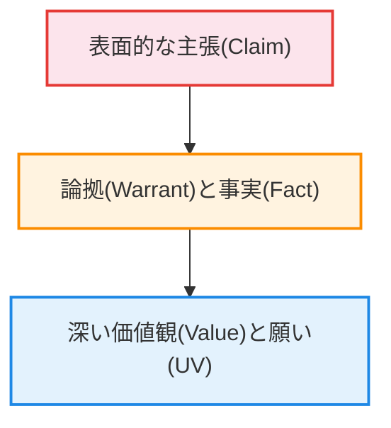
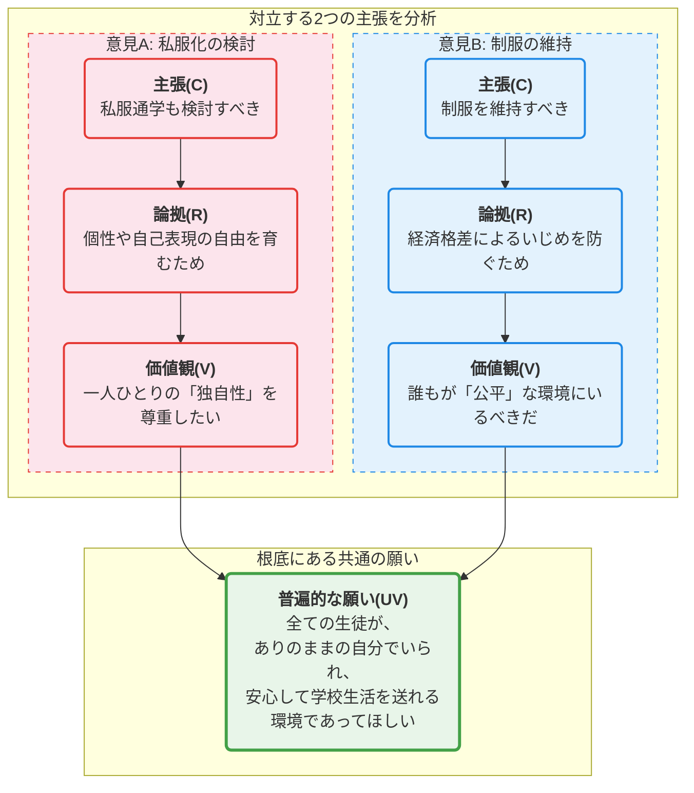
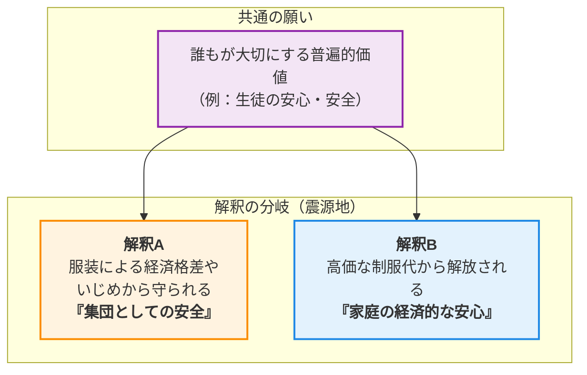

# 🧐 論理構造解析ワークシート：中学校の制服問題 を解き明かす

## 1. AREの「逆推論」を理解する
> **【この章の要約】表面的な意見の奥にある「普遍的な価値」まで遡るプロセスを学びます。**

皆さん、こんにちは！「論理的思考と合意形成」ワークショップへようこそ！ファシリテーターを務めます。どうぞよろしくお願いします！

さて、今日のテーマは、皆さんにとっても非常に身近な「**中学校の制服問題**」です。制服はあった方がいい？それとも、ない方がいい？もっとこうだったらいいのに…色々な意見がありますよね。

このワークショップの目的は、制服問題の答えを出すことではありません。この「生きた教材」を使って、**意見の奥に隠された「本当の願い」を見つけ出す**ための思考法をトレーニングすることです。これができれば、どんな複雑な問題でも、対立を乗り越えて、みんなが納得できる道筋（＝合意形成）を見つけ出す強力な武器になりますよ！

では早速、基本の型「**AREの逆推論**」をマスターしましょう！

普段、私たちが目にするのは「～すべきだ」という表面的な**主張（Claim）**です。しかし、その主張には必ず、それを支える**論拠（Warrant）**と**事実（Fact）**が存在します。そして、さらにその奥深くには、その人が大切にしている**価値観（Value）**や、人間として共通の**普遍的な願い（Universal Value）**が眠っているのです。

表面的な主張から、その根っこにある「願い」まで遡って掘り下げていくプロセス。これを「**逆推論**」と呼びます。まるで探偵のように、意見の深層心理を探っていくエキサイティングな旅だと思ってください！

具体例で見てみましょう。提供されたデータの中に、こんな主張がありました。

*   **主張(C):** 「中学校は、制服の費用負担を軽減する措置を講じるべきである」

なぜ、そう主張するのでしょうか？逆推論してみましょう！

1.  **【なぜ？】→ 論拠(W) & 事実(F):**
    *   それは「**家庭の経済的負担を軽減するため**」です。
    *   実際にデータを見ても、「**高価な制服は家庭に経済的負担をかける**」という事実や、「**制服代が平均6万円を超え、家計を圧迫している**」という調査結果が示されています。

2.  **【それが満たされると、どんないいことがある？】→ 価値観(V):**
    *   家庭の経済的負担が減ることで、「**家計の安定**」がもたらされます。この主張の裏には、「家計の安定を大切にしたい」という価値観があるわけですね。

3.  **【なぜ、それが究極的に大切なの？】→ 普遍的な願い(UV):**
    *   家計が安定することは、私たちが安心して生きていくための土台です。つまり、これは「**誰もが経済的な不安なく、安定した生活を送りたい**」という、人間共通の**生命/生存の追求**という普遍的な願いに繋がっているのです。

どうでしょう？「制服代を安くして！」というシンプルな主張の奥に、こんなにも深く、そして誰もが共感できる「願い」が隠れているなんて、面白いと思いませんか？

## 2. 複数の主張から「共通の価値」を見つける
> **【この章の要約】一見違う2つの意見が、実は「同じ願い」を持っていることを解剖します。**

さて、逆推論の威力が分かったところで、次にもっとスリリングな分析に挑戦してみましょう！それは、**一見すると正反対に見える2つの意見を解剖し、その根っこにある「共通の願い」を見つけ出す**ことです。

「あっちの意見とこっちの意見は、絶対に相容れない！」

そう感じるとき、私たちは表面的な主張のレベルでぶつかり合っています。でも、逆推論のドリルで深く掘り進めていくと…「あれ？目指している未来は、実は同じだったんだ！」という驚きの発見があるんです。これこそが、対立を乗り越えるための最大のヒントになります。

では、データの中から、対立しているように見える2つの意見を取り出してみましょう。

*   **意見A（見直し派）:** 「生徒の個性や自己表現の自由を育むために、**私服通学の選択肢を検討すべき**だ」
*   **意見B（維持派）:** 「生徒間の経済格差によるいじめを防ぐために、**制服の維持を検討すべき**だ」

「私服」か「制服」か。まさに正反対の主張ですね。では、この2つの意見を、先ほど学んだ逆推論で掘り下げてみましょう！

この図を見てください！

*   **意見A**は、「個性」や「自己表現」という価値観を大切にしています。これは、一人ひとりが自分らしく輝けることを願う「**独自性/個の追求**」に繋がります。
*   **意見B**は、「いじめ防止」や「公平性」という価値観を大切にしています。これは、誰もが差別されず安全な環境で過ごせることを願う「**平等/公平の追求**」に繋がります。

「独自性」と「公平性」。これだけ見ると、まだ違う方向を向いているように感じますよね。

しかし、もう一歩だけ深く潜ってみましょう。なぜ「独自性」が大切なのでしょうか？なぜ「公平性」が大切なのでしょうか？

それは、どちらも**「全ての生徒が、ありのままの自分で、安心して学校生活を送れる状態であってほしい」**という、たった一つの、共通の大きな願いにたどり着くのです。

*   服装によって自分らしさを否定されることなく、安心して過ごしてほしい。
*   家庭の経済状況によって惨めな思いをすることなく、安心して過ごしてほしい。

手段（私服か、制服か）は違えど、目指している**「生徒の幸せ」というゴールは同じ**だったのです！

この「共通の願い」を発見することこそ、合意形成のスタートラインです。ここから初めて、「じゃあ、この共通の願いを叶えるために、制服でも私服でもない、第三の道はないだろうか？」といった、建設的な対話が生まれるのです。

さあ、思考のウォーミングアップはここまでです！
この「逆推論」と「共通価値の発見」というツールを使って、後半は皆さんと一緒に、この中学校の制服問題をさらに深く、多角的に分析していきますよ！

## 3. 議論が噛み合わない「隠れた論拠(Warrant)」を発見する
> **【この章の要約】事実を「問題だ」と判断する背景にある、隠れた前提を探ります。**

皆さん、お疲れ様です！前半では、意見の奥にある「共通の願い」を見つける旅をしましたね。ここからは、さらに思考の解像度を上げていきますよ！

さて、私たちは「主張(Claim)」を支えるものとして「事実(Fact)」と「論拠(Warrant)」がある、と学びました。特にこの「**論拠(Warrant)**」というのが、なかなかのクセモノなんです。なぜなら、多くの場合、それは**言葉にされずに省略されている「隠れた前提」**だからです。

例えば、こんな意見を見てみましょう。

*   **主張(C):** 「中学校において、生徒の身分を明確にし、学校外での識別や安全確保に役立てるために、学校は制服の維持を検討すべきである。」

この主張の出発点となっている**事実(F)**は、データにもある通り、「制服は生徒の身分を明確にし、学校外での識別と安全確保に役立つ」という点です。これは客観的な事実ですよね。

しかし、考えてみてください。「安全確保に役立つ」という**事実(F)**から、「だから制服を維持すべきだ」という**主張(C)**にたどり着くには、論理的なジャンプがあります。その間を繋いでいるのが、語られていない「**隠れた論拠(W)**」なのです。

さあ、ここで皆さんにワークです！探偵になった気分で、この論理のジャンプを埋める「**隠れた論拠(W)**」、つまり**暗黙の前提**を見つけ出してみてください。どんな価値判断が隠れているでしょうか？

▼ 考え方のヒントと解答例

### 考え方のヒント
「なぜ『安全確保に役立つこと』が、制服を『維持すべき』と判断する絶対的な理由になるのでしょうか？」と考えてみましょう。そこには、学校や社会が何を**最優先すべき**だと考えているか、という強い価値判断が隠されていますよ。「〜のためなら、〜は許容されるべきだ」という文章の形で考えると、見つけやすいかもしれません。

### 解答例
この背景には、例えば以下のような「隠れた論拠（価値判断）」が考えられます。

*   **論拠の例1:** 「学校は、生徒の安全を何よりも優先して確保する**責任がある**。」
*   **論拠の例2:** 「生徒の安全を守るという大義のためには、多少の個性の制限や経済的負担は**許容されるべき**だ。」
*   **論拠の例3:** 「集団全体の安全は、個人の自由よりも**優先されるべき**場合がある。」

いかがでしたか？このように、同じ事実を見ても、どんな「隠れた論拠（価値判断）」を持っているかによって、導き出される主張は全く変わってきます。議論が噛み合わないとき、多くの場合、私たちはこの**お互いの「隠れた論拠」に気づいていない**のです。相手の「隠れた論拠」を想像する力こそ、対話の第一歩なんですね！

## 4. データが示す「対立の震源地」を特定する
> **【この章の要約】議論が平行線になる本当の理由（価値観の衝突）を特定します。**

さあ、いよいよ核心に迫っていきますよ！

前半パートで、私たちは「私服派」も「制服派」も、根っこでは「**生徒が安心して学校生活を送ってほしい**」という共通の願いを持っていることを発見しました。

それなのに、なぜ議論は平行線になってしまうのでしょうか？

その答えは、**共通の願いから出発しても、途中で「解釈」が大きく分かれてしまうから**です。私たちはこの決定的な分岐点を「**対立の震源地**」と呼んでいます。

下の図を見てください。これは、私たちの思考がどのように分岐していくかを示したものです。

まさに、これこそが制服問題の構造なんです！

*   誰もが「**生徒の安心・安全**」という普遍的な価値を願っています。これは私たちの共通の出発点です。
*   しかし、その「安心・安全」をどう解釈するか、という**震源地**で意見が分岐します。
    *   **解釈A**の道を選んだ人は、「服装でいじめられたり、仲間外れにされたりしない**『集団としての安全』**こそが大事だ」と考えます。だから、みんなが同じ格好をする制服を支持する傾向が強くなります。
    *   一方、**解釈B**の道を選んだ人は、「そもそも高価な制服を買うこと自体が生活を脅かす。**『家庭の経済的な安心』**がなければ始まらない」と考えます。だから、制服の費用負担軽減や見直しを求める声が大きくなるのです。

どちらも間違ってはいません。どちらも、心から生徒のことを想っている。ただ、**大切にしている「安心」の形が違う**だけなのです。

この「対立の震源地」を特定し、「ああ、あの人は『集団の安全』を、この人は『経済的な安心』を一番に考えているんだな」と理解すること。これができれば、相手を感情的に非難するのではなく、対立の構造そのものを客観的に見つめることができます。

## 5. 価値を統合して「第三の解決策」をデザインする
> **【この章の要約】AかBかの妥協ではなく、両方の価値を満たす新しい仕組みを考えます。**

対立の構造を解き明かした皆さん、おめでとうございます！いよいよ、このワークショップのクライマックス、解決策のデザインです！

私たちが目指すのは、A案とB案の真ん中を取るような、どっちつかずの「妥協案」ではありません。そんなものは、誰も幸せにしませんからね。私たちが目指すのは、対立する両方の価値を**”両立”させる、全く新しい「第三の解決策」**です！

そのための思考プロセスは、とてもシンプルです。

### 【思考プロセス】
1.  **対立する価値を並べる**
    対立の震源地で見つけた、両者が大切にしている価値を並べてみましょう。
    *   価値A: 「**集団としての安全**」「**公平性**」「**帰属意識**」
    *   価値B: 「**経済的な安心**」「**個性の尊重**」「**快適性**」

2.  **統合する問いを立てる**
    次に、これらの価値を「or」ではなく「and」で繋ぐ、魔法の問いを立てます。
    > **「どうすれば、『集団の安全』や『公平性』を保ちながら、同時に『経済的負担を減らし』、『個性を尊重』し、『快適に』過ごすことができるだろうか？」**

3.  **アイデアを組み合わせる**
    この「統合する問い」を羅針盤にして、自由な発想でアイデアを出していきます。制服か、私服か、という二者択一から解放されると、驚くほど創造的なアイデアが生まれてきますよ！

### 【第三の解決策の一例】
このプロセスから生まれる解決策の一例が、「**選択的標準服制度**」です。

これは、学校が指定した複数のアイテム（例えば、ジャケット、スラックス、スカート、ポロシャツ、セーターなど）の中から、**生徒が季節や好みに合わせて自由に組み合わせて着用できる**制度です。

*   全員が共通のアイテム群から選ぶので、「**統一感（帰属意識・公平性）**」は保たれます。
*   組み合わせは自由なので、「**個性の尊重**」に繋がります。
*   高価なジャケットは必須とせず、安価なポロシャツやセーター中心の組み合わせも可能にすれば、「**経済的負担の軽減**」が実現できます。
*   夏は涼しいポロシャツ、冬は暖かいセーターなど、機能性で選べるので「**快適性**」も向上します。

どうでしょう？対立していた価値が、見事に両立されていると思いませんか？

さあ、今度はあなたの番です！先ほどの「統合する問い」をヒントに、あなたならどんな「第三の解決策」をデザインしますか？正解はありません。自由な発想こそが、未来を創る力になるのです！

*   **ヒントとなる問い:**
    *   「リサイクルやリユースの仕組みを、もっと楽しく、当たり前の文化にするにはどうしたらいいだろう？」
    *   「地域のアパレル企業と連携して、安価でデザイン性の高い『地元オリジナル標準服』を開発できないだろうか？」
    *   「『服装について生徒会が主体となってルールを考える日』を、学校行事にしてしまうのはどうだろう？」

## 🎓 学習リフレクション

皆さん、本日のワークショップ、本当にお疲れ様でした！「中学校の制服問題」という身近なテーマから、私たちは論理の深層へと旅をしてきました。

最後に、少しだけ今日の学びを振り返ってみましょう。

*   もし、あなたが今日までずっと「制服は絶対必要だ」と思っていたとしたら、見直し派の意見の奥にある「経済的な不安をなくしたい」という**願い**に、どんな共感を覚えましたか？
*   逆に、「制服なんて時代遅れだ」と思っていたとしたら、維持派が守ろうとしている「集団の安全」という**価値**について、どんな発見がありましたか？

この思考法は、決して特別なものではありません。友人との意見の対立、家族との進路相談、将来の職場での会議…あらゆるコミュニケーションの場面で、この「**相手の意見の奥にある『願い』を探す旅**」は、あなたの強力な武器になります。

相手の言葉を「敵の主張」として聞くのではなく、「その人が大切にしている価値の表明」として聞く。その小さな意識の変化だけで、あなたの周りの世界は、もっと優しく、建設的なものに変わっていくはずです。

**論理的思考は、相手を打ち負かすための冷たい武器ではありません。むしろ、相手を深く理解し、心と心を繋ぎ、新しい未来を”共に”創るための、温かい道具なのです。**

今日学んだことを、ぜひ明日からの生活で少しだけ試してみてください。きっと、今まで見えなかった景色が見えてくるはずです。

皆さんのこれからの対話が、より豊かで実りあるものになることを、心から応援しています！ご参加、本当にありがとうございました！