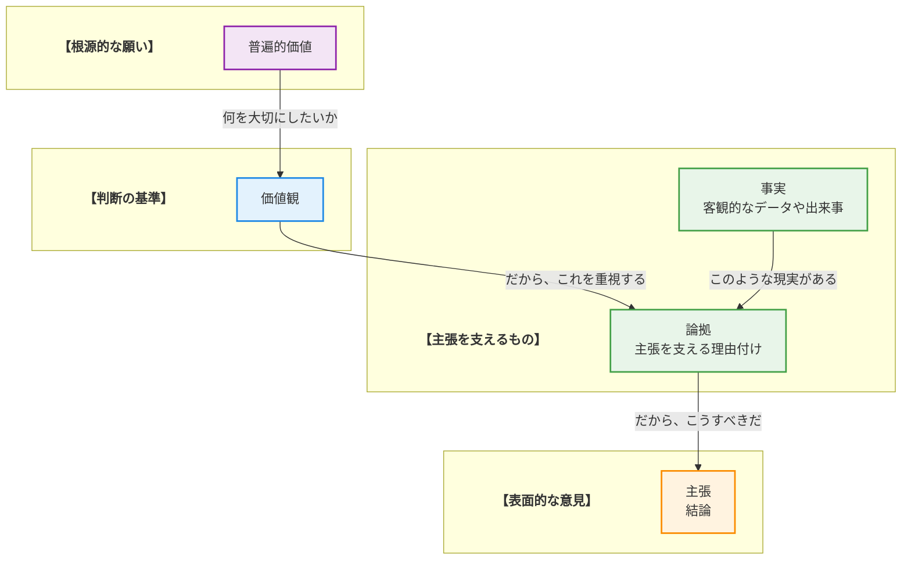
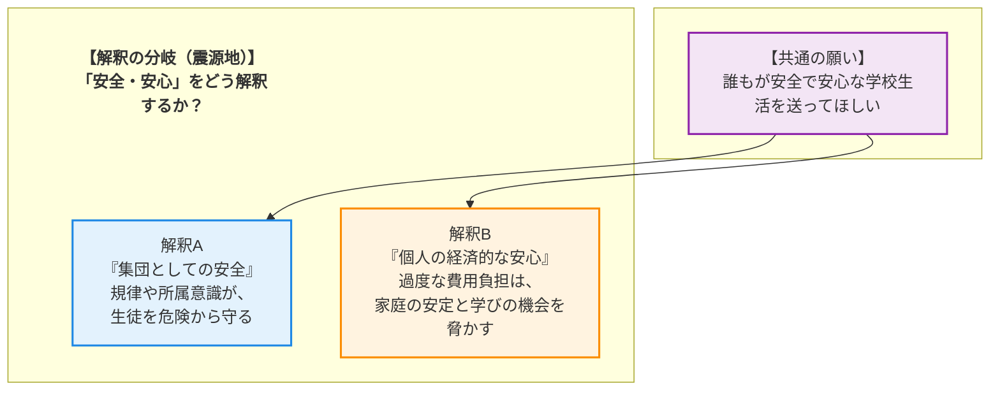

# 🧐 論理構造解析ワークシート：中学校の制服問題を解き明かす

## 1. AREの「逆推論」を理解する
> **【この章の要約】表面的な意見の奥にある「普遍的な価値」まで遡るプロセスを学びます。**

皆さん、こんにちは！「論理的思考と合意形成」ワークショップへようこそ！ファシリテーターを務めます。どうぞ、リラックスして参加してくださいね。

さて、私たちは日々、様々な意見に触れますよね。「〜すべきだ」「いや、〜であるべきだ」と。しかし、意見が食い違うと、そこで思考が止まってしまいがちです。今日のワークショップでは、そうした表面的な意見の「奥」に何が隠されているのかを探る冒険に出かけたいと思います。

そのための強力な武器が、これから紹介する **ARE** という考え方と、その応用である「 **逆推論** 」です。これは、意見（主張）からスタートして、「なぜ、そう言えるの？」と繰り返し問いかけることで、その人の根っこにある「本当に大切にしたい願い」まで遡っていく思考法です。

まずは、その全体像を地図で確認してみましょう！

*   **主張 (C: Claim)** : 「〜すべきだ」という具体的な意見・結論。
*   **論拠 (W: Warrant)** : 「なぜなら〜だからだ」という、主張を支える理由付け。
*   **事実 (F: Fact)** : 論拠を裏付ける客観的なデータや出来事。
*   **価値観 (V: Value)** : 「〜は重要だ」という、個人や集団が持つ判断の軸。
*   **普遍的価値 (UV: Universal Value)** : 「安全」「平等」「生命」など、文化や立場を超えてほとんどの人が反対しない根源的な願い。

---

さあ、この地図を使って、早速「生きた教材」である今回のテーマ、中学校の制服問題を分析してみましょう！

例えば、こんな **主張 (C)** があります。
「 **中学校は、制服の費用負担を軽減する措置を講じるべきである** 」

皆さんも一度は考えたことがあるかもしれませんね。では、ここから「逆推論」の旅を始めますよ！

1.  **なぜ、そう主張するの？ (C → W)**
    「なぜなら、 **高価な制服は家庭に大きな経済的負担をかけている** からだ」
    これが主張を支える **論拠 (W)** です。なるほど、理由が見えてきました。

2.  **それは本当？ (W → F)**
    「はい、事実として、ある調査では **中学1年生の制服代が平均6万円を超え、多くの保護者が負担に感じている** というデータがあります」
    客観的な **事実 (F)** が論拠を力強く支えていますね。

3.  **なぜ、それがそんなに重要なの？ (W → V)**
    「それは、 **家庭の経済的安定を守ることが重要だ** と考えているからです」
    ここで、その人が何を大切にしているのか、という **価値観 (V)** が見えてきました。「家計の安定」を重視しているのですね。

4.  **その価値観の、さらに奥にある「願い」は何？ (V → UV)**
    「突き詰めれば、 **経済的な理由で子どもたちの学ぶ機会が奪われたり、家族が不安な生活を送ったりすることがないようにしたい** という願いです。これは、誰もが安心して生きていける社会を願う『 **生命/生存** 』の追求や、経済状況によらず誰もが公平なスタートラインに立つべきだという『 **平等/公平** 』という根源的な願いに繋がっています」
    ついにたどり着きました！これが、ほとんどの人が「そうだよね」と頷ける **普遍的価値 (UV)** です。

どうでしょう？「制服を安くしろ」という一つの意見から、こんなにも深く、そして誰もが共感できる「願い」まで掘り下げることができました。これが「逆推論」の力です！

## 2. 複数の主張から「共通の価値」を見つける
> **【この章の要約】一見違う2つの意見が、実は「同じ願い」を持っていることを解剖します。**

さて、ここからが論理的思考の面白いところです！先ほどの逆推論を使うと、一見すると正反対に見える意見が、実は同じ「根っこ」から生えていることに気づけるのです。

ここに、制服に関する2つの意見があります。

*   **意見A:** 「家計への負担が重すぎる。 **制服の費用負担を軽減すべきだ！** 」
*   **意見B:** 「私服になると格差が見えてしまう。 **制服は維持すべきだ！** 」

「費用を軽減しろ」と「維持しろ」。これだけ聞くと、まるで水と油、絶対に交わらない対立した意見に見えますよね？ 普通なら、ここで議論は平行線です。

しかし、私たちはもう「逆推論」という武器を持っています。先ほどと同じように、それぞれの意見の奥にある「願い」を探ってみましょう。

**【意見Aの逆推論（おさらい）】**
*   **主張(C):** 費用負担を **軽減すべき**
*   **論拠(W):** 家庭の経済的負担が大きいから
*   **事実(F):** 制服は高価であるというデータがある
*   **価値観(V):** 家計の安定は重要だ
*   **普遍的価値(UV):** 経済格差による不利益を防ぎたい ( **平等/公平** )

**【意見Bの逆推論】**
*   **主張(C):** 制服は **維持すべき**
*   **論拠(W):** 生徒間の経済格差によるいじめや不平等を防ぐため
*   **事実(F):** 経済格差の表面化が、いじめの原因になりうるという研究結果がある
*   **価値観(V):** すべての生徒が安心して過ごせる公平な環境は重要だ
*   **普遍的価値(UV):** 経済格差による不利益を防ぎたい ( **平等/公平** )

皆さん、気づきましたか！？

驚くべきことに、「 **軽減しろ** 」という意見も、「 **維持しろ** 」という意見も、その根っこをたどっていくと、**「経済的な格差によって、子どもたちが辛い思いをしたり、不利益を被ったりしないようにしたい」** という、まったく同じ **普遍的価値 (UV)** 、つまり『 **平等/公平** 』という願いにたどり着くのです！

表面的な「どうするべきか (How)」で対立していても、その奥にある「何を願うか (Why)」は共通している。この発見こそが、対立を乗り越え、新しい解決策を生み出す「合意形成」の第一歩となります。

さあ、この「共通の願い」を足がかりに、私たちはどんな新しいアイデアを生み出せるでしょうか？
ワークショップの後半では、この発見を元に、皆さんと一緒に創造的な解決策を探っていきたいと思います！

## 3. 議論が噛み合わない「隠れた論拠(Warrant)」を発見する
> **【この章の要約】事実を「問題だ」と判断する背景にある、隠れた前提を探ります。**

皆さん、素晴らしい探求でしたね！対立する意見の根っこに「共通の願い」があることを見つけ出しました。

しかし、ここで一つ、新たな謎が生まれます。同じ事実を見ても、なぜ人は違う結論に至るのでしょうか？ 例えば、こんな **事実(F)** があります。

「 **制服は生徒の身分を明確にし、学校外での識別と安全確保に役立つ** 」

これは客観的なデータや多くの学校で採用されている理由からも裏付けられる事実です。この事実から、ある人はこう **主張(C)** します。

「 **だから、生徒の安全を守るために制服は維持すべきだ** 」

なるほど、一見すると自然な流れに聞こえます。しかし、ここには「飛躍」があります。「事実」と「主張」の間には、その人の価値観が反映された「橋」が架けられているのです。それが「 **隠れた論拠(W)** 」です。

さあ、皆さんの出番です！この事実と主張の間には、どんな「隠れた論拠(W)」があるでしょうか？ なぜ「身分が明確になること」が「制服を維持すべき」という結論に繋がるのでしょう？ 少し考えてみてください。

▼ 考え方のヒントと解答例

<strong>【考え方のヒント】</strong>

「もし〜でなければ、大変なことになる」という視点で考えてみましょう。制服がないことで、どんなリスクが生まれると、この主張をする人は考えているのでしょうか？ その人が「当たり前」だと思っている前提を想像してみるのがコツです。

<strong>【解答例】</strong>

この事実と主張の間には、例えば以下のような「隠れた論拠(W)」が考えられます。

<ul>
  <li>「生徒が事件や事故に巻き込まれた際、身元がすぐにわからないと救助や連絡が遅れ、<strong>命に関わる事態になるかもしれない</strong>」</li>
  <li>「学校に不審者が侵入しようとしたとき、制服を着ていない人物はすぐに見分けがつくため、<strong>犯罪を未然に防ぐことができるはずだ</strong>」</li>
  <li>「生徒であるという自覚が薄れると、<strong>規範意識が低下し、非行に走りやすくなる危険性がある</strong>」</li>
</ul>

いかがでしたか？ これらの論拠の奥には、「<strong>生徒の安全は何よりも優先されるべきだ</strong>」という、非常に強い価値観（前提）が隠れていることがわかります。議論が噛み合わない時、私たちはこの「隠れた論拠」の部分ですれ違っていることが多いのです。

## 4. データが示す「対立の震源地」を特定する
> **【この章の要約】議論が平行線になる本当の理由（価値観の衝突）を特定します。**

さあ、いよいよ核心に迫ります！私たちは「共通の願い」を見つけ、そして意見の裏にある「隠れた論拠」も発見しました。それでもなお、議論が平行線になってしまうのはなぜか？

それは、同じ「共通の願い」を持っていても、**「何が、その願いを最も脅かすのか」「どうすれば、その願いが最もよく実現するのか」という解釈が、人によって全く異なる**からです。

この **解釈の分岐点** こそが、対立の本当の震源地、いわば「特異点」なのです。

先ほどの制服問題を例に、この構造を図で見てみましょう。多くの人が持つ「 **誰もが安全で安心な学校生活を送ってほしい** 」という【共通の願い】。これは揺るぎません。しかし、この「安全・安心」という言葉の解釈が、ここで二つに分かれます。

*   **解釈A** の人々は、「安全・安心」を **集団の規律や秩序** によって守られるものだと考えます。だからこそ、身分を証明し、連帯感を生む制服が重要だと主張するのです。
*   一方、**解釈B** の人々は、「安全・安心」を **個々の家庭の経済的な安定** によって支えられるものだと考えます。高価な制服が家計を圧迫し、子どもたちの未来を脅かすことこそが最大のリスクだと捉えるのです。

どうでしょう？ どちらも間違ってはいませんよね。どちらも、心から生徒たちのことを想っている。ただ、大切にしている「安全・安心」の形が違うだけなのです。

この「震源地」を特定できれば、もはや相手は「敵」ではありません。「同じ願いを持つ、違う視点のパートナー」として見ることができるようになります。これこそが、合意形成への最も重要な一歩です！

## 5. 価値を統合して「第三の解決策」をデザインする
> **【この章の要約】AかBかの妥協ではなく、両方の価値を満たす新しい仕組みを考えます。**

対立の震源地がわかれば、私たちのゴールは「AかBか」の多数決や、「AとBの中間」という中途半端な妥協ではありません。目指すのは、両方の価値を統合し、誰もが「これなら！」と思える **第三の解決策** を創造することです！

そのための思考プロセスは、シンプルかつ強力です。

**【思考プロセス】**

1.  **対立する価値を並べる**
    まず、対立している2つの価値（解釈）を、敬意を込めてテーブルの上に並べます。
    *   **価値A:** 「 **集団としての安全** 」と「 **規律・連帯感** 」
    *   **価値B:** 「 **個人の経済的安心** 」と「 **選択の自由・多様性の尊重** 」

2.  **統合する問いを立てる**
    次に、「A **か** Bか？」ではなく、「A **も** B **も** 満たすには、どうすればいいか？」という魔法の問いを立てます。これが創造性のエンジンです！
    *   **問い:** 「 **集団の安全や連帯感を保ちつつ、家庭の経済的負担を減らし、個人の多様性や選択の自由も尊重できる、新しい服装の仕組み** は作れないだろうか？」

3.  **アイデアを組み合わせる**
    この「統合する問い」を羅針盤にして、具体的なアイデアを自由に出し合います。制服の「維持か廃止か」という二元論から抜け出し、全く新しい選択肢を探すのです。

---

**【第三の解決策の一例】**

この思考プロセスから、例えばこんなアイデアが生まれるかもしれません。

*   **選択的標準服（スマート・ユニフォーム）制度**
    *   **概要:** 学校が推奨する標準服（ブレザー、スラックス、スカート、ポロシャツなど、組み合わせ自由なアイテム）を複数用意します。
    *   **ルール:**
        *   生徒は、その標準服アイテムを着用しても良いし、学校が定めたガイドライン（例：無地で華美でないもの）に沿った手持ちの私服と組み合わせても良い。
        *   式典など特定の日は標準服の着用を推奨し、一体感を醸成する機会も設ける。
        *   学校が主体となったリユース制度や、必要家庭への購入補助制度を充実させる。
    *   **効果:** この仕組みは、**価値A** の「集団としての統一感や安全性」と、**価値B** の「経済的負担の軽減や選択の自由」を **両立** させる可能性を秘めています。

さあ、今度はあなたの番です！この「統合する問い」を元に、あなたならどんなアイデアを考えますか？

*   *IT技術を使えば、もっと面白いことができるかもしれませんね？*
*   *地域のお店や企業を巻き込むことはできないでしょうか？*
*   *生徒自身が、この新しい仕組みのデザインプロセスに関わるとしたら、どんなことが起きるでしょう？*

あなたの頭の中にある、まだ誰も見たことのない「第三の解決策」を、ぜひ探求してみてください！

## 🎓 学習リフレクション

皆さん、本日のワークショップ、本当にお疲れ様でした！「制服問題」という身近なテーマから、私たちは論理の奥深くにある「人の願い」まで、壮大な旅をしてきましたね。

最後に、今日の学びを皆さんの日常に繋げるために、少しだけ振り返りの時間を持ちましょう。

*   もし、あなたが今日分析した意見と **「反対の立場」** だったとしたら、どんな事実や価値観を大切にしていたでしょうか？
*   あなたの周りで起きている「意見の対立」の奥には、どんな **「共通の願い」** が隠れていると思いますか？
*   今日の学びで、一番 **「なるほど！」** と思ったのはどの部分ですか？ それはなぜですか？

この思考法は、何か特別な問題を解決するためだけのスキルではありません。家庭での何気ない会話、職場での会議、友人との意見交換など、あらゆるコミュニケーションの質を劇的に変える力を持っています。

相手の意見にカッとなったり、「NO」と反射的に返したりする前に、一呼吸おいてみてください。「なぜ、この人はそう考えるんだろう？」「この言葉の奥で、何を大切にしているんだろう？」と。

論理的思考は、相手を打ち負かすための冷たい武器ではありません。むしろ、相手を深く理解し、心と心を繋ぎ、共に新しい未来を創造するための、**温かい道具** です。

今日、皆さんと一緒に探求したこの思考の冒険が、皆さんの明日を少しでも豊かに、そして優しくすることを心から願っています。

素晴らしい学びの時間を、本当にありがとうございました！