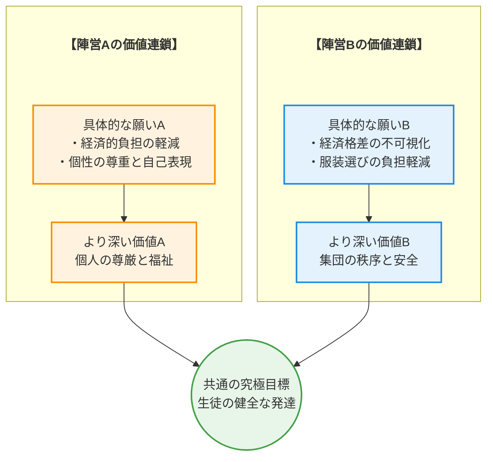
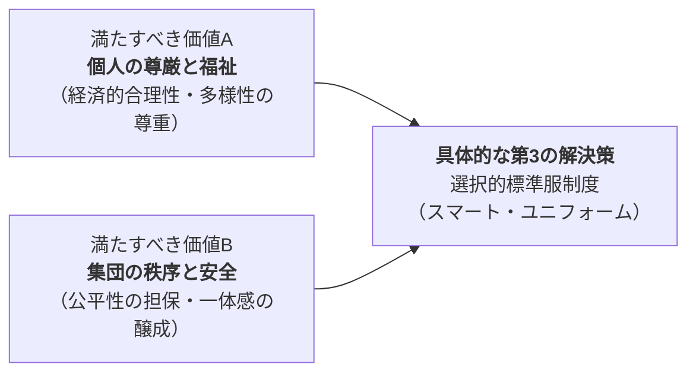

# 💡 価値統合ソリューション提案書：中学校の制服制度のあり方について

## 📋 0. Executive Summary
> **【この章の視点】議論の全体像と本質的な対立構造（Context & Singularity）**

中学校の制服は、長年にわたり生徒の規範意識や所属感を育む教育的ツールとして機能してきました。しかし、社会の価値観が多様化し、経済状況が変化する現代において、その在り方が大きな岐路に立たされています。本件が活発な議論を呼んでいる背景には、単なる「制服か私服か」という二者択一を超えた、根深い価値観の対立が存在します。

一方には、制服費用の高騰が家計を圧迫している現実（事実データ：N_FC_1, N_FC_2）、画一的な服装が生徒の個性を抑圧するという懸念（事実データ：N_35）、そしてジェンダー平等の観点からの要請（事実データ：N_FC_5）など、**個人の尊厳と福祉**を基軸に見直しを求める声があります。これらは、現代社会が重視する多様性、経済的合理性、そして一人ひとりのウェルビーイングを学校教育にも反映させようとする動きです。

他方で、制服が持つ伝統的な役割を再評価し、その維持を訴える声も根強く存在します。私服化によって家庭の経済格差が露呈し、新たな「服装格差」によるいじめを生むリスク（事実データ：N_82, N_FC_6）、毎日の服装選びが生徒や保護者の負担となる現実（事実データ：N_53, N_FC_7）、そして学校という共同体における一体感や規律の維持（事実データ：N_79, N_FC_10）など、**集団の秩序と安全**を確保する機能の重要性を主張します。

この議論の特異点は、両者が共に「**生徒の健全な発達**」という共通の目標を掲げているにもかかわらず、その実現に向けたアプローチが正反対の方向を向いている点にあります。本レポートは、この対立構造を多角的に分析し、表層的な主張の応酬から脱却して、双方の価値を統合する新たな解決策を探ることを目的とします。

## 1. 議論の構造と「価値ネットワーク」
> **【この章の視点】主張（Claim）の根底にある価値観（Value）の連鎖**

この問題における対立は、表面的な主張の違いだけでなく、その背後にある価値観の連鎖、すなわち「価値ネットワーク」の構造的な差異に起因しています。両陣営は異なる価値観を起点としながらも、最終的には共通の目標である「生徒の健全な発達」を目指しています。この構造を理解することが、対話と合意形成の第一歩となります。

**陣営A（見直し・改革派）**は、「経済的負担の軽減」や「個性の尊重」といった具体的な願いから出発します。これは、各家庭の経済状況や生徒一人ひとりの内面的な豊かさを守りたいという思いに根差しており、より深いレベルでは「**個人の尊厳と福祉**」という価値観に繋がっています。

**陣営B（維持・慎重派）**は、「経済格差の不可視化」や「服装選びの負担軽減」といった具体的な願いを重視します。これは、生徒が集団の中で過度なストレスや摩擦なく、安心して学校生活を送れる環境を維持したいという考えに基づき、究極的には「**集団の秩序と安全**」という価値観に支えられています。

以下の図は、この二つの異なる価値連鎖が、最終的に一つの共通目標へと収斂していく様子を示したものです。

## 2. 対称的リスクのワーストシナリオ
> **【この章の視点】事実（Fact）に基づく因果予測**

どちらか一方の主張を十分な配慮なく極端に推し進めた場合、双方の陣営が最も恐れる破滅的な未来、すなわち「ワーストシナリオ」が現実化する可能性があります。これらのリスクは対称的な関係にあり、一方の正義が他方の破綻を招く危険性をはらんでいます。

*   **【A派（見直し・改革派）の主張を強行・放置した場合のリスク】**
    *   **因果チェーン**: (X) **制服を完全に廃止し、服装を完全に自由化する政策をとると** → (Y) **現場では、家庭の経済状況が服装に如実に反映され、高価なブランド品をめぐる羨望、いじめ、仲間外れが多発する。また、毎日の服装選びが新たな精神的負担となり、生徒間の見えない同調圧力が学習環境を悪化させる。さらに、登下校時の生徒の識別が困難となり、不審者対策など安全確保上の脆弱性が増大する** → (Z) **結果として、学校が「ファッション格差」という新たな分断と混乱の舞台となり、教育の機会均等が著しく損なわれる。生徒は学業や自己形成に集中できず、社会全体の不平等感を再生産する装置として機能してしまうという、致命的な社会的損失をもたらす。**

*   **【B派（維持・慎重派）の主張を強行・放置した場合のリスク】**
    *   **因果チェーン**: (X) **高騰する制服費用や機能性への不満、ジェンダー多様性への配慮といった社会の要請を無視し、旧態依然とした制服制度を一切見直さずに固持すると** → (Y) **現場では、制服費用の負担に耐えられない家庭が経済的に追い詰められ、中には就学継続を断念するケースも現れる。窮屈で体温調節もままならない制服は生徒の健康を害し、学習意欲を削ぐ。性的マイノリティの生徒は、自認する性と異なる服装を強いられることで深刻な精神的苦痛を抱え、不登校に至ることもある** → (Z) **結果として、学校が社会の変化から断絶された硬直的な組織と見なされ、公教育への信頼が失墜する。未来を担う子どもたちの学ぶ権利と心身の健康が根本から脅かされ、長期的には社会の活力と創造性の源泉を枯渇させるという、致命的な社会的損失をもたらす。**

## 3. デッドロックの核心（特異点分析）
> **【この章の視点】対立の震源地（Singularity）の特定**

この議論が平行線をたどり、デッドロック（膠着状態）に陥りやすい根本的な原因は、特定の価値観の衝突にあります。ここでは、その対立の震源地を分析し、構造を明らかにします。

| 分析項目 | 評価(高/中/低) | 理由・背景（価値観の対立構造に基づく） |
| :--- | :--- | :--- |
| **価値の衝突度** | 高 | 対立の根源は、Input Dataが示すように「**生命/生存**」という最も根源的な価値観の解釈の相違にあります。陣営Aは、高騰する制服費から家計を守る「**経済的な生存（安全/防衛）**」を最優先します。一方、陣営Bは、服装格差によるいじめや疎外感から生徒を守る「**社会的な生存（連帯/絆）**」を重視します。同じ「生存」という究極目標を掲げながら、一方は「個の経済的防衛」、他方は「集団の社会的防衛」を志向しており、アプローチが真逆であるため、衝突度は極めて高くなります。 |
| **影響の非対称性** | 低 | この問題の影響は、特定の層にのみ偏る非対称なものではありません。制服費用の負担は経済的に困難な家庭に最も重くのしかかりますが、物価高騰が続く中、多くの家庭にとって無視できない問題です。一方で、私服化によって生じうる同調圧力や精神的負担は、家庭の経済状況に関わらず全ての生徒に及ぶ可能性があります。つまり、どちらの陣営が指摘するリスクも、程度の差こそあれ、ほぼ全ての生徒と家庭に関わる「対称的」な性質を持つため、影響の非対称性は低いと評価できます。 |

## 4. 「第3の解決策」と価値統合マップ
> **【この章の視点】対立する価値（Value）を両立させる新たな主張（Claim）の統合**

「個人の尊厳と福祉」と「集団の秩序と安全」という二つの価値は、一見するとトレードオフの関係にあります。しかし、これらは「生徒の健全な発達」という共通目標を達成するための両輪であり、どちらか一方を犠牲にすることは、本質的な問題解決には繋がりません。制服か私服かという二者択一の議論から脱却し、双方の価値を統合する「第3の解決策」が必要です。

ここで提案するのは、**「選択的標準服制度（スマート・ユニフォーム）」**の導入です。これは、従来の画一的な制服制度と完全な私服化の間に位置する、ハイブリッドな仕組みです。

この制度の核となるのは、以下の3つの要素です。
1.  **高品質・低価格な「標準服」の提供**: 学校は、機能性、耐久性、デザイン性に優れたブレザー、スラックス、スカート、ポロシャツ等のアイテムを「標準服」として複数選定し、安価に提供します。リユース・リサイクルシステムを制度的に確立し、さらなる家計負担の軽減を図ります。
2.  **選択の自由の保障**: 生徒は標準服を着用する義務を負いません。標準服のアイテムを自由に組み合わせることも、私服を着用することも認められます。これにより、個人の自己表現の機会と、服装選びの負担から解放されたいというニーズの両方に応えます。
3.  **生徒主体によるガイドライン策定**: 私服着用時の基本的なガイドライン（TPOをわきまえる等）は、教員が一方的に決めるのではなく、生徒会が中心となり、議論を通じて策定します。これにより、生徒の主体性と社会性を育みます。

この「選択的標準服制度」は、A派が重視する**経済的合理性**と**多様性の尊重**を担保しつつ、B派が懸念する**過度な服装格差の顕在化**や**一体感の喪失**を防ぐ緩衝材として機能します。対立する価値を乗り越えるのではなく、双方を同時に満たすことで、議論を新たな次元へと引き上げる解決策です。

## 5. 3つの未来シナリオ
> **【この章の視点】解決策の有無がもたらす未来の事実（Fact）の予測**

本件に関する意思決定は、今後の中学校教育の風景を大きく左右します。ここでは、取りうる選択肢によって分岐する3つの未来を具体的に予測します。

*   **現状維持（ベースライン）シナリオ**: 根本的な改革を怠った場合
    制服制度は存続するものの、価格高騰や多様性への配慮不足といった課題は放置され、小手先の変更に終始します。保護者の不満はインターネットや地域社会でくすぶり続け、一部の自治体では制服業者との不透明な関係が問題視され、公教育への不信感が募ります。生徒たちは、窮屈で時代に合わない制服への反発から、着崩しや校則違反を繰り返し、教員との間に絶え間ない緊張が生まれます。結果として、制服が本来持つべき教育的機能は形骸化し、単なる「管理のためのツール」へと成り下がり、学校は社会の変化から取り残された硬直的な組織と見なされるようになります。

*   **最悪の事態（ワースト）シナリオ**: 対立が激化し極端な政策が強行された場合
    世論の圧力に屈し、十分な議論なく「完全私服化」あるいは「厳格な制服維持」のどちらかが強行されます。
    *   **（A派勝利）完全私服化が強行された未来**: 学校は「ファッション格差」という新たな分断の舞台と化します。高価なブランド品をめぐる羨望や嫉妬が、SNSを通じたいじめや仲間外れを誘発し、不登校生徒が増加します。保護者は、流行を追い続ける子どもの衣料費の増大に苦しみ、家庭内の対立も深刻化します。学校は生徒の服装トラブルの対応に追われ、教育活動に支障をきたします。
    *   **（B派勝利）厳格な制服維持が強行された未来**: 制服費用の負担に耐えられない家庭の子どもは、劣等感を抱えながら学校生活を送ることを強いられます。性的マイノリティの生徒は、自認する性と異なる服装を強制される精神的苦痛から、心を閉ざし、学びの場から姿を消していきます。学校は、生徒一人ひとりの尊厳よりも集団の秩序を優先する冷徹な場所と認識され、公教育への信頼は完全に失墜します。

*   **仮説的成功（ベスト）シナリオ**: 提案した「第3の解決策」が導入された理想の未来
    「選択的標準服制度」が導入され、学校は生徒の主体性を尊重する先進的な教育機関へと変貌します。生徒たちは、その日の気分や活動内容に合わせて、標準服と私服を自由に組み合わせ、自己管理能力とTPOを判断する社会性を実践的に学びます。安価で機能的な標準服は、服装に悩みたくない生徒や経済的な懸念を持つ家庭にとって「安心できる選択肢」となり、過度な服装格差は自然と解消されます。ジェンダーに関わらず誰もが快適な服装を選べる環境が、心理的安全性を高め、生徒は安心して学業や友人関係に集中できます。この取り組みは、対立を乗り越え、多様性の中から新たな価値を創造するモデルケースとして、全国の教育現場に希望を与えることになります。

## 6. 政策の実効性（反論耐性とフェイルセーフ）
> **【この章の視点】現実社会への実装に向けたリスク検証（Warrant）**

いかに優れた理念を持つ解決策であっても、現実社会への実装には様々な抵抗や予期せぬ課題が伴います。ここでは、本提案に対する想定反論への応答と、制度が機能不全に陥った場合の安全網について詳述します。

▼ 想定される反論と、真の論点への昇華

*   **A派（見直し・改革派）からの想定される反論と回答**:
    *   **想定反論**: 「結局、標準服という名の『制服』が残るではないか。私服を選ぶ生徒への無言の同調圧力が生まれ、事実上の強制になる懸念がある。完全な自由こそが個性の尊重だ。」
    *   **回答**: 完全な自由を求めるお気持ちは、個性を最大限に尊重したいという強い願いの表れであり、深く理解いたします。また、標準服が事実上の強制となる同調圧力へのご懸念ももっともです。しかし、本質的な論点は「形式的な自由」の有無ではなく、**「すべての生徒が安心して自己表現できる実質的な環境」をいかに構築するか**です。本制度は、服装選びに悩みたくない生徒や、経済的な懸念がある家庭に「安心できる選択肢」を提供しつつ、私服という選択肢も明確に保障するものです。同調圧力を防ぐため、導入時に「多様な選択が尊重される文化」を醸成する教育プログラムを並行して実施し、定期的なアンケートで生徒の心理的負担をモニタリングする仕組みを設けます。これにより、自由に伴うリスクを社会的に管理し、全ての生徒にとって心理的安全性の高い環境を目指します。

*   **B派（維持・慎重派）からの想定される反論と回答**:
    *   **想定反論**: 「私服を一部でも認めることで、結局は服装格差が生まれる。学校の統一感が失われ、規律が乱れるのではないか。生徒の安全確保も難しくなる。」
    *   **回答**: 学校の一体感や規律を維持し、生徒の安全を守りたいというお考えは、教育現場の根幹を支える重要な視点です。私服の導入が、これまで制服が担ってきた秩序維持機能を損なうのではないかというご懸念は、当然のことと受け止めております。ここで向き合うべき真の論点は、「画一的な服装」そのものではなく、**「生徒が安心して学べる秩序と安全な環境」をいかに持続可能な形で維持するか**です。本制度では、多くの生徒が魅力を感じる高品質・低価格な標準服を提供することで、大半の生徒が自発的にそれを選択し、結果として過度な格差の顕在化を防ぐことを想定しています。私服に関しても「華美でないもの」といったガイドラインを生徒会主体で策定するプロセスを導入し、生徒の主体性と社会性を育む機会とします。登下校時の安全確保については、標準服と合わせて配布する共通デザインのバッグやIDカードの携帯を推奨することで対応可能です。

*   **フェイルセーフ設計**: 制度が想定通り機能しなかった場合の撤退ラインと安全網。
    *   **定点観測**: 制度導入後、毎学期、全生徒・保護者・教員を対象とした匿名アンケートを実施します。経済的負担感、服装に関する心理的負担、いじめ・仲間外れの発生状況、制度満足度などを定量的に把握し、結果を公開します。
    *   **評価と修正のトリガー**: 以下のいずれかの基準に抵触した場合、学校・保護者・生徒・外部有識者から成る第三者委員会を自動的に招集し、制度の抜本的な見直し協議を開始します。
        1.  「服装が原因で、いじめや仲間外れを経験した/見聞きした」と回答した生徒の割合が、全体の**5%**を超えた場合。
        2.  標準服の平均着用率が**30%**を下回り、制度の存在意義が希薄化したと判断される場合。
        3.  保護者アンケートにおける「衣料費全体の負担感」が、制度導入前と比較して統計的に有意な改善が見られない場合。
    *   **是正措置**: 第三者委員会は、ガイドラインの強化、標準服のデザイン刷新や価格見直し、私服選択可能日を週数日に限定するなどの修正案を答申します。状況が改善されない場合は、制度を一旦停止し、より支持の高い別の制度へ移行することも含めて検討します。

## 7. 結語（絶対回避ラインと対話への招待）
> **【この章の視点】絶対に守るべき普遍的価値（UV）の再確認**

中学校の制服をめぐる議論は、単なる服装ルールの問題ではありません。これは、私たちが未来を担う子どもたちに、どのような社会を手渡したいのかという、価値観そのものが問われる課題です。多様性を尊重し個人の尊厳を守る社会か、秩序を重んじ集団の調和を優先する社会か。その両立は不可能なのでしょうか。

私たちは、この対立の先にある統合された未来を描けると信じます。しかし、そのためのいかなる対話や妥協においても、絶対に越えてはならない一線が存在します。

それが、**「経済的な理由や、性自認を含む個人のあり方を理由に、特定の子どもが教育の機会から実質的に排除されたり、その尊厳が著しく傷つけられたりする事態」**です。

この絶対回避ラインは、私たちの社会が守るべき最低限の砦であり、あらゆる政策判断の基盤とならなければなりません。制服制度が、意図せずしてこのラインを脅かす凶器となりうるのであれば、私たちは躊躇なくそのあり方を問い直す責任があります。

本レポートが提示した「選択的標準服制度」は、あくまで現時点での最適解の一つに過ぎません。重要なのは、この提案を叩き台として、保護者、教員、そして何よりも当事者である生徒自身が、対話のテーブルに着くことです。

意思決定者の皆様に求められるのは、目先の対立を収めるための安易な結論ではなく、10年後、20年後の子どもたちが「この学校で学べてよかった」と心から思えるような、長期的視点に立った勇気ある決断です。対立のエネルギーを、より良い未来を創造する力へと転換する対話を、今こそ始めるべき時です。