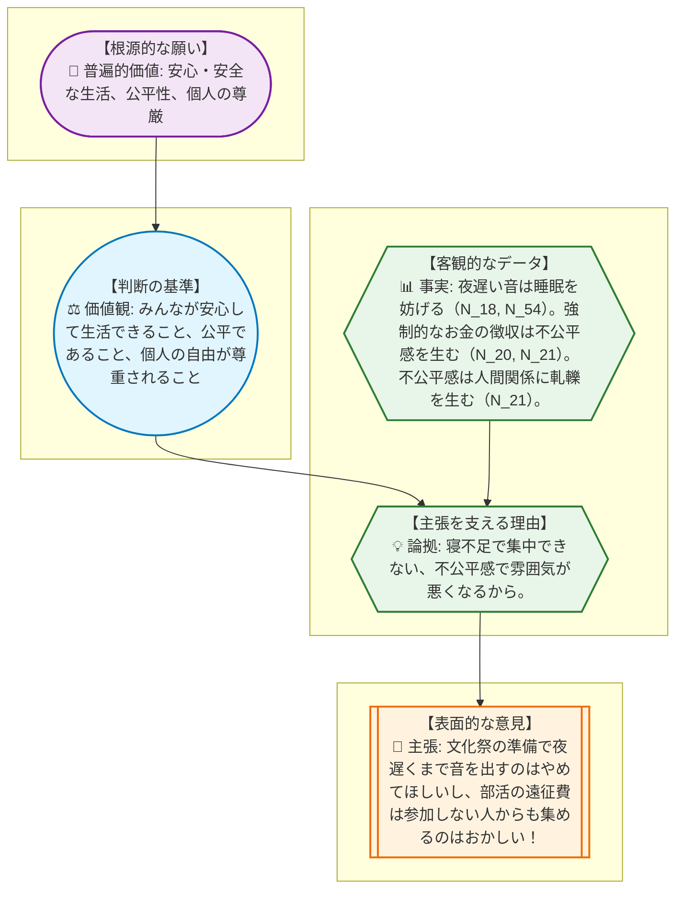
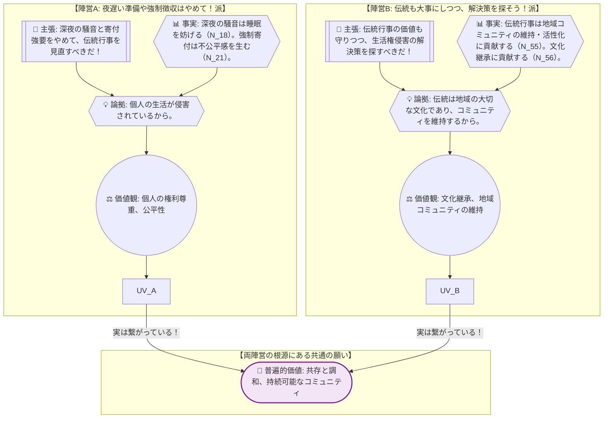
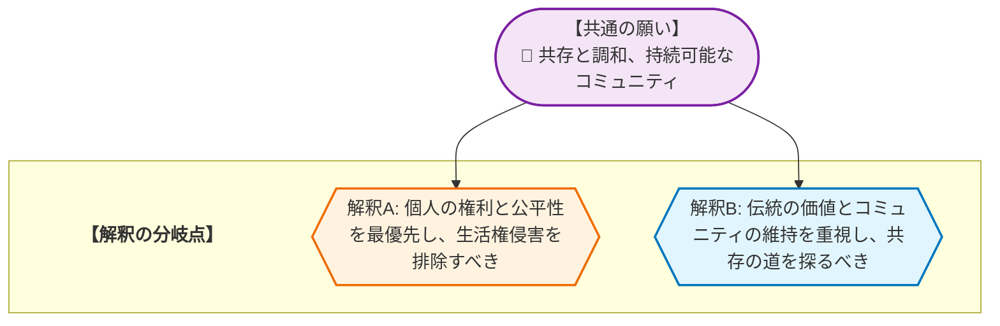

# 🧐 論理構造解析ワークシート：深夜の騒音と寄付強要への抗議 を解き明かす
> **【学習者の皆さんへ】**
> このレポートは、AIが論理の組み立て方を提示した「思考のサンプル」です。AIが示した「事実」や「理由」が本当に正しいか、他に抜けている視点はないか、自分なりに疑い、検証してみてください。このレポートの内容を批判的に検討し、自分の言葉で議論を深めること自体が、最高のリテラシー教育となります。

## 1. AREの「逆推論」を理解する
> **【この章の要約】表面的な意見の奥にある「普遍的な願い」まで遡るプロセスを学びます。**

みんな、元気にしてるか？ 論理的思考のインストラクター、先輩だよ！
今日は、一見するとただの文句や主張に見える意見の、もっと奥深くにある「本当の願い」を見つけるための探偵ゲームをしよう。このテクニックを「逆推論」って呼ぶんだ。

例えば、友達が「もう部活やめたい！」って言ったとするよね。表面的な主張は「部活をやめること」。でも、その奥には「本当はもっと勉強に集中したい」とか「人間関係で悩んでる」とか、いろんな「本当の願い」が隠れてるかもしれない。その「本当の願い」まで遡って考えるのが、この逆推論の面白いところなんだ。

今日のテーマは【深夜の騒音と寄付強要への抗議】。ちょっと難しそうに聞こえるけど、これをみんなの学校生活に置き換えて考えてみよう。

例えば、こんな主張があったとするね。
**📢 主張 (C):** 「現代社会において、深夜の太鼓の打ち鳴らしや寄付金の強要など、住民の生活権を侵害する伝統行事が行われている状況において、行事主催者や自治体は、住民の平穏な生活と権利を守り、地域社会の調和を保つために、時代にそぐわない伝統行事の実施方法を直ちに見直すべきである。」

これを、もし君がクラスの代表として先生に訴えるとしたら、どうなるかな？

---
**【学校生活に置き換えてみよう！】**

*   **📢 主張 (C):** 「先生！文化祭の準備で夜遅くまで音を出すのはやめてほしいし、部活の遠征費を参加しない人からも集めるのはおかしいです！」

この主張の奥には、どんな理由や願いが隠れているんだろう？一緒に探ってみよう！

*   **💡 論拠 (W):** 「だって、夜遅くまで音がするとみんな寝不足で授業に集中できないし、勉強もできない。それに、参加しない部活の遠征費を払うのは、なんだか不公平で、クラスや部活の雰囲気が悪くなっちゃうから。」
    *   この「論拠」を支える「客観的なデータ」や「事実」は何だろう？

*   **📊 事実 (F):**
    *   「夜遅い音は、みんなの睡眠を妨げ、集中力を低下させる。」（深夜の太鼓演奏が睡眠妨害や精神的苦痛を与える事実 N_18, N_54）
    *   「強制的なお金の徴収は、個人の自由な意思に反し、不公平感を生む。」（半ば強要される寄付は自由な意思に反し、不公平感を生む事実 N_20, N_21）
    *   「不公平感や不満は、クラスや部活の人間関係に軋轢を生む。」（地域コミュニティ内に不公平感や軋轢を生む事実 N_21）
    *   これらの事実から、どんな「判断の基準」が生まれるかな？

*   **⚖️ 価値観 (V):** 「みんなが安心して学校生活を送れること」「公平であること」「個人の自由が尊重されること」
    *   じゃあ、これらの価値観の、もっともっと根源にある「普遍的な願い」ってなんだろう？

*   **💎 普遍的価値 (UV):** 「安心・安全な生活」「公平性」「個人の尊厳」
    *   結局、君は「みんなが安心して、公平に、自分らしく学校生活を送れるようにしたい！」って願っているんだね。

どうかな？ 表面的な意見の奥に、こんなに深い願いが隠れているって、面白いだろ？

## 2. 複数の主張から「共通の価値」を見つける
> **【この章の要約】一見違う2つの意見が、実は「同じ願い」を持っていることを解剖します。**

さて、さっきの例では一つの意見を深掘りしたけど、実際の社会ではいろんな意見がぶつかり合うよね。今日のテーマ【深夜の騒音と寄付強要への抗議】でも、大きく分けて2つの陣営があるんだ。

1.  **陣営A:** 「深夜の騒音や寄付強要は、個人の生活を侵害している！伝統行事のやり方を見直すべきだ！」（N_6）
2.  **陣営B:** 「伝統行事には大切な価値がある。生活権侵害は解決しつつ、伝統も守る方法を探すべきだ！」（N_40）

まるで「文化祭の準備は夜9時まで！静かに勉強したい派」と、「文化祭は学校の伝統だし、みんなで盛り上げたい！でも準備のやり方は見直そうよ派」みたいに、水と油のように見えるかもしれない。でもね、実はこの2つの陣営は、同じ山の頂上を目指す別々の登山隊なんだ。目指す頂上、つまり「根源的な願い」は同じだったりするんだよ。

彼らが共通して願っている「普遍的価値」は何だろう？

それはズバリ、**「共存と調和」**、そして**「持続可能なコミュニティ」**だ！

どういうことかっていうとね。

*   **陣営A（夜遅い準備や強制徴収はやめて！派）**は、個人の権利や公平性を強く主張することで、結果的に「みんなが気持ちよく、トラブルなく学校生活を送れる状態」、つまり「調和の取れた学校」を目指しているんだ。一部の人が我慢するのではなく、みんなが納得できる形で共存したいという願いがある。

*   **陣営B（伝統も大事にしつつ、解決策を探そう！派）**は、文化祭のような伝統行事を守ることで、「学校の歴史や文化を次の世代に繋ぎ、みんなで協力し合える強い絆のある学校」を維持したいと考えている。これも、結局は「みんなが長く、楽しく、一緒にいられる学校」、つまり「持続可能なコミュニティ」を願っているんだ。

どちらの陣営も、形は違えど「この学校が、みんなにとって良い場所であってほしい」「みんながここで気持ちよく過ごしてほしい」という、根本的な願いは同じなんだ。対立しているように見えても、その奥には「共存と調和」「持続可能なコミュニティ」という共通の「普遍的価値」が隠れているんだね。

## 3. 議論が噛み合わない「隠れた論拠(Warrant)」を発見する
> **【この章の要約】事実を「問題だ」と判断する背景にある、隠れた前提を探ります。**

さあ、みんな、ここからは名探偵の出番だ！
探偵が事件現場で「事実(F)」を見つけ、そこから「犯人はこう考えたに違いない」と推理する、その「考え」が、まさに「隠れた論拠(Warrant)」なんだ。

今日のテーマ「深夜の騒音と寄付強要への抗議」でも、表面的な「事実(F)」と「主張(C)」の間には、私たち自身も気づかないような「隠れた論拠」が潜んでいることが多いんだ。これが、議論が平行線になったり、「なんでそんなこと言うの？」と相手の意見が理解できなかったりする原因になるんだよ。

例えば、
*   **📊 事実 (F):** 「深夜の太鼓演奏が睡眠妨害や精神的苦痛を与えている。」
*   **📢 主張 (C):** 「伝統行事の実施方法を直ちに見直すべきである。」

この二つの間には、どんな「隠れた論拠」があると思う？
探偵の目を凝らして推理してみよう。

それは、「**住民の平穏な生活や個人の自由・公平性は、伝統行事の継続よりも優先されるべき価値である。伝統行事であっても、住民の生活権を侵害するようなやり方は許されない**」という、無意識の前提なんだ。

もし、この「隠れた論拠」が相手と違っていたらどうなるだろう？
例えば、相手が「伝統行事の継続は、多少の住民の不便よりも優先されるべきだ」と考えていたら、いくら「騒音がひどい」という事実を訴えても、「だから何？」となってしまい、議論は永遠に噛み合わないよね。

この「隠れた論拠」を見つけることが、対立の根源を理解し、解決策を探るための第一歩なんだ。

---

**【ワーク】君も探偵になって「隠れた論拠」を探してみよう！**

もし君がクラスの代表として、先生にこんな主張をしたとするね。

*   **📊 事実 (F):** 「クラスの何人かの生徒が、いつも授業中にスマホをいじっています。」
*   **📢 主張 (C):** 「先生はもっと厳しくスマホの使用を禁止すべきです！」

この「事実」から「主張」へと飛躍する間に、どんな「隠れた論拠」があると思う？

▼ 考え方のヒントと解答例

**【ヒント】**
*   「スマホをいじる」という事実が、なぜ「厳しく禁止すべき」という主張につながるのか、その間にどんな「良くないこと」が起きていると、あなたは考えている？
*   「授業」や「学校生活」において、何が最も大切だと考えている？
*   「禁止すべき」という強い言葉の裏には、どんな「こうあるべきだ」という信念が隠れているだろう？

**【解答例】**
*   **隠れた論拠**: 「授業中にスマホをいじることは、生徒自身の学習の妨げになるだけでなく、クラス全体の集中力を低下させ、学習環境を損なう。学校は生徒の学習権と良好な学習環境を最優先で守るべきである。」

## 4. データが示す「対立の震源地」を特定する
> **【この章の要約】議論が平行線になる本当の理由（価値観の衝突）を特定します。**

さあ、探偵の次は、まるで地震学者のように「対立の震源地」を探ってみよう。
セクション2で、私たちは「深夜の騒音と寄付強要への抗議」というテーマにおいて、一見対立する2つの陣営が、実は「共存と調和」「持続可能なコミュニティ」という共通の「普遍的価値(UV)」を願っていることを見つけたよね。

でも、同じ「頂上」を目指しているはずなのに、なぜこんなにも意見がぶつかり合ってしまうんだろう？
それは、共通の願い（UV）から、それぞれの陣営が異なる「解釈の分岐点」を通って、異なるルートを選んでしまうからなんだ。

例えるなら、みんなで「最高の文化祭にしよう！」という共通の願い（UV）を持っているのに、
*   ある人は「最高の文化祭とは、みんなが勉強に集中できる環境を確保しつつ、準備を進めることだ！」と解釈し（陣営Aの解釈）、
*   別の人は「最高の文化祭とは、伝統を守り、みんなで協力して盛り上げることだ！」と解釈する（陣営Bの解釈）。

どちらも「最高の文化祭」を願っているのに、その「最高」の定義や、そこに至るまでの優先順位が違うから、意見が食い違ってしまうんだ。

今回のテーマでは、
*   **陣営A**は、「共存と調和、持続可能なコミュニティ」を実現するために、「個人の権利と公平性を最優先し、生活権侵害を排除すべき」だと解釈する。
*   **陣営B**は、「共存と調和、持続可能なコミュニティ」を実現するために、「伝統の価値とコミュニティの維持を重視し、共存の道を探るべき」だと解釈する。

このように、同じ「普遍的価値」を共有しながらも、その価値をどう実現するか、何に重きを置くかという「解釈の分岐点」で、対立が生まれてしまうんだね。

## 5. 価値を統合して「第三の解決策」をデザインする
> **【この章の要約】AかBかの妥協ではなく、両方の価値を満たす新しい仕組みを考えます。**

対立の震源地がわかったら、次は「第三の解決策」をデザインする番だ！
これは、陣営Aと陣営Bのどちらかを選ぶ「妥協」ではなく、両方の価値観をどちらも犠牲にしない、もっと良い「新しい仕組み」を考えることなんだ。哲学でいう「アウフヘーベン（止揚）」だね。

テーマ「深夜の騒音と寄付強要への抗議」において、
*   陣営Aは「個人の権利尊重、公平性、安心・安全な生活」を重視し、
*   陣営Bは「文化継承、地域コミュニティの維持、共存と調和」を重視している。

この両方の価値を満たす「第三の解決策」の一例として、こんなアイデアはどうだろう？

**【第三の解決策の一例：地域共創型伝統行事モデル】**

1.  **「行事共創委員会」の設立**: 伝統行事の主催者だけでなく、地域住民の代表（特に騒音や寄付に懸念を持つ人々）、自治体の担当者、そして第三者機関（地域のNPOなど）が参加する「行事共創委員会」を定期的に開催する。ここで、行事の企画段階から、住民の意見を吸い上げ、具体的な実施方法を共に検討する。
2.  **騒音対策の徹底と時間制限の厳格化**:
    *   深夜の太鼓演奏など、住民の睡眠を妨げる可能性のある活動は、防音設備が整った公共施設を利用するか、日中の時間帯に限定する。
    *   屋外での活動は、騒音レベルを測定し、地域住民と合意した基準値を超えないように調整する。
    *   行事の実施日時や騒音発生の可能性について、事前に詳細な情報を地域住民に周知し、苦情受付窓口を明確にする。
3.  **寄付の完全な任意化と多様な地域貢献の選択肢**:
    *   寄付は完全に任意とし、強制的な徴収は一切行わない。寄付の使途を明確にし、会計報告を透明化する。
    *   寄付以外の形で伝統行事や地域コミュニティに貢献できる選択肢を設ける。例えば、行事の準備や運営ボランティア、地域の清掃活動、伝統文化を学ぶワークショップへの参加など、時間や労力での貢献を可能にする。
    *   クラウドファンディングなどを活用し、広く共感を呼ぶ形で資金を募る。
4.  **伝統行事の「現代的意義」の再定義と共有**:
    *   伝統行事が持つ歴史的・文化的価値を、地域住民（特に若い世代）が理解し、共感できるような情報発信や体験プログラムを企画する。
    *   例えば、行事のルーツを学ぶ歴史講座や、伝統芸能を体験できるワークショップなどを開催し、単なる「騒音」や「負担」ではなく、「地域の誇り」として共有できる機会を増やす。

このモデルは、住民の生活権と公平性を守りつつ（陣営Aの価値）、伝統行事の継承と地域コミュニティの活性化も図る（陣営Bの価値）ことを目指しているんだ。

---

**【アクション：自己開示としての検証課題】**

この「地域共創型伝統行事モデル」が本当にうまくいくか、中学3年生の君ならどうやって確かめるかな？
例えば、どんな人に話を聞いてみたり、どんなデータを集めてみたりするといいと思う？
もし君がこのモデルを提案するなら、どんな準備をして、誰に、どうやって説明する？
具体的なアクションプランを考えてみよう！

## 🎓 学習リフレクション

今日の「思考の冒険」、どうだったかな？
一見すると複雑で、感情的にぶつかり合っているように見える問題も、AREのレンズを通して「事実」「理由」「主張」を分解し、その奥にある「隠れた論拠」や「普遍的な願い」、そして「解釈の分岐点」を探っていくと、その構造がクリアに見えてくるんだ。

対立の根源がわかれば、どちらかの意見を押し付けるのではなく、両方の価値を尊重し、新しい未来を創り出す「第三の解決策」をデザインする道が開ける。これは、まさに「思考の力」が世界を変える瞬間だね。

このAREの思考法、君の日常のどんな場面で役立ちそうかな？
友達との意見の食い違い、家族との話し合い、学校でのプロジェクト、ニュースで見る社会問題…どんな時にこの「思考の探偵」になって、問題の奥深くを探ってみたい？

---
**【本レポートの生成について（Disclaimer）】**
本レポートは、提供されたデータを基に、AREが新しい視点と学びを提供するために自動生成したものです。