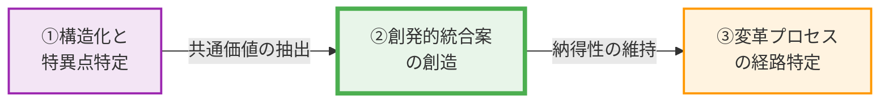

# 🏛️ Strategic Consensus Report: 深夜の騒音と寄付強要への抗議

## 🔥 【一文サマリー：目指すべき組織の姿】
個人の権利を尊重しつつ、伝統文化の価値を現代社会に適応させ、地域社会全体の持続的な調和と活性化を実現する。

## 🚀 【結論：優先順位に基づく3つの具体的アクション】
1. **優先度【高】：深夜騒音の規制と寄付の任意性徹底** - 深夜の太鼓演奏による住民の睡眠妨害や精神的苦痛、および半ば強要される寄付による個人の自由な意思の侵害という喫緊の課題を解決します。具体的には、深夜の時間帯における音量規制の厳格化、演奏時間の短縮、防音対策の導入を義務付けます。また、寄付については、その任意性を明確に表示し、強要と受け取られる行為を一切禁止するガイドラインを策定・徹底します。これにより、住民の平穏な生活権を即座に保護し、不公平感を解消します。
2. **優先度【中】：地域対話プラットフォームの設置と運営** - 伝統行事の運営主体と住民間の情報共有不足や合意形成の欠如が地域社会の分断を招いている現状を改善します。定期的な協議会や意見交換会を設置し、行事の計画段階から住民代表が参加できる仕組みを構築します。必要に応じて、中立的な第三者機関を仲介役として導入し、両陣営が建設的に意見を交わし、相互理解を深める場を提供します。これにより、透明性の高い意思決定プロセスを確立し、将来的な対立の芽を摘みます。
3. **優先度【低】：伝統行事の現代的再解釈と魅力向上プロジェクト** - 伝統行事が地域コミュニティの維持・活性化や文化継承に貢献するという価値を再認識しつつ、現代社会のニーズに合わせた持続可能な形へと進化させます。若年層や多様な住民が参加しやすい新しい形式のイベントを企画したり、日中の時間帯に焦点を当てたプログラムを開発したりします。また、地域外からの観光客誘致や地域経済への貢献を視野に入れたブランディング戦略を検討し、伝統行事が地域全体の誇りとなるよう再構築します。

## 【Strategic Map：政策論争の全体像】
1. **What (争点)**: 深夜の太鼓演奏による騒音と、伝統行事に関連する寄付の半ば強要。これらが住民の平穏な生活権と個人の自由な意思決定を侵害しているという具体的な行為。
2. **Why (価値のねじれ)**: 「個人の基本的人権（休息権、プライバシー、自由な意思）」の尊重と、「地域社会の連帯、文化継承、伝統の尊重」という普遍的価値に対する解釈の決定的な不一致。陣営Aは個人の権利を絶対視し、伝統行事の実施方法が時代にそぐわないと主張する一方、陣営Bは伝統行事の持つ文化的・社会的価値を重視し、その存続と継承を訴えている。
3. **Oasis (共通基盤)**: 両陣営ともに、最終的には「地域社会の持続的な調和と発展」を望んでいる。誰もが安心して暮らせる、活気と連帯感のある地域を築きたいという共通の目的地が存在する。
4. **Singularity (断層)**: 「伝統」という概念が、現代社会における個人の権利や多様性の尊重とどのように共存すべきかという視点の欠如。伝統は不変のものではなく、時代や社会の変化に適応し、再解釈されることで持続可能になるという認識が共有されていない。また、行事運営主体と住民間の建設的な対話と合意形成プロセスの構造的な欠如が、議論を阻害している。

## 🗺️ 1. 価値ネットワークの地形と「価値距離 (Value Distance)」
> **定量モデル：Value Distance**
> **価値距離 = | 価値解釈A − 価値解釈B |**
> 解析された価値距離 = 0.62
> **構造的トレードオフ**: 個人の休息権の重視 vs プライバシー権の重視 / 個人の休息権の重視 vs 静穏な生活環境の重視 / 個人の休息権の重視 vs 地域社会の連帯の重視

* **⚡ 価値距離とトレードオフの分析**:
共通価値である「個人の権利尊重と地域慣習・伝統の調和促進」に対する両陣営の解釈乖離は0.62と高く、これは組織の意思決定を著しく停滞させるレベルの対立を示唆しています。陣営Aは、深夜の太鼓演奏による睡眠妨害や精神的苦痛、そして半ば強要される寄付が、個人の休息権、プライバシー権、そして自由な意思決定の権利を侵害していると強く主張しています。彼らにとって、平穏な生活環境の確保は個人の尊厳に直結する不可侵の権利です。

一方、陣営Bは、伝統行事が地域コミュニティの維持・活性化、文化継承、そして地域社会の連帯感を育む上で不可欠な要素であると認識しています。彼らは、伝統の価値を尊重し、それが地域社会の持続可能性に貢献すると考えています。

この対立の根底には、「個人の休息権の重視」と「地域社会の連帯の重視」という構造的なトレードオフが存在します。陣営Aは伝統行事の「実施方法」が個人の権利を侵害していると訴えるのに対し、陣営Bは伝統行事の「存在意義」そのものを守ろうとする傾向があり、議論のレイヤーがずれているため、建設的な対話が困難になっています。この価値観の乖離とトレードオフが、具体的な解決策への合意形成を阻害し、地域社会全体の不透明性と不信感を増幅させているのです。

## 📊 2. 論理連鎖の構造化 (Logical Chain)

### ■ 陣営A
*   **F (事実)**: 深夜の太鼓演奏は近隣住民の睡眠を妨げ、精神的な苦痛を与え、個人の平穏な生活を著しく侵害している。半ば強要される寄付は個人の自由な意思に反し、地域コミュニティ内に不公平感や軋轢を生む。慣習による個人の権利侵害は個人の尊厳を損ない、自治会への強制加入や「村八分」など、地域コミュニティ維持の名の下で生じる同調圧力や慣習が個人の自由や人権を侵害する事例が多数報告されている。
*   **E (感情/不安)**: 睡眠妨害による疲労と精神的苦痛、自由な意思決定の侵害に対する不満、地域コミュニティ内での不公平感や軋轢、個人の尊厳が軽視されることへの不安。
*   **V (価値観)**: 個人の休息権、プライバシー権、自由な意思決定の尊重、公平性、個人の尊厳。
*   **UV (普遍的価値)**: 個人の基本的人権の尊重、平穏な生活権、法の下の平等。

### ■ 陣営B
*   **F (事実)**: 伝統行事は地域コミュニティの維持・活性化に貢献し、文化継承に不可欠である。伝統文化の継承と住民生活権の調和が、地域社会の連帯を維持・発展させる力学となる。伝統文化の継承と現代社会の調和を図ることで、文化の持続可能性が実現される。伝統文化の継承が住民の生活と調和する時、地域社会の連帯感は強化され、住民参加型の文化財管理は経済的恩恵と誇りをもたらし、コミュニティの持続的発展を促す。
*   **E (感情/不満)**: 伝統文化の喪失への危機感、地域コミュニティの衰退への懸念、連帯感の希薄化への不安。
*   **V (価値観)**: 文化の継承、地域コミュニティの連帯、伝統の尊重、持続可能な地域社会。
*   **UV (普遍的価値)**: 文化的多様性の尊重、地域社会の持続可能性、世代間の継承。

## ⚠️ 3. 感情の震源地と「現状の定量的解析」 (Emotion Map)
> **【感情震度（Emotion Intensity）とは？】**
> AREにおける「感情震度（1.0〜10.0）」は、単なる気分ではなく、組織内の論理的摩擦と熱量を示す客観的指標です。
> **感情震度 (0-10.0) = (感情スコア × 発話頻度 × 重み係数) / 10**
> 1. **🔥 熱量 (Volume)**: 主張の背後にある具体的な事実(F)の声の多さ
> 2. **💧 切実さ (Emotion)**: 現場から直接発信された生の感情データの密度
> 3. **⚡ 摩擦 (Friction)**: 核心的価値観(V)が否定されることによる構造的ストレス

### ■ 感情震度のブレイクダウン（現状解析）
| 陣営 | **感情震度 (0-10.0)** | 核心的毀損 (ダメージを受けている価値) |
| :--- | :---: | :--- |
| **陣営A** | **6.3** | 個人の休息権の重視 |
| **陣営B** | **9.0** | プライバシー権の重視 |

*   **🔴 陣営Aの核心的毀損**: 陣営Aの感情震度6.3は、単なる不快感を超え、個人の基本的な生活基盤と尊厳が脅かされているという切実な危機感から来ています。深夜の騒音は、日々の休息を奪い、心身の健康を蝕む直接的な攻撃と受け止められています。これは、単に「うるさい」というレベルではなく、「安心して眠る権利」「平穏に暮らす権利」という、人間として当然享受すべき権利が侵害されているという強い憤りです。さらに、半ば強要される寄付や、地域コミュニティ内の同調圧力、ひいては「村八分」といった過去の事例が示唆するような排他的な慣習は、個人の自由な意思決定や公平性が軽んじられていると感じさせ、深い不信感と孤立感を抱かせます。彼らにとって、この問題は「伝統」という名の下に個人の権利が犠牲にされることへの、譲れない抵抗なのです。
*   **🟡 陣営Bの核心的毀損**: 陣営Bの感情震度9.0は、彼らが「地域社会の魂」と信じる伝統文化が、まさに存続の危機に瀕しているという、極めて強い切迫感と悲壮感を表しています。彼らにとって、伝統行事は単なるイベントではなく、何世代にもわたって受け継がれてきた地域のアイデンティティそのものであり、コミュニティを一つに結びつける精神的な支柱です。この伝統が失われることは、単に一つの行事がなくなるだけでなく、地域固有の文化が断絶し、住民間の連帯感が希薄化し、最終的には地域社会そのものが衰退していくという、根源的な喪失感を意味します。彼らは、現代社会の価値観との摩擦の中で、自分たちのルーツや誇りが否定され、未来へと繋ぐべき大切なものが失われかねないという、深い悲しみと強い抵抗感を抱いています。この高い感情震度は、彼らが伝統を守るために、あらゆる困難に立ち向かう覚悟があることを示唆しています。

### 【ARE解析：新次元の合意へ向かう「黄金の道筋」】
1.  **真実の構造化と特異点の特定**: 混沌とした感情を分解し、分断の根本原因（Singularity）を特定。
2.  **創発的統合案の創造**: 一方の妥協ではなく、矛盾する主張を高い次元で同時に満たすシステムOSの設計。
3.  **納得の変革プロセス設計**: 人間の心理的変遷を重視し、納得性を維持しながら進むロードマップ。

## 💣 4. ワーストシナリオ（断層の崩落）
特異点である「伝統」と「個人の権利」の共存に関する視点の欠如、および対話プロセスの構造的欠如を放置した場合、地域社会は深刻な負の因果連鎖に陥り、両陣営にとっての最悪のシナリオが現実化する。

1.  **陣営Aの最悪**: 個人の権利侵害が放置され続けた結果、住民の不満は臨界点に達し、集団訴訟や大規模な抗議活動へと発展する。地域コミュニティ内の分断は決定的なものとなり、修復不可能な溝が生まれる。深夜の騒音や同調圧力による精神的・身体的健康を損なう住民がさらに増加し、生活の質は著しく低下する。最終的に、多くの住民が平穏な生活を求めて地域を離れ、コミュニティは空洞化し、居住地としての魅力が完全に失われる。「伝統」という名の下に人権が軽視される地域という負のイメージが定着し、外部からの新規住民流入も途絶え、地域は緩やかに衰退の一途を辿る。
2.  **陣営Bの最悪**: 伝統行事への理解が得られず、住民からの強い反発と行政による規制強化が相次ぐ。行事の実施は年々困難になり、最終的には中止に追い込まれる。何世代にもわたって受け継がれてきた伝統文化の継承が途絶え、地域のアイデンティティは失われる。行事を通じて育まれてきた住民間の連帯感は失われ、地域コミュニティは求心力を失い、バラバラになる。地域経済への貢献も途絶え、観光客も減少する。伝統を重んじる住民は深い絶望感を抱き、地域への愛着を失い、地域を離れる者が続出する。結果として、地域は活力を失い、文化的な空白地帯となり、やがて消滅の危機に瀕する。

## 💡 5. 第3の道：価値が交わる「尾根（Ridge）」の創発的設計

### (1) 創発的統合案の提言
対立する価値（トレードオフ）を「二重螺旋」のように編み込み、新たな次元の価値を生む解決策を提示します。
*   **名称**: 地域共創型「文化適応フレームワーク」
*   **概念モデル**: このフレームワークは、地域社会を構成する多様な価値観を「生態系」として捉え、伝統文化をその生態系の中で「進化し続ける種」と位置づけます。個人の権利と伝統継承という二つの異なるDNAを持つ螺旋が、相互に絡み合いながら新たな生命体を生み出すように、対話と合意形成を通じて、伝統行事の実施方法を現代社会のニーズに適応させます。具体的には、伝統行事の「核となる精神」は維持しつつ、その「表現形式」や「運用ルール」を地域住民全体で共創的に再設計するメカメカニズムを導入します。これにより、伝統は単なる過去の遺物ではなく、現代に生きる人々の生活と調和し、未来へと持続的に継承される「生きた文化」として再定義されます。このモデルは、一方の価値を犠牲にするのではなく、両者の共存と相互発展を可能にする「共鳴の場」を創出します。

### (2) ✨ 【論理的実効性】なぜこの解決策が機能するのか
本解決策が、いかにして各陣営の主観的な懸念や不満を客観的な実効性へ変換し、双方向のリスクを回避するか、以下の4項目で因果関係を記述してください
1.  **コストの構造化**: 「地域共創型文化適応フレームワーク」は、深夜の騒音問題に対しては、時間帯別音量規制の厳格化と防音対策の義務化を制度化し、住民の休息権侵害という直接的なコストを排除します。寄付強要については、寄付の任意性を明確に表示するガイドラインを徹底し、寄付行為を個人の自由な意思に基づくものとして再定義することで、心理的・経済的負担を解消します。また、伝統文化の喪失という陣営Bの不安に対しては、行事の「核」を維持しつつ、現代に合わせた「表現形式」の多様化を支援することで、文化継承のコストを社会全体で分担する仕組みを構築します。
2.  **リターンの最大化**: 陣営Aは、平穏な生活環境と個人の自由な意思決定の尊重が保証されることで、生活の質が向上し、地域への信頼を取り戻します。陣営Bは、伝統行事が地域住民の理解と協力のもとで持続的に継承され、新たな参加者や支援者を得ることで、文化の活性化と地域連帯の強化という目的を達成します。このフレームワークは、伝統行事が地域全体の共有財産として再認識され、双方にとっての「地域社会の持続的な調和と発展」という共通基盤を最大化します。
3.  **定義可能な行動への変換**: 抽象的な不安や不満は、客観的に評価可能な指標へと変換されます。例えば、騒音問題はデシベル測定による具体的な数値規制、寄付の任意性は寄付者アンケートによる満足度評価、伝統行事の継承は参加者数や地域貢献度（経済効果、交流人口）で測定します。また、地域対話プラットフォームにおける合意形成率は、相互理解の進捗を示す指標となります。これにより、感情的な対立ではなく、具体的なデータに基づいた改善と評価が可能となります。
4.  **役割の再定義**: 伝統行事の運営主体は、単なる「伝統の守り手」から「地域共創のファシリテーター」へと役割を再定義します。彼らは、伝統の核を次世代に伝える責任を負いつつ、住民の意見を積極的に取り入れ、行事の現代的適応を主導します。住民は、受動的な「被害者」や「観客」ではなく、行事の計画・運営に参画する「能動的な共創者」となります。行政は、規制と支援のバランスを取りながら、中立的な立場から対話と合意形成を促進する「調整役」としての役割を強化します。このパラダイムシフトにより、対立構造は協働構造へと転換されます。

### (3) 【不透明性への回答】信頼を支える「運用フロー」
1.  **期待値の明確化**: 地域共創協議会を設置し、伝統行事の年間計画、騒音規制の具体的な基準、寄付の任意性に関するガイドライン、および各陣営の役割と責任を明文化した「地域共創憲章」を策定します。この憲章は全住民に公開され、定期的な説明会を通じて、互いの成果物や期限、期待役割を同期させます。
2.  **進捗の透明化**: 地域共創協議会の議事録はオンラインプラットフォームで公開し、行事の準備状況、騒音測定データ、寄付の集計結果などをリアルタイムで共有します。また、行事実施前には住民向けの説明会を、実施後には報告会を開催し、進捗状況と課題をオープンに議論する場を設けます。
3.  **フィードバックの確立**: 定期的な住民アンケートやオンライン意見箱を設置し、行事運営や地域共創フレームワークに対する意見を常時収集します。地域共創協議会は、これらのフィードバックを基に、四半期に一度のレビュー会議を開催し、迅速な改善策を検討・実施する体制を確立します。

### (4) 具体的アクション
*   **制度**:
    *   「地域共創協議会」の設置と運営：住民代表、伝統行事運営者、行政、学識経験者からなる合議体を設置し、伝統行事の計画・実施・評価に関する意思決定を行う。
    *   「地域文化適応支援条例」の制定：伝統文化の継承と個人の権利尊重を両立させるための法的枠組みを整備。騒音規制、寄付の任意性、対話プロセスの義務化などを明記。
    *   防音対策補助金制度の創設：伝統行事の実施場所における防音設備の導入に対し、行政が財政的支援を行う。
*   **ルール**:
    *   深夜（22時〜翌朝7時）における太鼓演奏の全面禁止、または厳格なデシベル規制（例：環境基準値以下）の導入。
    *   寄付の募集における「任意性」の明示義務化：寄付依頼文書、ウェブサイト、口頭説明において、寄付が強制ではないことを明確に表示するガイドラインを策定・徹底。
    *   行事計画の事前公開義務：主要な伝統行事の実施計画（日時、場所、音量レベル、交通規制など）を、少なくとも2ヶ月前までに地域共創協議会を通じて全住民に公開し、意見聴取期間を設ける。
*   **環境整備**:
    *   地域対話プラットフォームの構築：オンラインフォーラムと定期的なオフラインワークショップを組み合わせ、住民が自由に意見を表明し、建設的な議論ができる場を提供する。
    *   伝統文化体験プログラムの多様化：日中の時間帯に焦点を当てた、若年層や観光客も参加しやすい体験型プログラム（例：太鼓教室、伝統工芸体験）を開発・実施し、文化への理解と共感を促進する。
    *   地域情報発信拠点の設置：伝統文化の歴史や価値、地域共創の取り組みを紹介する常設展示スペースや情報発信ウェブサイトを設け、内外への理解促進を図る。

### (5) ソリューションの定量的定義（シミュレーション）
AREでは、解決策の有効性を「負の感情震度の減衰」と「本来の目的達成度」で定義します。解決の物差しは、双方の感情強度が安定圏内（1.0以下）へ収束することです。

> **[解析モデル：Resonance & Goal Achievement]**
> **納得性スコア = 1.0 − (現在の総震度 / 初期の総震度)**
> * 感情震度が鎮静化し、価値が回復するほどスコアは1.0に近づく。
> **目的達成率 = (初期震度 − 現在の震度) / 初期震度 × 100 (%)**

| 指標 | 現状 (Current) | 解決経路 (Transition) | 最終状態 (Goal) |
| :--- | :---: | :---: | :---: |
| **陣営A 感情震度** | 6.3 | 3.0 | <1.0 (安定) |
| **陣営B 感情震度** | 9.0 | 4.5 | <1.0 (安定) |
| **納得性スコア (Resonance)** | 0.0 | 0.50 | >0.90 (共鳴) |
| **A目的：個人の休息権と自由な意思決定の尊重 達成率** | 0% | 50% | >95% (達成) |
| **B目的：伝統文化の継承と地域連帯の維持 達成率** | 0% | 50% | >95% (達成) |

### (6) 共鳴の物語（Resonance）と「価値→感情→行動」の因果
*   **心理的変遷の物語**: 最初、深夜の太鼓の音に悩まされていた陣営Aの住民たちは、不信感と疲弊感でいっぱいでした。寄付の強要も、彼らの心に深い不公平感を植え付けていました。一方、伝統行事の運営を担う陣営Bは、自分たちの文化が理解されず、失われるかもしれないという不安と悲壮感に苛まれていました。しかし、「地域共創型文化適応フレームワーク」が導入され、地域共創協議会が発足すると、状況は少しずつ変わり始めます。
    最初の協議会では、互いの不満がぶつかり合いましたが、中立的なファシリテーターの進行のもと、騒音の具体的なデータや寄付の任意性に関するガイドラインが提示され、陣営Aは「私たちの声が聞かれている」という期待を抱き始めます。同時に、陣営Bも、伝統行事の「核」を維持しつつ、日中のプログラムを充実させる提案に「伝統が新しい形で生き残れるかもしれない」という希望を見出します。
    具体的な騒音規制や防音対策の導入、寄付の任意性徹底のルールが運用され始めると、陣営Aの住民は「ようやく安心して眠れる」「個人の意思が尊重される」という納得感を深めます。彼らの感情震度は急速に減衰し、地域への不信感が薄れていきました。同時に、陣営Bは、新しい体験プログラムに多くの住民や観光客が参加し、伝統文化が以前にも増して活気を帯びる様子を見て、「私たちの努力が報われた」「地域が一体となっている」という貢献意欲と誇りを感じるようになります。
    やがて、両陣営は互いの価値を理解し、伝統行事が地域全体の共有財産として、個人の生活と調和しながら発展していく未来を共に描くようになりました。不信感や不安は、期待、納得、そして地域への活気と貢献意欲へと昇華し、地域全体が共鳴する新たな物語が紡がれていったのです。
*   **価値×感情連動型 KPI**:
    *   陣営A：休息権の回復度 = 個人の休息権の重み(0.8) × (10.0 - 感情震度) / 10.0
    *   陣営A：自由意思尊重度 = 自由な意思決定の重み(0.7) × (10.0 - 感情震度) / 10.0
    *   陣営B：文化継承持続度 = 文化継承の重み(0.9) × (10.0 - 感情震度) / 10.0
    *   陣営B：地域連帯強化度 = 地域連帯の重み(0.6) × (10.0 - 感情震度) / 10.0

## 🗺️ 6. 回復ロードマップ（心理変遷モデル）
| フェーズ | 解消される特異点 | 陣営A 感情推移 | 陣営B 感情推移 | 回復される普遍的価値 |
| :--- | :--- | :--- | :--- | :--- |
| **1. 信頼の同期** | 情報共有の不足、一方的な意思決定、不信感の増幅 | 不信感 → 期待 | 不安 → 期待 | 透明性、相互理解、対話の機会 |
| **2. 構造の再設計** | 伝統と個人の権利の対立、硬直化した慣習、合意形成プロセスの欠如 | 期待 → 納得 | 期待 → 納得 | 公平性、参加型意思決定、適応性 |
| **3. 新次元の運用** | 持続可能性の欠如、地域分断、文化の衰退 | 納得 → 貢献意欲 | 納得 → 貢献意欲 | 持続可能性、地域共創、文化的多様性 |

### (7) 未来を創る牽引者へのメッセージ (Call to Action)
この地域が直面する対立は、単なる問題ではありません。それは、私たちがより強く、より調和の取れた未来を築くための、変革のエネルギーです。個人の尊厳と古き良き伝統、この二つの価値は決して相容れないものではなく、むしろ互いを高め合う「二重螺旋」として、新たな地域社会の基盤を創り出すことができます。今こそ、私たちは過去の慣習に縛られることなく、未来を見据え、対話と共創の精神でこの「地域共創型文化適応フレームワーク」を推進する時です。この一歩が、分断された地域に再び共鳴をもたらし、持続可能で誇り高きコミュニティを次世代へと繋ぐ、歴史的な転換点となるでしょう。さあ、共にこの「尾根」を越え、新次元の合意へと進みましょう。